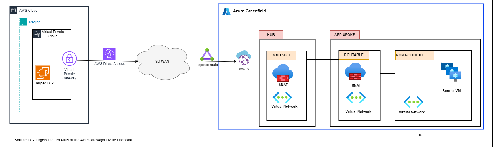

        

Document Metadata

|  |  |
|----|----|
| Identifier | **`LMP-PAT-0048`** |
| Type | **Functional Design Pattern** |
| Status | **Published** |
| Approvals | LMP Migration Architecture Approval |
| Published on | **December 16, 2024** |
| Valid From | **December 16, 2024** |
| Authors |   |
| Tags | NetworkInternet |
| Technology Capabilities | Infrastructure / Network / Data Network |

# Non-Azure Connectivity to Azure Greenfield<a href="#non-azure-connectivity-to-azure-greenfield" class="headerlink" title="Permanent link">¶</a>

## Requirement / Story<a href="#requirement-story" class="headerlink" title="Permanent link">¶</a>

> As an application engineer, I need to publish my application to other non-Azure endpoints in other cloud service providers. Specific requirements around security, encryption, latency and availability would preclude internet as the transport in some cases. I need the traffic to use internal networks. The client-side of the application will initiate the sessions and my application will respond.

## Scope<a href="#scope" class="headerlink" title="Permanent link">¶</a>

- IP traffic originating from components deployed a non-Azure cloud provider.
- Traffic will traverse the internet WAN and not use the internet.
- DNS resolution is out of scope.

## Principles<a href="#principles" class="headerlink" title="Permanent link">¶</a>

- Application teams will build their application in the non-routable VNET within the Azure Greenfield environment.
- The application will be presented to the internal systems/WAN using approved Cloud Product Framework resources – i.e. Application Gateway, Private Link Endpoints.
- Application teams are responsible for raising change requests for firewall changes at both ends of the session. This will be in the form of a Service Now ticket (requiring source IP, destination, protocol etc.).
- Inbound traffic to the Azure Greenfield service will traverse the Azure Control Plane Hub firewalls. Traffic is then forwarded to the application presentation resource, not the Application Spoke Firewall. No NAT takes place on this type of flow on any firewalls.

## General ALZ connectivity between an Azure subscription & other CSP<a href="#general-alz-connectivity-between-an-azure-subscription-other-csp" class="headerlink" title="Permanent link">¶</a>

    May 30, 2025      November 28, 2024 

 Previous 

Customer Connectivity Hub Connectivity (aka Rejoice/DDN)

 Next 

Azure Greenfield to non-Azure Connectivity

Made with <a href="https://squidfunk.github.io/mkdocs-material/" target="_blank" rel="noopener">Material for MkDocs</a>

