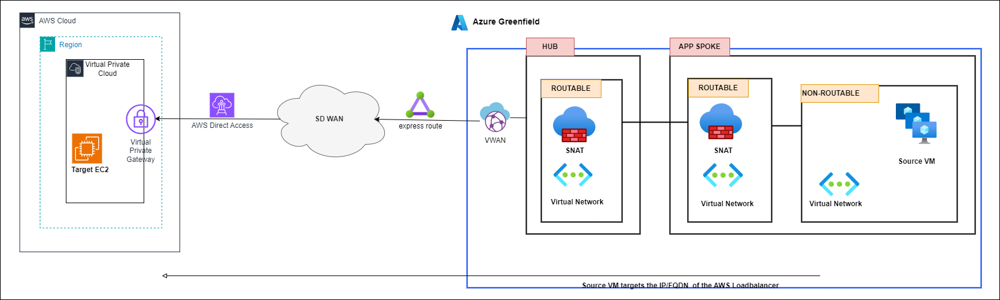

        

Document Metadata

|  |  |
|----|----|
| Identifier | **`LMP-PAT-0050`** |
| Type | **Functional Design Pattern** |
| Status | **Published** |
| Approvals | LMP Migration Architecture Approval |
| Published on | **December 16, 2024** |
| Valid From | **December 16, 2024** |
| Authors |   |
| Tags | NetworkInternet |
| Technology Capabilities | Infrastructure / Network / Data Network |

# Azure Greenfield to non-Azure Connectivity<a href="#azure-greenfield-to-non-azure-connectivity" class="headerlink" title="Permanent link">¶</a>

## Requirement / Story<a href="#requirement-story" class="headerlink" title="Permanent link">¶</a>

> As an application engineer, I need to allow my application to consume services hosted in other clouds (i.e. AWS) from my Greenfield subscription. I need my application to initiate the connectivity at runtime and use the internal network.

## Scope<a href="#scope" class="headerlink" title="Permanent link">¶</a>

- IP traffic originating from components deployed in either the application’s routable or non-routable Virtual Network ( VNET) within the Azure Greenfield subscription.
- Traffic will traverse the private internet WAN and does not apply to internet.
- DNS resolution is out of scope.

## Principles<a href="#principles" class="headerlink" title="Permanent link">¶</a>

- All traffic will originate from the Azure Greenfield subscription in either the routable or non-routable VNETs.
- Source systems will target the IP/FQDN of the target service (likely a load-balancer or web application firewall presentation).
- If traffic is originating from the non-routable VNET, traffic will be forwarded via the Application Spoke Firewall and will perform FQDN filtering, L3/L4 filtering and Source NAT to translate to a routable IP from a WAN perspective.
- The Azure Firewall has SNAT port limitations of 2496 ports per IP, where the non routable subnet hosts a large number of instances, or a smaller number of instances making a large number of connections. This is mitigated in the most part by only having one application per spoke which limits the number of instances and connections that the firewall SNAT has to handle. This can also be mitigated further because the limit is *per public IP address* (max 250) and *per scale set instance* (min 2). This means the SNAT port density can be scaled up to over 1m connections.
- Traffic (from routable or non-routable) will also be subject to packet filtering on the Azure Firewall in the “control plane hub” that is managed by the platform team. No NAT is performed here.
- Traffic will leave the Azure region via Express Routes onto the LSEG WAN and onto the target IP (in this case AWS, GCP or on-premises).
- Traffic will terminate on the target load-balancer or web application firewall. This will reverse proxy traffic to the final target VM/EC2 etc.

## General ALZ connectivity between an Azure subscription & other CSP<a href="#general-alz-connectivity-between-an-azure-subscription-other-csp" class="headerlink" title="Permanent link">¶</a>

    May 30, 2025      December 3, 2024 

 Previous 

Non-Azure Connectivity to Azure Greenfield

 Next 

Proxies for Customer-Impacting Applications (Functional Design Pattern)

Made with <a href="https://squidfunk.github.io/mkdocs-material/" target="_blank" rel="noopener">Material for MkDocs</a>

