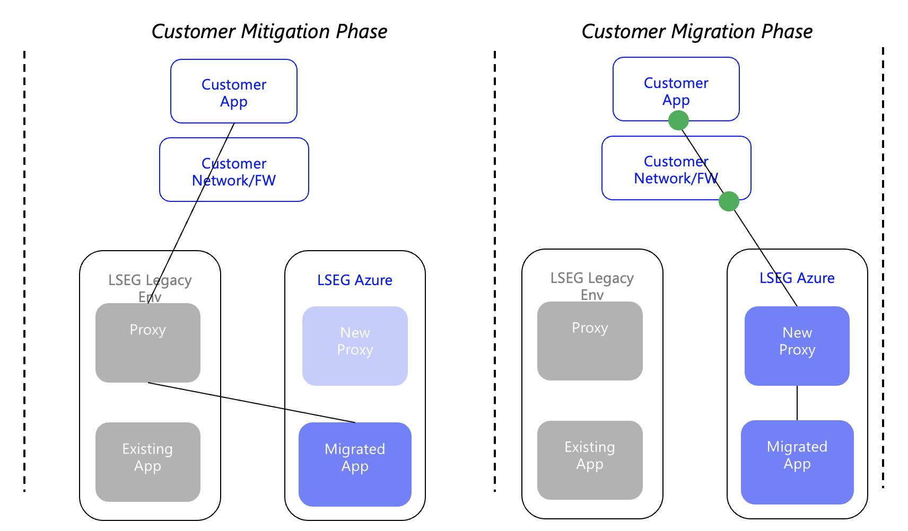

        

Document Metadata

|  |  |
|----|----|
| Identifier | **`LMP-PAT-0013`** |
| Type | **Functional Design Pattern** |
| Status | **Published** |
| Approvals | LMP Migration Architecture Approval |
| Published on | **September 13, 2024** |
| Valid From | **July 04, 2024** |
| Authors |   |
| Tags | Service DeliveryNetwork AccessInternet |
| Technology Capabilities | Business / Manufacturing & Delivery / Service DeliveryInfrastructure / Network / Data Network |

# Proxies for Customer-Impacting Applications (Functional Design Pattern)<a href="#proxies-for-customer-impacting-applications-functional-design-pattern" class="headerlink" title="Permanent link">¶</a>

## Introduction<a href="#introduction" class="headerlink" title="Permanent link">¶</a>

Customer-facing and customer-impacting applications are a critical part of LSEG's technology estate, and are typically the most difficult to migrate from one hosting location to another. Migration depends not just on activities within LSEG's control, but on activities required by customers, at customer sites, dependent on customer change & sometimes customer budget cycles. As LSEG applications are moved to Azure it is important to lay foundations for the future, which ensure that any future migrations of customer-impacting applications are as simple as possible, and isolate customers from any impact.

The LMP Migration program has identified that the current best-practice approach for migrating customer-impacting applications is to leverage 'proxy' components, e.g. an API gateway, to isolate customers from any underlying application change, or data centre/CSP move. This de-couples the change of the application, from anything visible to the customer.

The ability to repeat this approach in the future is highly desirable, so is being mandated for all customer-impacting applications as they are moved into Azure.

## Principles<a href="#principles" class="headerlink" title="Permanent link">¶</a>

- Customer-impacting applications must always include a 'proxy' component, to provide the option of future creation of a 'dog-leg', to ease any future customer migrations
- Customer-facing FQDNs must be minimised

## Dog-leg<a href="#dog-leg" class="headerlink" title="Permanent link">¶</a>

Existing on-premise proxy components are being used to create a network 'dog-leg', from the customer, to the existing environment, then to the new environment. Later, customers are mitraged to hit new proxies, in the new environment.

All customer-impacting applications must implement, or integrate with, a proxy-like component, to enable a dog-leg-like approach for future migrations. The proxy component can be other applications (e.g. central API gateways), or can be components (e.g. APIM, FrontDoor etc.) associated with the application.

## Further reading<a href="#further-reading" class="headerlink" title="Permanent link">¶</a>

- [Customer Migrations - Bundles Overview](https://lsegroup.sharepoint.com/:p:/r/teams/LSEGLMPAppMigrationApprovers/Shared%20Documents/Architecture%20Docs%20-%20Proposals,%20Strategies%20etc/LMP%20Customer%20Migrations%20-%20%20Bundles.pptx?d=w8bc02e9e8abc4e37876019d68e0c7dba&csf=1&web=1&e=ufXLW8)

    May 30, 2025      August 6, 2024 

 Previous 

Azure Greenfield to non-Azure Connectivity

 Next 

RDP API Gateway Dog-Leg - Customer Mitigation (Functional Design Pattern)

Made with <a href="https://squidfunk.github.io/mkdocs-material/" target="_blank" rel="noopener">Material for MkDocs</a>

