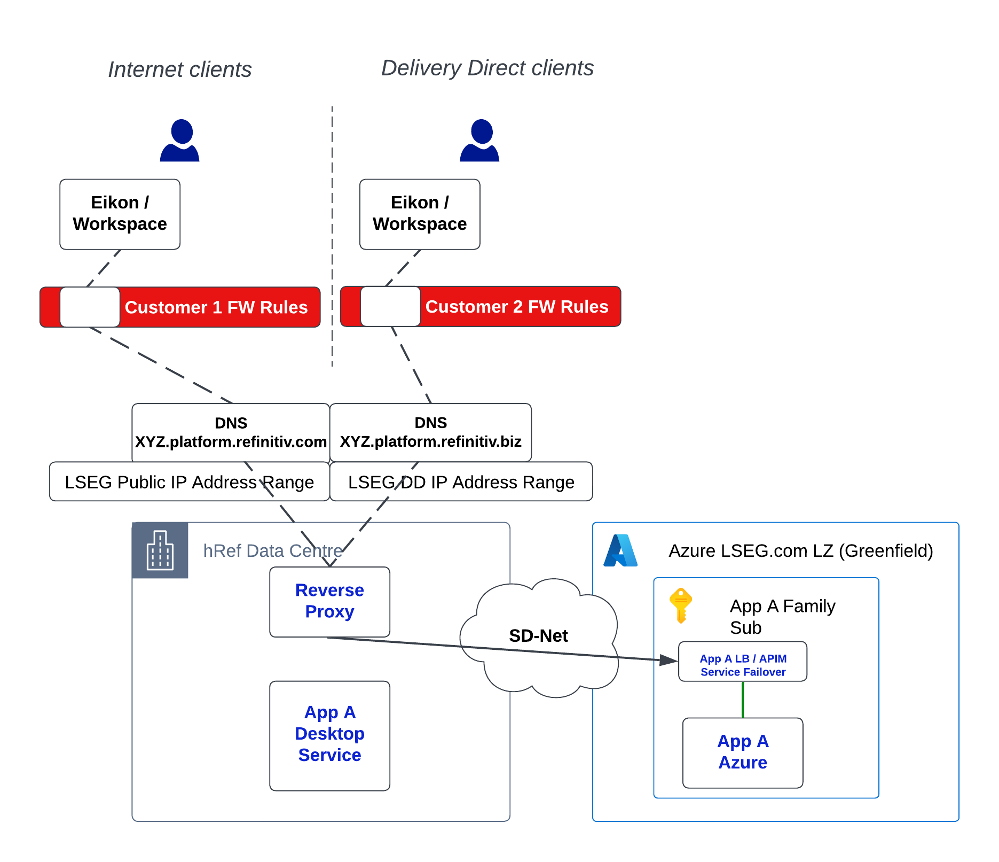

        

Document Metadata

|  |  |
|----|----|
| Identifier | **`LMP-PAT-0020`** |
| Type | **Functional Design Pattern** |
| Status | **Published** |
| Approvals | LMP Migration Architecture Approval |
| Published on | **September 18, 2024** |
| Valid From | **August 09, 2024** |
| Authors |   |
| Tags | Service DeliveryNetwork AccessInternet |
| Technology Capabilities | Business / Manufacturing & Delivery / Service DeliveryInfrastructure / Network / Data Network |

# Eikon Reverse Proxy Dog-Leg - Customer Mitigation (Functional Design Pattern)<a href="#eikon-reverse-proxy-dog-leg-customer-mitigation-functional-design-pattern" class="headerlink" title="Permanent link">¶</a>

## Introduction<a href="#introduction" class="headerlink" title="Permanent link">¶</a>

This reference architecture describes the approach for mitigating customer impact of any migrating applications that expose their APIs via the [Eikon Reverse Proxy (APP-202047)](https://lseg.leanix.net/LsegPROD/external/applicationId/APP-202047).

## Principles<a href="#principles" class="headerlink" title="Permanent link">¶</a>

- Application migrations as part of the LMP Migration program, and any consequential customer product migrations must be de-coupled

## Scope<a href="#scope" class="headerlink" title="Permanent link">¶</a>

All applications that are within LMP Migration program perimeter, and expose their APIs via the Eikon Reverse Proxy, are expected to follow the approach detailed in this pattern. It is expected that there are roughly 50 applications exposing their APIs via the Eikon Reverse Proxy, the majority being hRefinitiv on-premise.

## Approach<a href="#approach" class="headerlink" title="Permanent link">¶</a>

This section details the approach that must be taken for every migrating application that meets the criteria discussed in Scope. Broadly, the aim of the approach is to mitigate any customer impact of the migrating application, by introducing a "dog-leg" - a network connection between the Eikon Reverse Proxy on-premise, and the new application in Azure. In doing so, migration of the application, and migration of any impacted products and customers, are successfully de-coupled, allowing customer traffic and usage to exercise the migrated application in the new Azure environment, whilst leaving any consumers intact and uninterrupted.

### Current State<a href="#current-state" class="headerlink" title="Permanent link">¶</a>

The below diagram describes current state of an AWS-based application, "App A", that exposes its API via the Eikon Reverse Proxy, prior to any application migration commencing.

### Application Build<a href="#application-build" class="headerlink" title="Permanent link">¶</a>

The below diagram describes the next phase, where the migrating application, "App A", is being built in Azure, but customer traffic is still routed to the prior version on-premise.

A few points to note:

- Diagram describes an "App A LB / APIM / Service Failover" component, and in varying circumstances this component may differ. In some cases, it might be an Azure APIM instance, in others it could be a Load Balancer or other component.
- Diagram describes an "App A Family Subscription". In most cases, applications will be deployed in shared subscriptions alongside alike applications, whereas in others applications may be deployed in their own subscription
- In some cases the application being migrated may be multi-region in Azure. To de-couple on-premise infrastructure and failover entities from applications in Azure, it is best build any regional failover capabilities for the application in Azure, and prepare for regional Eikon Reverse Proxy instances to point a component (Load Balancer, FrontDoor etc.) that can provide region failover and routing
- To achieve trust between the Eikon Reverse Proxy on-premise, and the fronting component of the migrated application in Azure (as above, could be one of several Azure services), use of source IP filtering in the subscription's Azure Firewall is recommended. A more complete system-system authentication solution is not recommended in this particular case.

### Dog-Leg<a href="#dog-leg" class="headerlink" title="Permanent link">¶</a>

The below diagram describes the introduction of the Mitigation phase, where customer traffic is routed to the migrated application in Azure.

A key step in achieving the cutover described is a connectivity request via [App Conn](https://lsegroup.sharepoint.com/sites/CloudCentral/SitePages/AppConn-Connectivity-Request.aspx). App Conn, the replacement of the SBO request form, allows for connectivity to be achieved between disparate points on LSEG networks.

To deploy the change and have the Eikon Reverse Proxy route requests to new endpoints, this is achieved via the Eikon Reverse Proxy's standard backend change / SDLC process.

### Cutover Process: big-bang / canary / other approaches<a href="#cutover-process-big-bang-canary-other-approaches" class="headerlink" title="Permanent link">¶</a>

Some application teams may be comfortable cutting all customer traffic over in one change (big bang), whilst in other cases, especially those with very significant amounts of customer traffic, teams may prefer more staged/phased cutover.

The simplest method of staging cutover is to move API endpoints/methods, or API verbs (GET/POST etc.) in different phases, e.g. migrate lower-risk or read-only methods first, followed by higher-risk/write methods. This can be controlled via aforementioned standard API SDLC on the Eikon Reverse Proxy, and is the recommended approach for staging cutover.

For some apps, teams have discussed other cutover approaches, e.g. routing specific customers, or a % of queries to Azure. As of Q3 2024, there is no central capability for this in the Eikon Reverse Proxy. If many other applications have the same requirement, a central solution can be investigated.

## Further Reading<a href="#further-reading" class="headerlink" title="Permanent link">¶</a>

- [Reverse Proxy Customer Mitigation & Migration - More detail](https://confluence.refinitiv.com/pages/viewpage.action?pageId=1015615297)
- [Customer Migrations - Bundles Overview](https://lsegroup.sharepoint.com/:p:/r/teams/LSEGLMPAppMigrationApprovers/Shared%20Documents/Architecture%20Docs%20-%20Proposals,%20Strategies%20etc/LMP%20Customer%20Migrations%20-%20%20Bundles.pptx?d=w8bc02e9e8abc4e37876019d68e0c7dba&csf=1&web=1&e=ufXLW8)
- [App Conn request process](https://lsegroup.sharepoint.com/sites/CloudCentral/SitePages/AppConn-Connectivity-Request.aspx)
- [Reverse Proxy IPs and whitelist for network connectivity](https://confluence.refinitiv.com/display/EF/RP+IPs+and+whitelist+for+network+connectivity)
- [Reverse Proxy Onboarding checklist](https://confluence.refinitiv.com/display/EF/Reverse+Proxy+On-boarding+checklist)

    May 30, 2025      August 19, 2024 

 Previous 

RDP API Gateway Dog-Leg - Customer Mitigation (Functional Design Pattern)

 Next 

F5 Load Balancer Dog-Leg - Customer Mitigation (Functional Design Pattern)

Made with <a href="https://squidfunk.github.io/mkdocs-material/" target="_blank" rel="noopener">Material for MkDocs</a>

