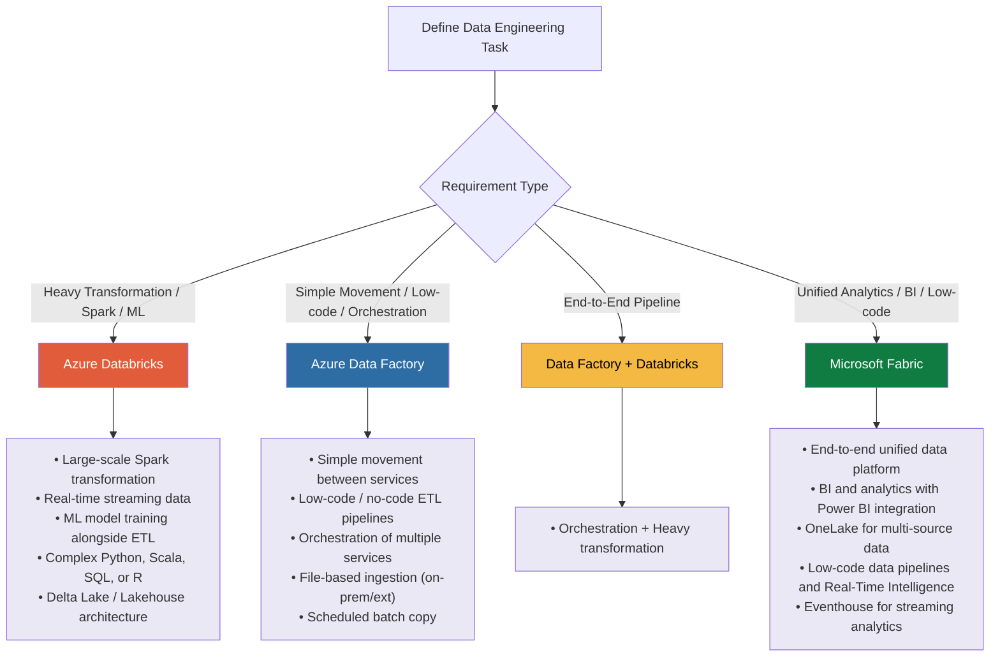

# Spark migration to Azure

## Compatibility

This advice pertains to the choice of options to migrate and orchestrate Spark Jobs in Microsoft Azure,
driven by agreements between D&A Engineering architecture, LMP architecture, CPE architecture,
LSEG Procurement and Cyber Security.

## Recommended Target

Azure Data Bricks, Microsoft Fabric and Azure Data Factory for MySQL are recommended targets for greenfield
application builds due to portability, and migrations with higher R-types (Re-factor, Re-architect).

| Technology           | Status | ITC                    | CPF Module                          |
|----------------------|--------|------------------------|-------------------------------------|
| Azure Data Bricks    | Adopt  | [ITC-91572][ITC-91572] | [Azure Databricks CPF Module]       |
| Microsoft Fabric     | Adopt  | [ITC-91615][ITC-91615] | [Azure Microsoft Fabric CPF Module] |
| Azure Data Factory   | Adopt  | [ITC-90979][ITC-90979] | [Azure Data Factory CPF Module]     |

## Decision Tree Diagram

## Notable Differences

| | | Azure Data Bricks | Microsoft Fabric | Azure Data Factory |
| --- | --- | --- | --- | --- |
| 1 | **Cost** | Pricing based on **Databricks Units (DBUs)** for compute. Storage and underlying cloud infrastructure (VMs, ADLS) are billed separately. Supports serverless SKUs and spot VMs for cost optimization. | **Capacity-based pricing using Fabric Capacity Units (CUs)** across all workloads (data engineering, BI, pipelines, AI). Single shared compute pool. Pay-as-you-go and reserved capacity available.  For teams running **on-demand Spark workloads** (rather than 24/7 continuous clusters), costs are comparable to Databricks — cost should not be the sole deciding factor between the two platforms. | **Consumption-based pricing** across multiple meters: pipeline activity runs, data movement (DIUs), and Data Flow compute (vCore-hours). Cost depends on pipeline complexity and execution frequency. |
| 2 | **Scalability** | Highly scalable distributed compute platform with autoscaling clusters and serverless execution options. | Scales via **capacity (CU) resizing** and shared compute pool. Supports dynamic bursting and concurrency across workloads | Scales for **serverless orchestration and integration workloads** across multiple sources and sinks. |
| 3 | **Ease of Use** | Code-first platform using notebooks; requires strong engineering skills (Python/SQL). Collaborative notebooks and APIs support advanced workflows. | **Unified SaaS platform** with low-code + pro-code experience. Integrated workspace across lakehouse, warehouse, BI, and pipelines. Includes Copilot/AI-assisted development. | **Low-code / drag-and-drop UI** with visual pipeline authoring, monitoring, and scheduling. Supports SSIS lift-and-shift scenarios. |
| 4 | **Integration** | Deep integration with Azure services (ADLS, Synapse, ML, Unity Catalog). Supports APIs, connectors, and multi-cloud integrations. | Native integration across Fabric ecosystem using **OneLake (unified data layer)** with shortcuts (zero-copy access across sources). Seamless integration with BI, real-time, and analytics services. | Integrates with **100+ data sources** and Azure services via pipelines and activities. Supports hybrid connectivity via Integration Runtime. |
| 5 | **Language Support** | Python, SQL, Scala, R (multi-language notebooks supported). | Python, SQL, Scala, R + **KQL (for real-time analytics).** Supports multi-language notebooks in Spark runtime. | Primarily **low-code**, but supports dynamic expressions and integration with external engines (Databricks, Synapse, SQL). Not a language-first platform. |
| 6 | **Performance** | Optimized Spark-based platform with continuous runtime improvements, Photon engine, and Delta Lake optimizations. | High performance via **Spark runtime + Native Execution Engine**, with up to significant performance gains over standard Spark for certain workloads. | Efficient for orchestration and ETL. Performance depends on configured compute (DIU/vCore) and integration runtime. |
| 7 | **Orchestration** | Built-in **Lakeflow Jobs / Workflows** for DAG-based orchestration, scheduling, triggers, and dependencies. | Native pipeline orchestration via **Fabric Data Factory**, integrated with lakehouse and other Fabric workloads. Supports scheduling and event-based execution. | **Primary orchestration engine** in Azure: pipelines, triggers, dependencies, retries, branching logic. Designed for complex ETL workflows. |
| 8 | **Spark Version** | Supports latest runtimes: **Spark 4.1 (latest), Spark 4.0 (LTS), Spark 3.5 (previous LTS)** depending on Databricks Runtime version. | Supports **Spark 3.5 (Runtime 1.x) and Spark 4.0 (Runtime 2.0 preview).** | Not a Spark-native compute platform (uses external engines like Databricks/Synapse for Spark execution). |
| 9 | **Best Use cases** | Best for **advanced data engineering, big data processing, ML/AI workflows**, and Spark-heavy architectures requiring full control. | Best for **unified analytics platform**: end-to-end data platform (ingestion → transformation → BI → AI) with minimal integration effort. Strong for enterprise standardization. | Best for **data integration, ETL/ELT pipelines, and enterprise orchestration** across distributed systems. Acts as control plane for data movement. |

## Considerations

For a unified data experience with business intelligence clubbed with low code experience for data workflows
Microsoft Fabric would be a good choice along with machine learning integrations. The new feature of OneLake
could help getting data from on prem, multi cloud vendors on to a same data lake for further analytics.
Microsoft Fabric is available across LMP environments including Migration applications and has been adopted since
early 2025. Teams already using Fabric on-prem or in other environments can leverage it with minimal learning
curve for unified analytics workloads.

If your team's primary data source is hosted on **Microsoft Fabric** (for example, consuming data from the
DaaS platform), Fabric is the strongly preferred choice. Fabric-to-Fabric integration is significantly faster
and simpler than cross-platform integration from Databricks to Fabric, reducing both engineering complexity
and latency. This is particularly relevant for teams that publish data for internal research or connect into
DaaS for external product use cases.

For any high complexity transformations and efficient spark job processing Azure DataBricks can be leveraged especially
if there are existing clusters, and it can give more control as well compared to others. If the current team is well
versed with DataBricks On premises or any other cloud, Azure DataBricks would be a great option to look for.
Azure DataBricks also has use cases for data scientists and machine learning with latest Apache spark engine and
DBX runtime.

It is to be noted that the Data Flows in Azure DataFactory uses on demand spark compute behind the scenes which is
managed by Azure. It can only be useful for simple transformations which ADF has support for. If there are simple
jobs where customer wanted low code experience this would be a good tool to look for.Other than that it is advised
to use ADF for Data Ingestion and orchestration tool.

- **Alternative Technology**: As per the general LMP approach, general strategy is to prefer Azure native technology
  where possible and where appropriate to the use case. The referenced guidance covers these scenarios in depth.
  If alternatives are needed for specific architectural challenges, they would be treated as exceptional.
  As and when exceptions crop up, and where merited, they will be added to this pattern.

## Key Factors for Tool Selection

Before committing to a platform, teams should evaluate the following factors to make a first-time-right decision:

| Factor | Guidance |
| --- | --- |
| **Long-term vision** | Consider where the broader data platform strategy is heading within your programme and across LMP. Aligning early avoids costly re-platforming. |
| **Data dependencies** | Identify where your primary data sources are hosted. If your key data (e.g. DaaS) already lives on Fabric, Fabric-to-Fabric integration is materially faster and simpler. |
| **Spark workload requirements** | Assess whether workloads are on-demand/batch vs. continuous. On-demand workloads have comparable costs across Fabric and Databricks; 24/7 workloads may differ. |
| **Team readiness and onboarding** | Factor in the team's existing skills and the realistic time to onboard. Fabric has demonstrated faster onboarding for teams without prior Databricks experience. |
| **External vs. internal data publishing** | If data is published for internal research on Fabric, or for external consumers via DaaS, Fabric-to-Fabric communication is the preferred path. |

## Migration Experiences

> These real-world migration stories from LMP teams are captured here to support better first-time-right decisions.

### StarMine — Migration to Microsoft Fabric

The StarMine team initially evaluated **Azure Databricks** for their analytics workloads. As one of the
earlier teams in the LMP programme to explore Databricks, they encountered onboarding challenges that were
partly attributable to the platform being newly introduced at that stage. In parallel, the team's use case
progressively aligned more closely with **Microsoft Fabric** — particularly due to their dependency on DaaS
data and the need for seamless data publishing. The team subsequently adopted Fabric and completed onboarding
within one to two sprints.

Key reasons for selecting Fabric:

- **DaaS integration**: StarMine consumes large volumes of data from the DaaS platform, which is hosted on
    Fabric. Fabric-to-Fabric integration proved significantly faster and easier than the Databricks-to-Fabric
    path.
- **Lower code change overhead**: Migrating to Fabric required fewer changes to existing code and compute
    configurations compared to Databricks.
- **Ease of onboarding**: From a development perspective, Fabric was straightforward to onboard to from the
    StarMine application side.
- **Data publishing**: For internal research publishing on Fabric, and for product use cases routed through
    DaaS, Fabric-to-Fabric is the recommended communication model.

### FRTB — Migration to Azure Databricks

The FRTB application was migrated from **AWS to Azure** by Siva's team. Given the scale of the workload —
processing data from 86 exchanges, managing terabytes of data and billions of records — and the need to
replicate an established AWS EMR and Athena architecture.

**Original AWS architecture:**

The AWS setup processed data from multiple exchanges, storing it in S3 buckets across partitioned datasets
managing terabytes of data and billions of records. Athena tables were used for reporting and ad-hoc querying.

**Azure migration approach:**

The team replicated the AWS architecture on Azure by moving data processing to Databricks, with Databricks
serverless warehouses serving as the Athena equivalent. Custom orchestration scripts were developed to manage
pipeline execution.

**Technical challenges encountered:**

- Spark's limited parallelism for certain file types required custom orchestration work.
- Processing throughput was initially slower than AWS EMR; concurrency was tuned from 4 to 11 parallel jobs
    to compensate.
- The application also fetches data from MySQL databases and external APIs, adding integration overhead and
    contributing to latency in the Azure environment.

**Cost considerations:**

| | AWS | Azure (Databricks) |
| --- | --- | --- |
| Monthly cost | ~$4,000–$6,000 | ~$30,000 |
| Compute (EMR / Databricks only) | ~$2,000 | ~$12,000–$15,000 |

The increase in cost is attributable to higher base compute pricing on Azure, and the concurrency tuning
required to match AWS EMR performance. Databricks serverless compute was used to partially offset fixed costs.

**Key takeaway:** For large-scale, Spark-intensive workloads with complex orchestration requirements and no
strategic dependency on Fabric data sources, Databricks is a proven option on Azure. Teams migrating from AWS
should be aware of the significant compute cost difference compared to AWS and conduct a cost analysis early
in their migration planning. Microsoft Fabric should also be evaluated alongside Databricks for such workloads,
as both platforms offer comparable functionality for this use case.

## Further Reading

- [Azure DataBricks Clear Listing](https://gitlab.dx1.lseg.com/app/app-51285/cloud-security-controls/azure-clear-listing/-/blob/main/azure/services/Microsoft.Databricks/workspaces/v1.0.0/markdown/serviceControls.md?ref_type=heads)
- [Azure Data Factory Clear Listing](https://gitlab.dx1.lseg.com/app/app-51285/cloud-security-controls/azure-clear-listing/-/blob/main/azure/services/Microsoft.DataFactory/factories/v1.1.0/markdown/serviceControls.md?ref_type=heads)
- [Microsoft Fabric Clear Listing](https://gitlab.dx1.lseg.com/app/app-51285/cloud-security-controls/azure-clear-listing/-/blob/main/azure/services/Microsoft.Fabric/capacities/markdown/serviceControls.md?ref_type=heads)

[ITC-91572]: https://lseg.leanix.net/lsegprod/factsheet/ITComponent/4c45ce16-dbfa-4ee2-8d64-b581025accec
[ITC-91615]: https://lseg.leanix.net/lsegprod/factsheet/ITComponent/06ba8f5a-eb13-470a-87bb-7258448134df
[ITC-90979]: https://lseg.leanix.net/lsegprod/factsheet/ITComponent/bdc883aa-14b0-4ede-9ff4-a5975b9946ec
[Azure Databricks CPF Module]: https://devportal.lseg.com/modules/azure-databricks?filters%5Bkind%5D=CloudServiceModule
[Azure Microsoft Fabric CPF Module]: https://devportal.lseg.com/modules/microsoft-fabric?filters%5Bkind%5D=CloudServiceModule
[Azure Data Factory CPF Module]: https://devportal.lseg.com/modules/azure-data-factory?filters%5Bkind%5D=CloudServiceModule

## References

[Fabric vs Databricks-Analytics Platform–Predictive Analytics](https://confluence.refinitiv.com/spaces/APPA/pages/1767863151/Fabric+vs+Databricks)

[Comparing JAR Execution in EMR Studio vs Fabric-Analytics Platform](https://confluence.refinitiv.com/spaces/APPA/pages/1178772135/Comparing+JAR+Execution+in+EMR+Studio+vs+Fabric)

[DataBricks-SpotVMS](https://techcommunity.microsoft.com/t5/analytics-on-azure-blog/azure-databricks-and-azure-spot-vms-save-cost-by-leveraging/ba-p/2374187)

[Fabric Capacity Billing](https://learn.microsoft.com/en-gb/azure/cost-management-billing/reservations/fabric-capacity)

[Fabric Features](https://learn.microsoft.com/en-us/fabric/enterprise/fabric-features)

[Azure Data Factory](https://learn.microsoft.com/en-us/azure/data-factory/)

