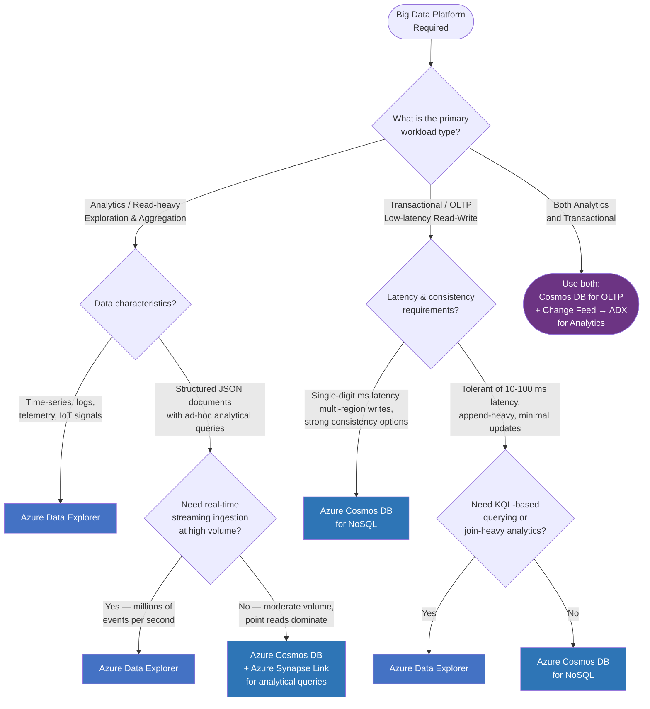

# Azure Data Explorer vs Azure Cosmos DB — Big Data Platform Selection

## Compatibility

This pattern helps teams choose between **Azure Data Explorer (ADX)** and **Azure Cosmos DB** as a big data
platform in Azure. Both services handle large volumes of data but are designed for fundamentally different
workload profiles:

- **Azure Data Explorer (Kusto)** is optimised for high-volume ingestion and fast analytical queries over
  time-series, log, telemetry, and IoT data.
- **Azure Cosmos DB** is optimised for low-latency transactional (OLTP) reads and writes on document,
  key-value, graph, and column-family data models.

This pattern does not cover relational databases (see [LMP-PAT-0077][pat-0077]) or pure ETL/data-processing
tool selection (see [LMP-PAT-0079][pat-0079]).

## Recommended Targets

| Technology | Status | ITC |
| --- | --- | --- |
| Azure Data Explorer (Kusto) | Adopt | [ITC-91597][ITC-91597] |
| Azure Cosmos DB for NoSQL | Adopt | [ITC-90978][ITC-90978] |
| Azure Cosmos DB for MongoDB | Hold | [ITC-91619][ITC-91619] |

- **Azure Data Explorer** is recommended for analytical workloads: log analytics, telemetry, IoT signals,
  time-series, security event analysis (SIEM-adjacent), and ad-hoc exploration of large datasets using KQL.
  ADX is also the recommended Azure-native replacement for Elasticsearch when the primary use case is
  telemetry analytics rather than full-text search (see [LMP-PAT-0007][pat-0007]).
- **Azure Cosmos DB for NoSQL** is recommended for transactional workloads: user-facing applications
  requiring single-digit-millisecond reads/writes, session state, shopping carts, content management,
  and globally distributed OLTP data.
- Where both analytical and transactional access are needed on the same data, consider a combined
  architecture using Cosmos DB Change Feed to stream data into ADX for analytical queries.

### R-type Guidance

- **Re-architect / Refactor:** Evaluate the decision tree below. Choose ADX for analytics-first workloads
  and Cosmos DB for transaction-first workloads. For hybrid needs, use both with Change Feed integration.
- **Re-host / Re-platform:** Map the source workload characteristics to the closest Azure service. If the
  source is a time-series or log store (e.g. Elasticsearch for analytics, InfluxDB, Splunk), prefer ADX.
  For Elasticsearch migrations specifically, see [LMP-PAT-0007 — Full-Text Document Indexing and Search][pat-0007]
  for guidance on when ADX is the right target vs Azure AI Search or managed Elasticsearch.
  If the source is a NoSQL document store (e.g. MongoDB, DynamoDB, Couchbase), prefer Cosmos DB.

## Decision Tree Diagram

Use the following decision tree to determine whether Azure Data Explorer or Azure Cosmos DB is the
appropriate target for your workload.

### How to read the decision tree

| Outcome | When to choose it |
| --- | --- |
| **Azure Data Explorer** | Time-series, logs, telemetry, IoT, high-volume streaming ingestion, KQL-based ad-hoc analytics |
| **Azure Cosmos DB for NoSQL** | User-facing OLTP apps, single-digit ms latency, globally distributed transactional workloads |
| **Cosmos DB + Synapse Link** | Primarily transactional with occasional analytical queries on the same data |
| **Cosmos DB + Change Feed → ADX** | Both real-time transactional access and heavy analytical querying are required on the same dataset |

## Notable Differences

| Consideration | Azure Data Explorer (Kusto) | Azure Cosmos DB for NoSQL |
| --- | --- | --- |
| **Primary Use Case** | Analytics over large volumes of time-series, log, and telemetry data | Low-latency transactional reads/writes on document data |
| **Query Language** | KQL (Kusto Query Language), T-SQL subset | SQL-like API, SDKs (.NET, Java, Python, Node) |
| **Client Experience** | KQL via Kusto Explorer, Jupyter, REST API; JDBC/ODBC connectors | REST API and native SDKs for .NET, Java, Python, Node, Go |
| **Data Model** | Semi-structured (JSON, CSV, Parquet, Avro, ORC, W3CLOGFILE, and more); columnar storage | Document (JSON), key-value, graph, column-family, table |
| **Data Ingestion Formats** | Apache Avro, CSV, JSON, MultiJSON, ORC, Parquet, PSV, RAW, SCsv, SOHsv, TSV, TXT, W3CLOGFILE | JSON documents via SDK, Bulk Import, or Change Feed |
| **Ingestion Sources** | Event Hubs, IoT Hub, Kafka, Blob Storage, Azure Data Factory, Logstash, OpenTelemetry | Point writes via SDK, Bulk Import, Change Feed |
| **Write Latency** | Seconds (ingestion is batched, not real-time per-record) | Single-digit milliseconds per write |
| **Read Latency** | Sub-second for analytical queries over billions of rows | Single-digit milliseconds for point reads |
| **Consistency** | Eventual (optimised for read-heavy analytics) | Strong, bounded staleness, session, consistent prefix, eventual |
| **Indexing** | Automatic columnar indexing; optimised for range and text search | Automatic indexing on all properties by default |
| **Global Distribution** | Multi-cluster with follower databases (read replicas) | Native multi-region writes with five consistency levels |
| **Scaling** | Compute + storage scale independently; optimized autoscale | Provisioned RU/s, Autoscale, or Serverless |
| **Streaming Support** | Native ingestion from Event Hubs, Kafka, IoT Hub | Change Feed for event-driven downstream processing |
| **Integration** | Power BI, Grafana, Azure Monitor, Microsoft Fabric, Synapse, Logstash, OpenTelemetry, Apache Spark, JDBC/ODBC, Azure Functions, Power Apps | Azure Functions triggers, Synapse Link, Azure AI Search |
| **Best Volume Profile** | Billions of records, TB-to-PB scale analytics | Millions of records, GB-to-TB scale transactional |
| **Tiers** | Production and Dev/Test clusters | Provisioned, Autoscale, Serverless |
| **Pricing** | Cluster-based (compute + storage separate); capacity reservations available. Example: ~$500/month for 100 GB/day, 7-day hot retention, 2 engine + 2 data management instances[^6] | Per RU/s provisioned or per RU consumed (Serverless) |
| **Scaling** | Vertical or horizontal; automatic scaling by CPU, cache, or ingestion utilization | Based on provisioned RU/s or automatic with Autoscale/Serverless |
| **SLA** | 10% service credit for uptime ≤ 99.9%[^6] | Up to 99.999% with multi-region[^2] |

## Considerations

### Azure Data Explorer (Kusto)

- Purpose-built for near-real-time analytics on fast-moving data (logs, metrics, events)
- KQL provides powerful aggregation, time-series analysis, anomaly detection, and pattern recognition
- Supports direct ingestion from Event Hubs, IoT Hub, Kafka, Azure Blob Storage, Azure Data Factory,
  Logstash, and OpenTelemetry — making it a natural migration target for Elasticsearch telemetry workloads
- Native support for a wide range of data formats: Apache Avro, CSV, JSON, ORC, Parquet, W3CLOGFILE, and more
- Columnar storage engine with automatic indexing delivers sub-second query performance on billions of rows
- Follower databases enable read-scale-out across regions without data duplication cost
- Integrates natively with Power BI, Grafana, Microsoft Fabric, JDBC/ODBC, Apache Spark, and Jupyter
- Supports materialized views and continuous data export for pre-aggregated reporting
- Vertical and horizontal scaling with automatic autoscale based on CPU, cache, or ingestion utilization
- Production and Dev/Test tiers with capacity reservation pricing available
- Not designed for low-latency per-record transactional writes — ingestion is batched

#### Elasticsearch to ADX Migration Guidance

For workloads currently on Elasticsearch where the primary use case is **telemetry analytics** (log analysis,
metrics dashboarding, time-series exploration), ADX is the preferred Azure-native target. Key migration
considerations:

- ADX supports Logstash and OpenTelemetry ingestion, easing the transition from Elastic Agent / Beats pipelines
- KQL replaces Elasticsearch Query DSL — KQL is purpose-built for analytics and provides richer
  time-series and anomaly detection capabilities
- Grafana and Power BI replace Kibana for dashboarding
- ADX pricing (cluster-based with capacity reservations) is typically more predictable than Elasticsearch
  managed service pricing (VM SKU-based)
- For workloads requiring **full-text or vector search** rather than analytics, see [LMP-PAT-0007][pat-0007]
  which covers Azure AI Search and managed Elasticsearch as alternatives

### Azure Cosmos DB for NoSQL

- Purpose-built for globally distributed, low-latency transactional workloads
- Single-digit millisecond reads and writes at any scale with guaranteed SLA
- Five tuneable consistency levels from strong to eventual
- Multi-region writes with automatic conflict resolution
- Change Feed enables event-driven architectures and data streaming to downstream systems (including ADX)
- Synapse Link provides no-ETL analytical access to operational data
- Serverless mode available for bursty workloads with unpredictable traffic
- Not designed for heavy ad-hoc analytics, aggregations, or joins across large datasets

### Hybrid Architecture — Cosmos DB + ADX

For workloads that require both transactional and analytical capabilities:

1. Use **Cosmos DB** as the transactional store for low-latency reads/writes
2. Enable **Cosmos DB Change Feed** to stream changes in near-real-time
3. Ingest the Change Feed into **Azure Data Explorer** using the built-in Cosmos DB connector
4. Run analytical queries, dashboards, and time-series analysis in ADX

This pattern gives you the best of both worlds — OLTP performance from Cosmos DB and analytical
power from ADX — without compromising either workload.

## Alternatives

- **Azure Synapse Analytics** — for enterprise data warehouse workloads combining SQL pools and Spark pools.
  Better suited when the primary need is structured data warehousing rather than free-form analytics or OLTP.
- **Microsoft Fabric Real-Time Analytics (Eventhouse)** — Fabric's managed ADX offering. Prefer this when
  the organisation is already invested in the Microsoft Fabric ecosystem and wants unified billing under
  Fabric capacity units. See [LMP-PAT-0080][pat-0080] for Fabric guidance.
- **Azure SQL Database / SQL Managed Instance** — for relational transactional workloads.
  See [LMP-PAT-0077][pat-0077].
- **Elasticsearch on Azure** — for full-text search and observability workloads. Elasticsearch managed
  service is available via Azure Marketplace. However, for telemetry analytics use cases, ADX is the
  preferred Azure-native alternative offering better price-performance on time-series and log data.
  For full-text and vector search use cases, see [LMP-PAT-0007][pat-0007] which covers Azure AI Search
  and managed Elasticsearch in detail.

## References

[^2]: [Azure Cosmos DB documentation](https://learn.microsoft.com/en-us/azure/cosmos-db/)
[^6]: [LMP-PAT-0007 — ADX pricing and SLA comparison](../databases/0007-search.md)

[ITC-91597]: https://lseg.leanix.net/lsegprod/factsheet/ITComponent/4ec13e80-99f6-408c-8303-3b2b44d9bb1a
[ITC-90978]: https://lseg.leanix.net/lsegprod/factsheet/ITComponent/feadfe01-fae9-4145-9aed-28c9de4e4929
[ITC-91619]: https://lseg.leanix.net/lsegprod/factsheet/ITComponent/6a005c9e-4860-4016-8b62-a77725df0f5b
[pat-0007]: ../databases/0007-search.md
[pat-0077]: ../databases/0077-relational-databases.md
[pat-0079]: 0079-etl-databricks-adf.md
[pat-0080]: ../databases/0080-document-database.md

