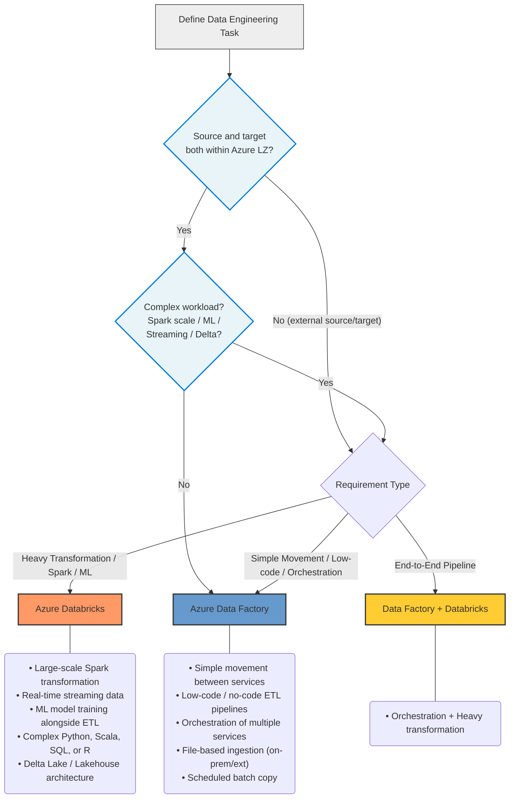

# Azure ETL & Data Processing Technology Selection

## Compatibility

This advice pertains to the choice of ETL and data processing technology target in Azure, driven by agreements between
D&A Engineering architecture, LMP architecture, CPE architecture, LSEG Procurement and Cyber Security.

## Recommended Target

| Technology                       | Status                 | Scope                                                                                  | ITC                    |
|----------------------------------|------------------------|----------------------------------------------------------------------------------------|------------------------|
| Azure Data Factory               | Adopt (default)        | Pure ETL, data movement, and orchestration where source and target are within Azure LZ | [ITC-90979][ITC-90979] |
| Azure Databricks                 | Adopt (complex cases)  | ML-alongside-ETL, large-scale Spark processing, real-time streaming, Delta Lakehouse   | [ITC-91572][ITC-91572] |

For workloads where both source and target reside within the Azure Landing Zone, Azure Data Factory is the
preferred default because data remains within the Azure subscription boundary with no egress cost implications.
Azure Databricks is the recommended choice for complex cases where its specific technical capabilities —
large-scale Spark transformation, machine learning integration, or real-time streaming — cannot be met by ADF alone.
Azure Databricks and Azure Data Factory can be used together, where Data Factory orchestrates the pipeline
and triggers Databricks notebooks for heavy transformation workloads.

## Data Residency and Egress Considerations

A key factor in technology selection is whether data leaves the Azure Landing Zone (LZ) or subscription boundary.

**Azure Data Factory** runs its Integration Runtime within the customer's subscription. For Azure-to-Azure
data movement, data never crosses the subscription boundary, and intra-region traffic incurs no egress charges.

**Azure Databricks** has a split-plane architecture:

- The **control plane** (job orchestration, cluster management, notebook state, metadata) resides in
  Databricks' own Azure tenant — outside the customer's subscription — making it a SaaS boundary crossing
  even when VNet injection is configured.
- The **data plane** can be injected into the customer's VNet via private endpoints, but control-plane
  traffic still crosses the subscription boundary.

This has two practical consequences:

1. **Data governance**: Regulated or sensitive data processed via Databricks should be assessed against
   the organisation's data classification policy, as metadata and job context traverse a third-party tenant.
2. **Egress cost**: Control-plane traffic travels over Microsoft's backbone network (Databricks' control
   plane is itself hosted in Azure) and is not typically charged as egress. However, if Databricks compute
   clusters and source/target storage accounts are in different Azure regions, standard inter-region egress
   charges apply. For high-volume ETL, ensuring clusters and storage are co-located in the same region is
   essential to avoid unexpected cost — the same discipline required for any Azure service.

**Guidance**: Where source and target are both within the same Azure LZ, prefer ADF to avoid the SaaS
boundary crossing and associated cost. Use Databricks only where its specific capabilities justify the trade-off.

## Decision Tree Diagram

| Condition                                                                   | Recommended Technology    |
|-----------------------------------------------------------------------------|---------------------------|
| Source and target both within Azure Landing Zone; no complex transformation | Azure Data Factory        |
| Large-scale data transformation using Spark                                 | Azure Databricks          |
| Real-time streaming data processing                                         | Azure Databricks          |
| Machine learning model training alongside ETL                               | Azure Databricks          |
| Complex transformations requiring Python, Scala, SQL, or R                  | Azure Databricks          |
| Delta Lake / Lakehouse architecture                                         | Azure Databricks          |
| Simple data movement between Azure services                                 | Azure Data Factory        |
| Low-code / no-code ETL pipeline development                                 | Azure Data Factory        |
| Orchestration of multiple Azure services (incl. Databricks)                 | Azure Data Factory        |
| File-based data ingestion from on-premises or external sources              | Azure Data Factory        |
| Scheduled batch data copy with minimal transformation                       | Azure Data Factory        |
| End-to-end pipeline: orchestration + heavy transformation                   | Data Factory + Databricks |

## Notable Differences

| Area | Azure Databricks | Azure Data Factory |
| --- | --- | --- |
| **Primary Use Case** | Large-scale data processing, advanced analytics, ML | Data orchestration, data movement, ETL pipeline management |
| **Processing Engine** | Apache Spark (distributed compute) | Mapping Data Flows (Spark-based) or Copy Activity (direct data movement) |
| **Development Model** | Code-first: notebooks in Python, Scala, SQL, R | Low-code/no-code visual designer with optional code |
| **Streaming Support** | Native Structured Streaming for real-time workloads | Limited; primarily batch-oriented with tumbling window triggers |
| **Scalability** | Optimized autoscaling clusters; scales aggressively for big data | Auto-scaling integration runtimes; suited for moderate workloads |
| **Data Transformation** | Complex transformations, custom logic, UDFs, ML pipelines | Built-in transformations via Mapping Data Flows; limited for complex custom logic |
| **Orchestration** | Job scheduling via Lakeflow Jobs | Rich orchestration with pipeline activities, triggers, dependencies, and control flow |
| **Integration** | Integrates with Azure ML, Delta Lake, Unity Catalog, MLflow | 90+ connectors; integrates with Databricks, Azure SQL, Blob Storage, on-premises sources |
| **Cost Model** | DBU-based pricing; higher cost for small workloads | Pay-per-pipeline-run; cost-effective for simple data movement |
| **Security** | VNet injection, private endpoints, Unity Catalog governance, customer-managed keys | Managed VNet, private endpoints, managed identity, customer-managed keys |

## Databricks vs. Microsoft Fabric for Complex Workloads

When a workload is sufficiently complex to move beyond ADF, the choice may arise between Databricks and
Microsoft Fabric (Spark / Data Engineering workloads). The following comparison applies:

| Area | Azure Databricks | Microsoft Fabric (Spark / Data Engineering) |
| --- | --- | --- |
| **Spark engine maturity** | Photon engine; highly optimised, battle-tested at scale | Spark on Synapse; improving but less mature than Photon |
| **ML lifecycle** | Native MLflow integration; tight fit with Azure ML | Azure ML integration available but less native |
| **Governance** | Unity Catalog: cross-workspace, fine-grained column/row security | OneLake + Purview; simpler but coarser-grained |
| **Streaming** | Lakeflow Spark Declarative Pipelines; mature structured streaming | Eventstream; less mature, fewer capabilities |
| **Data residency** | Control plane outside customer subscription (SaaS boundary) | Fully within Microsoft 365 / Azure tenant boundary |
| **Open format interop** | Strong: Delta, Parquet, Iceberg | Good: OneLake open formats |
| **Microsoft ecosystem fit** | Good Azure integration | Tighter Power BI / M365 integration |
| **Cost model** | DBU-based; can be expensive at small-to-medium scale | Capacity-based; simpler for orgs with existing M365/Fabric licences |

**Guidance**: Prefer Databricks when ML workloads, Delta Lakehouse architecture, or advanced streaming are
the primary drivers, and the team has Spark/Python expertise. Fabric may be preferable where Power BI-integrated
analytics or a unified Microsoft capacity licence is the dominant concern. In line with LMP's preference for
established Azure-native patterns, Fabric should be treated as an exception requiring architectural justification
unless the application already has an approved Fabric footprint.

## Considerations

- **Data Residency**: Databricks' control plane runs outside the customer's Azure subscription boundary (in
  Databricks' own Azure tenant), making it a SaaS boundary crossing even with VNet injection. For workloads
  where data must not leave the Azure LZ — particularly regulated data or high-volume pipelines sensitive to
  egress cost — ADF is the preferred choice. Use Databricks only where its specific capabilities (Spark scale,
  ML, streaming) justify the boundary trade-off.
- **Combined Usage**: Azure Databricks and Azure Data Factory are complementary. Use Data Factory to orchestrate
  end-to-end data pipelines and trigger Databricks activities for complex transformations. This is the recommended
  approach for most enterprise data platforms.
- **Migration R-Types**: For Re-host and Re-platform migrations of existing ETL workloads, Azure Data Factory provides
  a simpler path with its visual pipeline designer. For Re-factor and Re-architect migrations, Azure Databricks
  provides greater flexibility and scalability.
- **Alternative Technology**: As per the general LMP approach, the general strategy is to prefer Azure native technology
  where possible and where appropriate to the use case. If alternatives are needed for specific architectural
  challenges, they would be treated as exceptional. As and when exceptions crop up, and where merited, they will
  be added to this pattern.

## Further Reading

- [Azure DataBricks Clear Listing](https://gitlab.dx1.lseg.com/app/app-51285/cloud-security-controls/azure-clear-listing/-/blob/main/azure/services/Microsoft.Databricks/workspaces/v1.0.0/markdown/serviceControls.md?ref_type=heads)
- [Azure Data Factory Clear Listing](https://gitlab.dx1.lseg.com/app/app-51285/cloud-security-controls/azure-clear-listing/-/blob/main/azure/services/Microsoft.DataFactory/factories/v2.0.0/markdown/serviceControls.md?ref_type=heads)
- [Overview of Azure Data Factory](https://dev.azure.com/LSEGroup/Migration/_wiki/wikis/Migration.wiki/774/Overview-of-Azure-Data-Factory)
- [Azure Databricks Documentation](https://learn.microsoft.com/en-us/azure/databricks/)
- [Azure Data Factory Documentation](https://learn.microsoft.com/en-us/azure/data-factory/)

[ITC-91572]: https://lseg.leanix.net/lsegprod/factsheet/ITComponent/4c45ce16-dbfa-4ee2-8d64-b581025accec
[ITC-90979]: https://lseg.leanix.net/lsegprod/factsheet/ITComponent/bdc883aa-14b0-4ede-9ff4-a5975b9946ec

