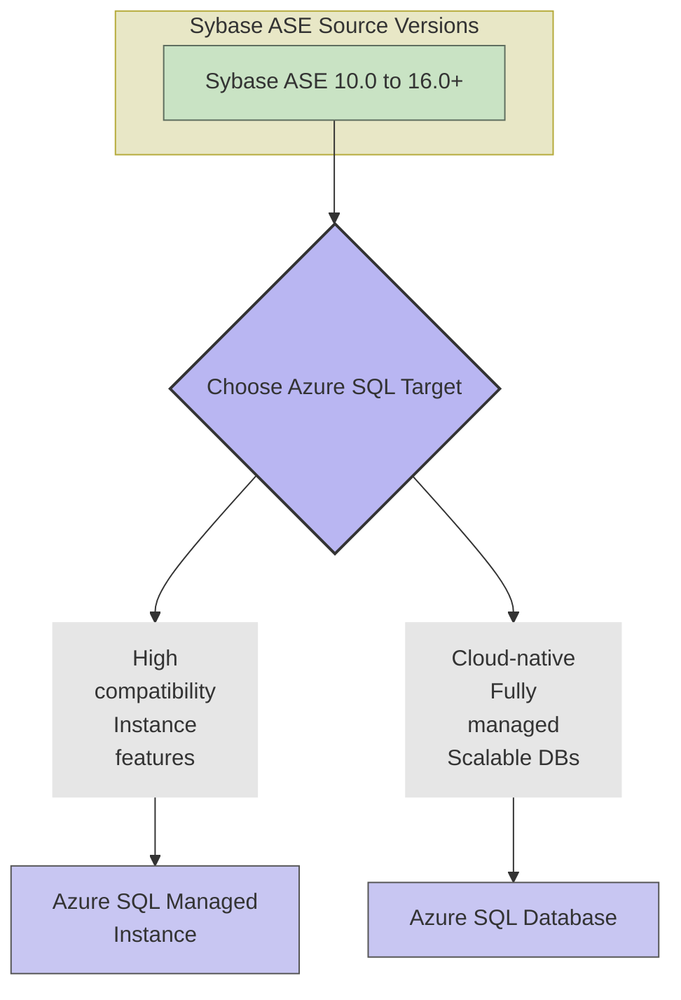

# Azure Relational Database Selection

## Compatibility

This advice pertains to the choice of relational database target in Azure, driven by agreements between D&A Engineering
architecture, LMP architecture, CPE architecture, LSEG Procurement and Cyber Security.

## Recommended Target

| Technology                       | Status | ITC                                   | CPF Module                     |
| -------------------------------- | ------ | ------------------------------------- | ------------------------------ |
| Azure Database for PostgreSQL    | Adopt  | [ITC-90989][ITC-90989]                | [Azure database forpostgresql] |
| Azure Database for MySQL         | Adopt  | [ITC-91621][ITC-91621]                | [Azure database for mysql]     |
| Azure SQL Database               | Hold   | [ITC-90996][ITC-90996]                | [Azure sql database]           |
| Azure SQL Managed Instance       | Hold   | [ITC-91624][ITC-91624]                | [Azure sql managed instance]   |
| Oracle options                   | Hold   | [Oracle LMP-PAT-0083](0083-oracle.md) | NA                             |

Azure Database for PostgreSQL and Azure Database for MySQL are recommended targets for greenfield application builds
due to portability, and migrations with higher R-types (Re-factor, Re-architect).
Azure SQL Database and Azure SQL Managed Instance are acceptable targets for migrations, especially lower R-types
(Re-host, Re-platform).
For Oracle options, see separate Technology Selection Pattern for Oracle, but note these are not acceptable for
greenfield application builds.

## Decision Tree Diagram

As a starting point, review the *Selecting an Azure Data Store* decision tree in
the [public Azure documentation](https://learn.microsoft.com/en-us/azure/architecture/guide/technology-choices/data-store-decision-tree).
It helps delineate what is available in Azure for relational, semi-structured, time-series, graph and binary data, etc.
It is deliberately not republished here since it is likely to change more frequently than this pattern.

Combine the advice from that decision tree with the advice given
in [Data Platform Migration Approach](https://dev.azure.com/LSEGroup/Migration/_wiki/wikis/Migration.wiki/217/Data-Platform-Migration-Approach-Technical-).
Within, there is guidance for migrations for multiple scenarios including SQL Server to SQL Managed Instances,
Maria DB to Azure DB, etc. With each, detailed guidance covers seeding, synchronization, cutover, etc.

## Sybase (SAP ASE) Migration Recommendation

With SAP's announcement of the end of mainstream maintenance for SAP ASE by 2025,
all Sybase (SAP ASE) databases should be migrated to Azure-native relational
database services. The recommended targets are:

- **Azure SQL Database**
- **Azure SQL Managed Instance**

This migration ensures continued support, enhanced scalability, and access
to modern cloud capabilities. Migrating to Azure SQL services is the expected
direction for all Sybase workloads.

For detailed migration steps and considerations, refer to
the [Sybase Migration Guidance](https://dev.azure.com/LSEGroup/Migration/_wiki/wikis/Migration.wiki/239/Sybase-Migration).

## Considerations

- **Alternative Technology**: The general strategy for relational databases is to prefer portable technologies over
Azure-native, for greenfield builds or for major re-architectures. Azure-native is acceptable for migrations, and
specifically when addressing Sybase.  If alternatives are needed for specific architectural challenges, they will
be treated as exceptional. As and when exceptions crop up, and where merited, they will be added to this pattern.

## Further Reading

- [Database Strategy](https://lsegroup.sharepoint.com/:w:/r/teams/TechnologyStrategy-Private/Shared%20Documents/Private/2024/Oracle%20Strategy/Q1%202024%20Database%20Strategy%20Update%20-%20v0.6.docx?d=wce03b502f7784d0fba545bc29d9bcc57&csf=1&web=1&e=eLvRf1&isSPOFile=1)
- [Oracle Strategy - D&A Tech Decision Tree](https://lsegroup-my.sharepoint.com/:w:/g/personal/oli_bage_lseg_com/EUP-w7euY4ZIt1YvglQIL5wBTGQJPQT04WIUVtKa9xjOWQ?e=kM3v7d)

## Flowchart: Supported Sybase Versions to Azure SQL

This flowchart provides a concise visual representation of the Sybase
ASE versions generally supported for migration to Azure SQL Database and
Azure SQL Managed Instance.

[ITC-90989]: https://lseg.leanix.net/lsegprod/factsheet/ITComponent/f0072bff-154a-4b92-8ea5-00edc8b3f2c2
[ITC-91621]: https://lseg.leanix.net/lsegprod/factsheet/ITComponent/3dbb873b-cfbb-4106-9a9f-56f3c6d9fefd
[ITC-90996]: https://lseg.leanix.net/lsegprod/factsheet/ITComponent/b72f9a6e-e50d-4feb-bd42-00546dfdc85d
[ITC-91624]: https://lseg.leanix.net/lsegprod/factsheet/ITComponent/1a83b850-73f4-4438-adeb-d6201230ec6d
[Azure database for mysql]: https://devportal.lseg.com/modules/azure-database-for-mysql?filters%5Bkind%5D=CloudServiceModule
[Azure sql database]: https://devportal.lseg.com/modules/azure-sql-database?filters%5Bkind%5D=CloudServiceModule
[Azure sql managed instance]: https://devportal.lseg.com/modules/azure-sql-managed-instance?filters%5Bkind%5D=CloudServiceModule
[Azure database forpostgresql]: https://devportal.lseg.com/modules/azure-database-for-postgresql?filters%5Bkind%5D=CloudServiceModule

