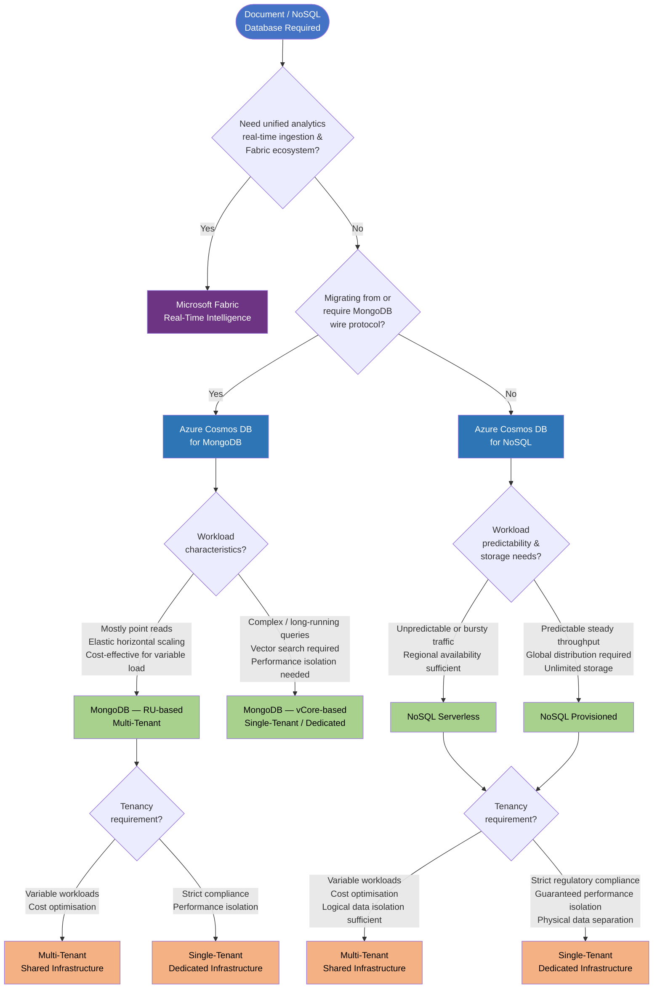

# Document Database Selection

## Compatibility

This advice pertains to the selection of a document / NoSQL database target in Azure, covering migrations from
AWS DynamoDB, existing MongoDB workloads, and new greenfield NoSQL projects.

## Recommended Targets

| Technology                              | Status | ITC                       | CPF                    |
| --------------------------------------  |--------| --------------------------| ---------------------- |
| Azure Cosmos DB for NoSQL               | Adopt  | [ITC-90978][ITC-90978]    | [CPF-CosmosDB]         |
| Azure Cosmos DB for MongoDB             | Hold   | [ITC-91619][ITC-91619]    | [CPF-CosmosDB]         |
| Microsoft Fabric Real-Time Intelligence | Adopt  | [APP-51686]               | [CPF-Fabric-Capacity]  |

Azure Cosmos DB for NoSQL is the native Azure API with a JSON document model and SQL-like query language.
Azure Cosmos DB for MongoDB is wire-protocol compatible and on **Hold** — it remains an acceptable target for
existing MongoDB migrations but is not recommended for new greenfield workloads. It is available in two capacity models:

- **RU-based** – multi-tenant, request-unit based, elastic horizontal scaling
- **vCore-based** – dedicated compute, suitable for complex queries and vector search

**Microsoft Fabric Real-Time Intelligence** provides a scalable, fully managed solution for ingesting, storing, and
querying semi-structured and NoSQL data (including JSON documents) within the Microsoft Fabric platform. It is
recommended for workloads that benefit from unified analytics, real-time ingestion, and integration with the
broader Fabric ecosystem (OneLake, Power BI, Data Factory, Eventhouse)[^15].

For the CPF product service definition, see the [Cosmos DB Mongo Database product service][CPF-CosmosDB].

## Decision Tree Diagram

Use the following decision tree to determine the appropriate target offering, capacity model, and tenancy model.

## Notable Differences - Cosmos DB vs Microsoft Fabric Real-Time Intelligence[^15]

| Similarity | Consideration       | Azure Cosmos DB (NoSQL / MongoDB)        | Microsoft Fabric Real-Time Intelligence                    |
|------------|---------------------|------------------------------------------|------------------------------------------------------------|
| 🟡         | Data Model          | Document (JSON / BSON)                   | Semi-structured (JSON, Parquet, CSV)                       |
| 🟡         | Query Language      | SQL-like / MQL, SDKs                     | KQL (Kusto Query Language), T-SQL, SDKs                    |
| 🟢         | Transaction support | Yes (multi-document ACID)                | Limited (append-optimised, not OLTP)                       |
| 🟡         | Ingestion           | SDK writes, Change Feed, Bulk Import     | Real-time streaming (Event Hubs, Kafka), batch (ADF)       |
| 🟡         | Best suited for     | OLTP, low-latency point reads/writes     | Real-time analytics, log/telemetry, time-series, analytics |
| 🟡         | Storage             | 20 GB/partition, unlimited per container | OneLake – unified, virtually unlimited                     |
| 🟡         | Scaling             | Provisioned RU, Serverless, or vCore     | Automatic, capacity-based (Fabric CUs)                     |
| 🟡         | Integration         | Standalone, Azure Functions triggers     | Native Power BI, Data Factory, Notebooks, Eventhouse       |
| 🟡         | Pricing             | Per RU/hour or vCore                     | Per Fabric capacity unit (CU)                              |

## Notable Differences - Cosmos DB for NoSQL vs Cosmos DB for MongoDB[^3]

| Similarity | Consideration          | Cosmos DB for NoSQL                                                 | Cosmos DB for MongoDB                                           |
|------------|------------------------|---------------------------------------------------------------------|-----------------------------------------------------------------|
| 🟢         | Data Model             | Document (JSON)                                                     | Document (BSON)                                                 |
| 🟢         | Data Structure         | Database:Collection:Document:Field                                  | Database:Collection:Document:Field                              |
| 🟡         | Query Language         | SQL-like query language, SDKs                                       | MongoDB Query Language (MQL), SDKs                              |
| 🟢         | Transaction support    | Yes                                                                 | Yes                                                             |
| 🟡         | Migration tooling      | Java/.NET SDK[^8], Striim[^9]                                       | mongodump, mongorestore                                         |
|            | Max size               | 20 GB/partition, unlimited per container[^1]                        | 20 GB/partition, unlimited per container[^1]                    |
| 🟡         | Scaling                | Provisioned or Serverless                                           | Request Units (RU) or vCore                                     |
| 🟢         | SLA                    | 10% credit at < 99.99%[^7]                                          | 10% credit at < 99.99%[^7]                                      |
| 🟡         | Consistency Model      | Eventual, Consistent Prefix, Session, Bounded Staleness, Strong[^4] | Mapping of 3 Cosmos levels to Mongo Read and Write concerns[^5] |
|            | DR/High Availability   | Global distribution                                                 | Global distribution                                             |

## Notable Differences - NoSQL Provisioned vs Serverless[^11]

| Similarity | Consideration     | Provisioned               | Serverless                                |
|------------|-------------------|---------------------------|-------------------------------------------|
| 🟢         | Query Suitability | All database operations   | All database operations                   |
| 🟡         | Availability      | Global                    | Regional                                  |
| 🟡         | Provisioning      | Configured                | Automatic                                 |
| �          | Storage[^1]       | Unlimited                 | Unlimited                                 |
| 🟢         | Latency           | < 10 ms point read/writes | < 10 ms point reads; < 30 ms point writes |
| 🟡         | Pricing           | Per *provisioned* RU/hour | Per *consumed* RU/hour                    |

## Notable Differences - MongoDB RU vs vCore[^13]

| Similarity | Consideration     | Azure Cosmos DB for MongoDB (RU) | Azure Cosmos DB for MongoDB (vCore)  |
|------------|-------------------|----------------------------------|--------------------------------------|
| 🟡         | Query Suitability | Mostly point reads               | Mostly long-running, complex queries |
| 🟡         | Scaling model     | Horizontal, instantaneous        | Horizontal and vertical              |
| 🟡         | Availability      | 99.999%                          | 99.995%                              |
| 🔴         | Vector support    | N/A                              | Yes                                  |
| 🟡         | Provisioning      | Multi-tenant                     | Dedicated                            |
| 🟡         | Pricing           | By no. RUs, storage              | By CPU, memory, nodes, storage       |

## Notable Differences - Multi-Tenant vs Single-Tenant[^14]

| Similarity | Consideration        | Multi-Tenant (Shared)                          | Single-Tenant (Dedicated)                          |
|------------|----------------------|------------------------------------------------|----------------------------------------------------|
| 🟡         | Infrastructure       | Shared compute across tenants                  | Dedicated compute resources                        |
| 🟡         | Performance          | Subject to noisy-neighbour effects             | Guaranteed performance isolation                   |
| 🟡         | Scaling              | Elastic, automatic                             | Pre-provisioned, manual or scheduled               |
| 🟡         | Availability         | 99.999%                                        | 99.999%                                            |
| 🟡         | Cost model           | Pay per consumed/provisioned RUs               | Reserved capacity, higher base cost                |
| 🟡         | Best suited for      | Variable or unpredictable workloads            | Predictable, high-throughput workloads             |
| 🟡         | Data isolation       | Logical isolation (partition key)              | Physical isolation (dedicated cluster)             |
| 🔴         | Compliance           | Shared infrastructure may limit certifications | Easier to meet strict regulatory requirements      |

## Considerations

- **Consider Microsoft Fabric Real-Time Intelligence** for workloads that benefit from unified analytics, real-time
  streaming ingestion (Event Hubs, Kafka), KQL-based querying, and tight integration with the Fabric ecosystem
  (OneLake, Power BI, Data Factory, Eventhouse). It is well suited for log analytics, telemetry, time-series data,
  and scenarios where document/NoSQL data feeds into broader analytical pipelines[^15].
- **Prefer Cosmos DB for NoSQL for OLTP / low-latency workloads.** It is Microsoft's native document API with full
  control over the interface and SDK client libraries, and receives new Azure Cosmos DB features first.[^3]
- **Cosmos DB for MongoDB is on Hold.** It remains an acceptable target for migrations of existing MongoDB workloads
  that require wire-protocol compatibility, but is not recommended for new greenfield builds.
- **Azure DocumentDB and Cosmos DB for MongoDB are intentionally parallel Microsoft offerings.** Cosmos DB for MongoDB
  is integrated into the Cosmos DB platform with RU/vCore-based capacity options. Azure DocumentDB is a separate,
  open-source (MIT-licensed, Linux Foundation-governed) service positioned for MongoDB compatibility, portability, and
  multi-cloud scenarios. Teams evaluating MongoDB-compatible targets should note both options; Azure DocumentDB requires
  org ITC approval before adoption.
- **Choose RU-based (multi-tenant) MongoDB** for elastic, cost-effective workloads dominated by point reads. Choose
  **vCore-based (single-tenant) MongoDB** when you need complex query performance, vector search, or dedicated compute.
- **Choose Serverless** for NoSQL workloads with bursty or unpredictable traffic where single-region availability
 is sufficient. Choose
  **Provisioned** when global distribution or predictable steady throughput is needed.
- **Multi-tenant** deployments suit most workloads and offer cost advantages through shared infrastructure. Choose
  **single-tenant (dedicated)** when strict regulatory compliance, physical data isolation, or guaranteed performance
  isolation is required.
- Azure Cosmos DB supports multiple APIs beyond the document-oriented ones covered here, including PostgreSQL, Cassandra,
  Gremlin, and Table. Select the API that best matches the source workload's data model and query patterns.

## Alternatives

- [Azure Cosmos DB for MongoDB](https://learn.microsoft.com/en-us/azure/cosmos-db/mongodb/overview)[^16]
- [Azure DocumentDB (MongoDB-compatible, open-source, multi-cloud)](https://learn.microsoft.com/en-us/azure/documentdb/overview)
- [MongoDB Atlas on Azure](https://www.mongodb.com/products/platform/atlas-database)[^2]
- [Apache Cassandra on Azure](https://learn.microsoft.com/en-gb/azure/cosmos-db/cassandra/choose-service)

## References

[^1]: [Azure Cosmos DB Limits](https://learn.microsoft.com/en-us/azure/cosmos-db/concepts-limits)
[^2]: [Compare Azure DocumentDB to MongoDB Atlas](https://learn.microsoft.com/en-us/azure/documentdb/compare-mongodb-atlas)
[^3]: [Azure Cosmos DB for NoSQL overview](https://learn.microsoft.com/en-us/azure/cosmos-db/nosql/)
[^4]: [Consistency levels in Azure Cosmos DB](https://learn.microsoft.com/en-us/azure/cosmos-db/consistency-levels)
[^5]: [Consistency levels for Azure Cosmos DB and the API for MongoDB](https://learn.microsoft.com/en-us/azure/cosmos-db/mongodb/consistency-mapping)
[^7]: [Microsoft SLAs for Online Services](https://www.microsoft.com/licensing/docs/view/Service-Level-Agreements-SLA-for-Online-Services?lang=1)
[^8]: [Cosmos DB Bulk Ingestion Library](https://github.com/Azure-Samples/azure-cosmosdb-bulkingestion)
[^9]: [Migrate data to Azure Cosmos DB for NoSQL account using Striim](https://learn.microsoft.com/en-us/azure/cosmos-db/nosql/migrate-data-striim)
[^11]: [How to choose between provisioned throughput and serverless](https://learn.microsoft.com/en-us/azure/cosmos-db/throughput-serverless)
[^13]: [What is Azure Cosmos DB for MongoDB?](https://learn.microsoft.com/en-us/azure/cosmos-db/mongodb/overview)
[^14]: [Multitenancy and Azure Cosmos DB](https://learn.microsoft.com/en-us/azure/architecture/guide/multitenant/service/cosmos-db)
[^15]: [Microsoft Fabric Real-Time Intelligence documentation](https://learn.microsoft.com/en-us/fabric/real-time-intelligence/overview)
[^16]: [Azure Cosmos DB for MongoDB overview](https://learn.microsoft.com/en-us/azure/cosmos-db/mongodb/overview)

[ITC-90978]: https://lseg.leanix.net/lsegprod/factsheet/ITComponent/feadfe01-fae9-4145-9aed-28c9de4e4929
[ITC-91619]: https://lseg.leanix.net/lsegprod/factsheet/ITComponent/6a005c9e-4860-4016-8b62-a77725df0f5b
[CPF-CosmosDB]: https://devportal.lseg.com/modules/azure-cosmos-db?filters%5Bkind%5D=CloudServiceModule
[APP-51686]: https://lseg.leanix.net/lsegprod/factsheet/Application/63c2a176-e24b-4d2a-829e-52212a4627b6
[CPF-Fabric-Capacity]: https://devportal.lseg.com/catalog/default/pattern/cpf-azure-prdsvc-fabriccapacity

