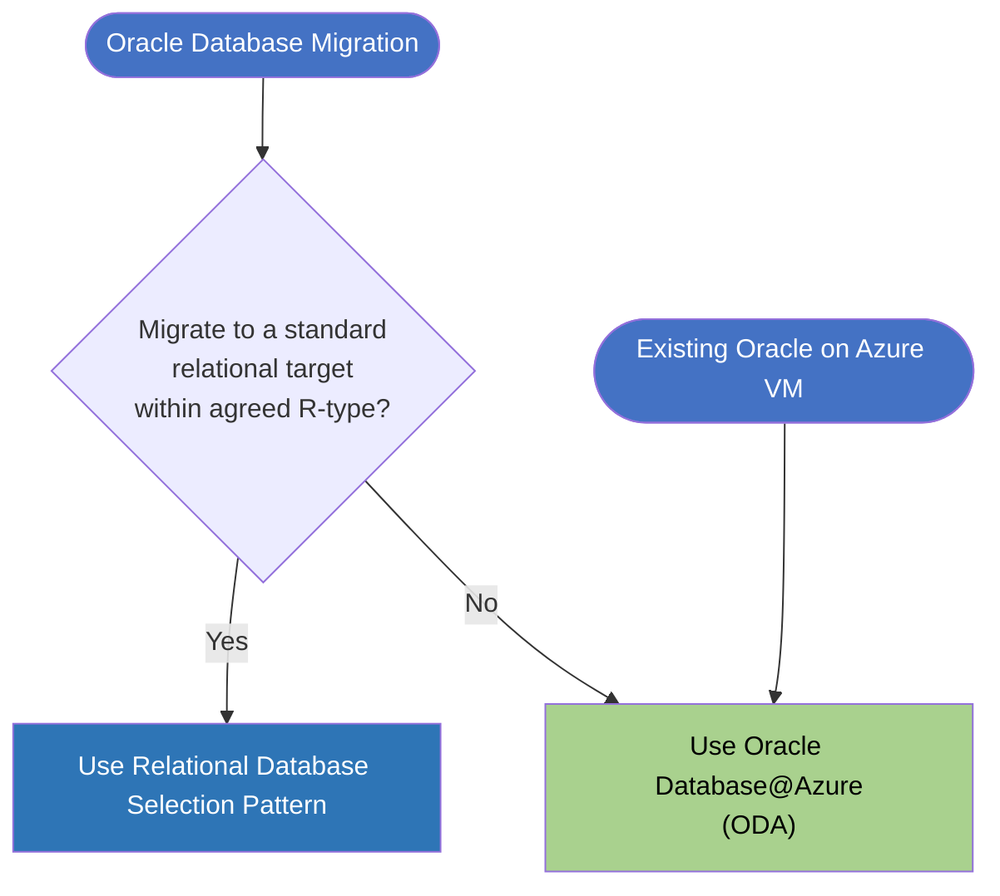

# Oracle Database Selection

## Compatibility

This pattern provides guidance for selecting an appropriate Azure target for Oracle database workloads.
It applies where migration to a
standard [Azure Relational Database](https://app.pages.dx1.lseg.com/app-51723/migration-patterns/mig-pat-source-to-target/patterns/databases/0077-relational-databases/)
target is not feasible within the application’s agreed R-type, and helps teams choose between Oracle Database@Azure
and Oracle on Azure Virtual Machines.

It builds on the internal Oracle strategy direction that teams should first consider migration to standard relational
database targets where feasible, and only retain Oracle where application, feature,
or migration constraints make that impractical.

## Recommended Targets

| Technology                             | Status    | ITC                                                                                                      | CPF |
|----------------------------------------|-----------|----------------------------------------------------------------------------------------------------------|-----|
| Oracle Database@Azure (ODA)            | Hold      | [ITC-90231](https://lseg.leanix.net/LSEGPROD/factsheet/ITComponent/14251287-aaf7-4027-86f9-b055aa3bec99) | N/A |
| Oracle on Azure Virtual Machines (OVM) | Eliminate | [ITC-90397](https://lseg.leanix.net/LSEGPROD/factsheet/ITComponent/029492ad-4369-4095-8122-0b7fbf812a64) | N/A |

Applications must migrate to
standard [Azure Relational Database](https://app.pages.dx1.lseg.com/app-51723/migration-patterns/mig-pat-source-to-target/patterns/databases/0077-relational-databases/)
choices where they are able to do so within their agreed R-type, typically refactor or rearchitect.

Where migration away from Oracle is not feasible, **Oracle Database@Azure** is the strategic Oracle target.
It provides Oracle database services colocated in Azure datacentres, integrated with Azure networking,
and tends to be a lower TCO option, approx. 15% lower vs on-prem and 42% lower vs Oracle on Azure VM.

| Feature        | Oracle Database@Azure (ODA)               | Oracle on Azure VM (OVM)                  |
|----------------|-------------------------------------------|-------------------------------------------|
| Management     | Co-managed with Cloud Automation          | Self-managed                              |
| Performance    | Optimized for high performance            | Depends on VM configuration and resources |
| Scalability    | Automatic scaling                         | Manual scale-up                           |
| Infrastructure | Oracle manages the Exadata infrastructure | Self-managed VM and storage               |
| Cost           | Pay for database service                  | Pay for compute, storage, networking      |
| Learning Curve | Easier to use, managed service            | Requires VM and Oracle DB knowledge       |

**Oracle on Azure Virtual Machines** (OVM) is no longer a tolerated option with the introduction of ODA. Application
team should migrate from OVM to ODA where possible to achieve the lower TCO and higher levels of automation.

## Decision Tree Diagram

The [IPE DB CLOUD ENG TEAM](mailto:IPE-DB-CLOUD-ENG@lseg.com) provides an assessment to help plan your workload's
migration
to ODA and covers the use of advanced features such as:

- Exadata or RAC demand
- ASM
- Database Vault
- Flashback Database
- FTP and SFTP
- Hybrid partitioned tables
- Messaging Gateway
- OEM or Cloud Control Repository
- Oracle RAC
- Real Application Security
- Real Application Testing
- Unified Auditing Pure Mode
- Workspace Manager

Use the following decision tree to determine the appropriate use of Oracle.

## Notable Differences - Oracle Database@Azure vs Oracle on Azure Virtual Machines

| Similarity | Consideration    | Oracle Database@Azure                                                                                   | Oracle on Azure Virtual Machines                                                          |
|------------|------------------|---------------------------------------------------------------------------------------------------------|-------------------------------------------------------------------------------------------|
| 🟡         | Service model    | Oracle database service running on Oracle Exadata infrastructure colocated in select LSEG Azure regions | Oracle database software deployed on Azure IaaS virtual machines in any LSEG Azure region |
| 🟡         | Management model | Co-Managed with I&C Database Team via Cloud Automation                                                  | Self-managed operating model                                                              |
| 🟡         | Infrastructure   | Oracle manages the Exadata infrastructure and offers automatic scaling                                  | You manage the VM, storage and scaling                                                    |
| 🟡         | Licensing        | Supports Bring Your Own Licence                                                                         | Deployments on VM have a 2x licence requirement                                           |

## Considerations

- Applications **MUST** migrate to standard relational targets where possible. Teams **SHOULD** only retain Oracle where
  migration
  to a standard relational database target is not feasible within the agreed R-type.
- Applications **MUST** use Oracle Database@Azure where Oracle is to be retained. This is the strategic Oracle target.
- Applications currently using Oracle on Azure VM **SHOULD** migrate to ODA wherever possible to reduce TCO.

## References

- [Database Strategy: Update to Oracle Guidance](https://lsegroup.sharepoint.com/:w:/r/teams/TechnologyStrategy-Private/Shared%20Documents/Private/2024/Oracle%20Strategy/Q1%202024%20Database%20Strategy%20Update%20-%20v0.6.docx?d=wce03b502f7784d0fba545bc29d9bcc57&csf=1&web=1&e=eLvRf1&isSPOFile=1)
- [Oracle Database@Azure](https://www.oracle.com/cloud/azure/oracle-database-at-azure/)
- [Oracle on Azure | Microsoft Learn](https://learn.microsoft.com/en-us/azure/oracle/oracle-azure-overview)
- [Oracle Database Azure - LSEG Application Engagement.pptx](https://lsegroup.sharepoint.com/:p:/r/teams/ODA/Shared%20Documents/General/Application%20Engagement/Oracle%20Database%20Azure%20-%20Application%20Comms%20Engagement.pptx?d=w05483d29863f464d91a5603fe5f98816&csf=1&web=1&e=KohO64)

