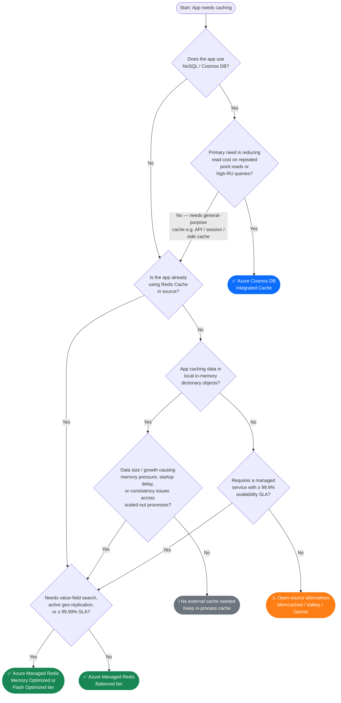

# Caching options in Azure

## Compatibility

This pattern covers general-purpose distributed caching use cases in Azure, including data cache, content cache,
 session state, and other low-latency in-memory data access scenarios.

It also covers the case where cache capability is provided within Azure Cosmos DB using the integrated cache
 on the dedicated gateway for read-heavy NoSQL workloads.

It does not cover security use cases (e.g. SIEM).

## Key Recommendation

> **Azure Managed Redis is the recommended caching solution for all new workloads in Azure.**
>
> It replaces Azure Cache for Redis, which is now on **Eliminate** and will be retired by Microsoft on September 30,
 2028 and creation of new instances blocked from October 1, 2026.
  See [Azure Cache for Redis Retirement](https://techcommunity.microsoft.com/blog/azure-managed-redis/azure-cache-for-redis-retirement-what-to-know-and-how-to-prepare/4458721)
>
>All teams should plan to adopt Azure Managed Redis for new projects and begin migrating existing
> Azure Cache for Redis instances.
>
> The only exception is when you are already running a Cosmos DB NoSQL workload with heavy repeated reads — in that case,
> use the Cosmos DB integrated cache instead.

## Recommended Target

| Technology | Status | ITC | CPF |
| ---- | ---- | ---- | ---- |
| Azure Managed Redis | **Adopt** | [ITC-93815](https://lseg.leanix.net/LSEGPROD/factsheet/ITComponent/f419ea56-1608-4e37-86f6-afaa70766109) | [CPF Azure Managed Redis Module](https://devportal.lseg.com/catalog/default/pattern/cpf-azure-prdsvc-managedredis) |
| Azure Cosmos DB integrated cache | **Adopt** | [ITC-90978](https://lseg.leanix.net/LSEGPROD/factsheet/ITComponent/feadfe01-fae9-4145-9aed-28c9de4e4929) | [Azure Cosmos DB](https://devportal.lseg.com/modules/azure-cosmos-db?filters%5Bkind%5D=CloudServiceModule) |
| Azure Cache for Redis | **Eliminate** | [ITC-90991](https://lseg.leanix.net/LSEGPROD/factsheet/ITComponent/946c5825-0fbc-4897-9c6e-acb48f088b1b) | [CPF Azure Redis Cache Module](https://devportal.lseg.com/catalog/default/pattern/cpf-azure-prdsvc-rediscache) |

- For general-purpose distributed cache requirements such as side cache, session state,
 content/API caching, and similar low-latency in-memory use cases,
  [Azure Managed Redis][azure-managed-redis] is the preferred target.
- Azure Managed Redis is the strategic replacement for Azure Cache for Redis. Microsoft recommends upgrading
 existing Azure Cache for Redis instances to Azure Managed Redis. Azure Cache for Redis will phase out by 2028.
- For workloads already using Azure Cosmos DB for NoSQL, where the main need is to reduce cost for read-heavy access patterns
 with many repeated point reads or many repeated high-RU queries, evaluate [Azure Cosmos DB integrated cache][cosmos].
  The integrated cache is part of the dedicated gateway and cache hits have zero RU charge.
- For applications that cannot adopt above technologies, [Memcached][memcached] and [Valkey][valkey] are open-source alternatives.

### R-type Guidance

- **Re-architect / Refactor:** Follow the decision tree — default to Azure Managed Redis
 (Balanced tier for general use, Memory Optimized / Flash Optimized for advanced search or geo-replication needs).
  Use Cosmos DB integrated cache only when the app already runs on Cosmos DB NoSQL with heavy repeated reads.
- **Re-host / Re-platform:** If the source app already uses Redis, migrate directly to Azure Managed Redis.
 For in-memory dictionary caches, evaluate the decision tree to determine whether externalising to Managed Redis is warranted.
  Document exceptions in the solution design.

## Decision Tree Diagram

### How to read the decision tree

| Outcome | When to choose it |
| --- | --- |
| **Azure Cosmos DB Integrated Cache** | App already uses Cosmos DB for NoSQL and the main goal is to cut cost on repeated reads / high-RU queries |
| **Azure Managed Redis — Memory Optimized / Flash Optimized** | You need search by value fields (not just key), active geo-replication across regions, or an SLA of 99.99% or higher |
| **Azure Managed Redis — Balanced** | General-purpose caching (side cache, session, API cache, message broker) without the advanced requirements above |
| **Keep in-process cache** | App uses local dictionary/object cache and there are no memory, startup, or consistency concerns across scaled-out instances |
| **Open-source alternatives (Memcached / Valkey / Garnet)** | A managed service is not required and a 99.9%+ SLA is not needed; self-hosted on VM |

## Notable Differences

| Considerations | Azure Managed Redis (Adopt) | Azure Cosmos DB integrated cache (Adopt) |
| --- | --- | --- |
| Typical Use Case | In-memory datastore/cache — side cache, session store, message broker, real-time analytics | Reduce read cost on an existing Cosmos DB NoSQL database — repeated point reads and high-RU queries |
| Client Experience | All Redis-compatible clients — .NET, Java, Node, Python, Go, Rust, C, PHP | .NET, Java, Node, Python for SQL (core) API; community SDKs for Cassandra and API for MongoDB |
| Data Models | Key-value, stream, time series, JSON, search, probabilistic data structures | Document/JSON, key-value, graph (Gremlin), column-family (Cassandra), table |
| Scale-out | Yes — clustering with automatic sharding | Yes, unlimited, instant elastic scalability |
| Throughput | 1M+ simultaneous requests | Depends on provisioned configuration |
| Data Integrity | In-memory with RDB + AOF persistence; flash-based tiers offer disk-backed durability | Data stored on disk; lossless data store by design |
| Consistency | Strong eventual consistency | Strong, bounded staleness, session, consistent prefix, or eventual |
| Key/Value Latency | Sub-millisecond | P99 under 10 ms, P50 as low as 2-3 ms |
| Active Geo-Replication | Yes — built-in active-active across regions | Multi-region writes available |
| Pricing | Tier-based (Balanced, Memory Optimized, Compute Optimized, Flash Optimized) | Provisioned Throughput (RU/s) or Serverless (pay-per-request) |
| Scaling | Tier-based, supports auto-scaling | Provisioned throughput — Manual / Autoscale / Serverless |
| Region availability | [Expanding — check latest availability][azure-managed-redis] | Available in all regions |
| SLA | Up to 99.999% | Up to 99.999%[^2] |

## In-Memory Data Dictionary to Azure Managed Redis

When the decision tree leads from "App caching data in local in-memory dictionary objects" to Azure Managed Redis,
 use the table below to understand the migration trade-offs.

| **Considerations** | **In-memory data dictionary** | **Azure Managed Redis — Balanced tier** | **Azure Managed Redis — Memory Optimized / Flash Optimized tier** |
| --- | --- | --- | --- |
| Cost | n/a | By tier and size | By tier and size |
| Availability | n/a | 99.9% | 99.99% (up to 99.999% with active geo-replication) |
| Memory | 2 GB maximum object size | Up to 1.2 TB | Up to 13 TB+ (flash-backed) |
| Cache Coherence | Must be maintained by application logic | Single highly available cache ensures a consistent view of cached data | Same |
| Searchable by Data content | Yes, with LINQ | Yes, with Redis Search | Yes, with Redis Search |
| Programming Model | Data Dictionary of application language | Redis client / RedisOM | Redis client / RedisOM |

## Considerations

### Azure Managed Redis

Azure Managed Redis is the next generation of Azure Cache for Redis.
 It is fully managed by Microsoft and offers all the capabilities of the previous Enterprise tier plus additional improvements:

- All data types — Lists, Sets, Hashes, Sorted Sets, HyperLogLogs, Streams, Geospatial
- Lua scripting
- Built-in search (RediSearch) and vector search capabilities
- Bloom, Cuckoo, count-min sketch, and Top-K probabilistic filters
- Time series functionality
- Native JSON support
- Active geo-replication for multi-region high availability
- Flash-optimized tiers for large datasets at reduced cost
- Seamless upgrade path from Azure Cache for Redis Enterprise

### Azure Cache for Redis (Eliminate)

> **This service is on Eliminate.** No new instances should be provisioned or will be possible to be
 provisioned from October 1, 2026.
> Existing instances should plan migration to Azure Managed Redis before 2028.

- Useful data types including Lists, Sets, Hashes, Sorted Sets, HyperLogLogs, Streams, and Geospatial
- Lua scripting
- Search functionality with RediSearch[^1]
- Bloom, Cuckoo, count-min sketch, and Top-K filters with RedisBloom[^1]
- Time series functionality with RedisTimeSeries[^1]
- Handle JSON formatted data with RedisJSON[^1]

### In-memory Data Dictionary to Azure Managed Redis

Redis cache is a highly scalable low-latency in-memory cache for key-value data provided as a service within Azure. An
external Redis cache supports cloud-friendly application architecture in a number of ways:

- External Redis cache can be shared by a variable number of client processes allowing logic to be elastically scaled
- Single source of cached data eases data management as any data changes need only be
  made in a single place
- Redis caches are scalable up to terabyte scale, allowing cached data volume to grow without
  impacting application logic footprint
- Redis caches can be persistent, recovering quickly from infrastructure failures without
  needing to be repopulated from source systems
- Redis caches can be up to 99.999% available, minimising downtime
- Using a remote data cache imposes a requirement for external connectivity on application
  services, adding extra elements to their provisioning and observability needs

### Azure Cosmos DB

- Integrated cache that lowers database operations costs in SQL (core) API
- Single-digit latency SLA for reads and writes
- SQL, API for MongoDB, Gremlin, Cassandra, and Table APIs
- Azure Synapse Link for HTAP capability
- Automated global distribution

## Alternatives

- **Memcached**: [Memcached][memcached] is an open-source, high-performance, distributed memory
  object caching system intended for speeding up dynamic web applications by alleviating database load.
  Memcached is an in-memory key-value store for small chunks of arbitrary data (strings, objects)
  from results of database calls, API calls, or page rendering.
- **Valkey**: [Valkey][valkey] is an open-source (BSD) high-performance key/value datastore.
  It supports a variety of workloads such as caching, message queues, and can act as a primary database.
  Valkey can run as either a standalone daemon or in a cluster, with options for replication and high availability.
- **Garnet**: [Garnet][garnet] is a remote cache store from Microsoft Research, MIT
  licensed open source. The Garnet server is written in modern .NET C# and runs efficiently on almost any platform.
  It works equally well on Windows and Linux. There is no compelling marketplace option.

[^1]: Available in the Enterprise tiers of Azure Cache for Redis only
[^2]: With multi-region writes; otherwise 99.99% availability

[azure-managed-redis]: https://learn.microsoft.com/en-us/azure/redis/

[cosmos]: https://learn.microsoft.com/en-us/azure/cosmos-db/integrated-cache

[redis-scaling](https://learn.microsoft.com/en-us/azure/azure-cache-for-redis/cache-best-practices-scale)

[azure-redis-regions](https://learn.microsoft.com/en-us/azure/azure-cache-for-redis/cache-overview#availability-by-region)

[valkey]: https://valkey.io/

[garnet]: https://microsoft.github.io/garnet/

[memcached]: https://memcached.org

