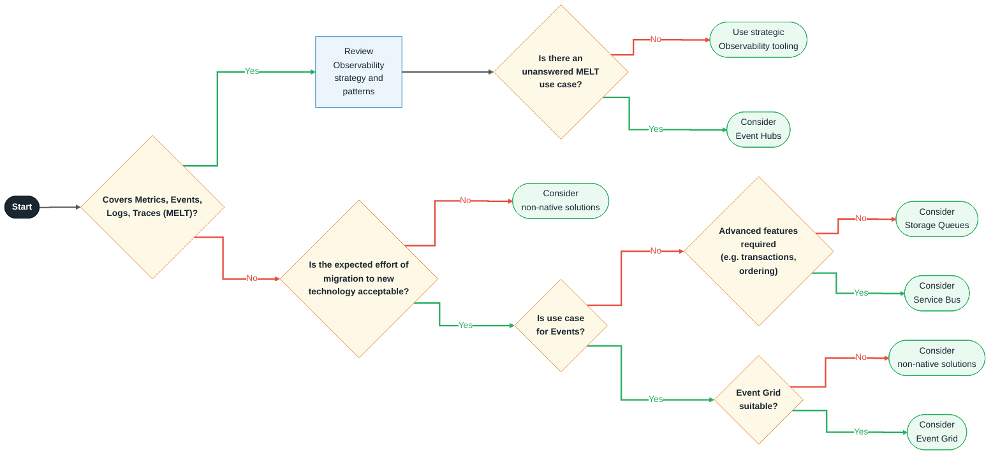

# Messaging & Event Distribution

General principles for selecting Messaging technology in Azure are:
**Use Azure managed services / PaaS where possible**
**Avoid technologies that involve 3rd party licensing where possible**

If considering app migrations from on-premise or other CSPs, the R-type could be a limiting factor in terms of
abiding by these principles. E.g. with lower R-types (Re-Host, Re-Platform), it may not be possible to modify
application code away from existing technologies. With higher R-Types (Re-Factor, Re-Architect), it is expected
that principles can be followed.

- **Re-architect / Refactor** → use Azure-managed PaaS services (**Event Hubs**, **Event Grid**, **Service Bus**,
  **Queue Storage**) for reduced ops overhead and cloud-native alignment.
- **Re-host / Re-platform** → non-managed platforms (**RabbitMQ**, **Kafka**, **TIBCO** on VMs or AKS) are acceptable
  where lift-and-shift speed takes priority over modernisation.

## Compatibility

The advice in this pattern pertains to the use of messaging and event distribution solutions, including TIBCO
Rendezvous.

## Recommended Targets

As with other technology selections, guidance is towards Azure-native services if there is appetite for adoption of
newer technology.

In this case, recommendations are:

| Technology          | Status | ITC                    | CPF Module                                                       |
|---------------------|--------|------------------------|------------------------------------------------------------------|
| Azure Event Hub     | Adopt  | [ITC-91004][ITC-91004] | [Azure Event Hub CPF Module][Azure Event Hub CPF Module]         |
| Azure Event Grid    | Adopt  | [ITC-91553][ITC-91553] | [Azure Event Grid CPF Module][Azure Event Grid CPF Module]       |
| Azure Service Bus   | Adopt  | [ITC-90995][ITC-90995] | [Azure Service Bus CPF Module][Azure Service Bus CPF Module]     |
| Azure Queue Storage | Adopt  | [ITC-91689][ITC-91689] | [Azure Queue Storage CPF Module][Azure Queue Storage CPF Module] |

## Decision Tree Diagram

---

### Legend

| Colour | Meaning |
| ------ | ------- |
| 🟢 Green arrow | **Yes** path |
| 🔴 Red arrow | **No** path |
| 🟡 Diamond | Decision point |
| 🔵 Rectangle | Process / Action step |
| ⬛ Pill (dark) | Start / Exit |
| 🟩 Pill (green) | Recommended outcome / Technology choice |

## Notable Differences

| Similarity |                                | Event Hubs                          | Queue Storage                           | Service Bus                                  | Event Grid                                      |
|------------|--------------------------------|-------------------------------------|-----------------------------------------|----------------------------------------------|-------------------------------------------------|
| 🟢         | **Consumer**                   | Pub/Sub                             | Polling                                 | Polling and "push-style API"[^3]             | Pub/Sub                                         |
| 🟡         | **Protocols**                  | Kafka, AMQP, HTTP                   | HTTP                                    | HTTP, AMQP 1.0                               | HTTP/MQTT                                       |
| 🔴         | **Retention**                  | 90 days, 1TB/CU                     | 500 TB (single Storage Account)         | 1 GB to 80 GB                                | 7 day retention                                 |
| 🟡         | **Message Size**               | 1 MB (Premium)                      | 64 KB (<=200 GB if combined with Blobs) | 256 KB (100 MB with 'large message support') | 512 KB                                          |
| 🟡         | **Queue/Topic/Partition Size** | 5GB-80GB, 10k/ns                    | Unlimited                               | 10,000 topics/queues per namespace           | 100 namespace topics per TU                     |
| 🟡         | **Number of clients**          | 5,000 (AMQP)/ns                     | Unlimited                               | 5,000 concurrent receive requests            | 10,000 sessions per TU                          |
| 🟡         | **Achievable Bandwidth**       | Per Capacity Unit                   | 2,000 messages/sec/queue (1KB messages) | Per Messaging Unit                           | 1,000 messages per second per TU (inbound MQTT) |
| 🟢         | **Delivery guarantee**         | At least once                       | At least once                           | At least once or at most once                | At least once                                   |
| 🟢         | **Transactions**               | No                                  | No                                      | Yes                                          | No                                              |
| 🔴         | **Ordering**                   | Per Partition                       | No                                      | FIFO                                         | No                                              |
| 🟡         | **Tiers/Cost**                 | Basic, Standard, Premium, Dedicated | By Capacity, Redundancy & Operations    | Basic, Standard, Premium (MUs, Partitions)   | Basic, Standard (TUs)                           |
| -          | **Additional Features**        | -                                   | -                                       | Duplicate detection, state management        | -                                               |

## Considerations

### Use of TIBCO Rendezvous

TIBCO Rendezvous is supported[^2] on virtualised and public cloud environments, provided operating system and capacity
requirements are suitable, and **provided multicast/broadcast features are not being used**.

Provided those characteristics are met, TIBCO Rendezvous should be retained in two specific cases:
R-Type: if the application's R-Type is Re-host or Re-platform and the migration scope does not justify the
effort of re-integrating with an Azure-native messaging service;
Client Facing Apps with Tibco: if client-facing or external applications depend on TIBCO as their messaging
interface, and migrating to Azure messaging would disrupt those consumers in ways outside the team's control.

Outside of these two cases — particularly for Refactor or Re-architect workloads with no external TIBCO
dependencies — teams should plan a migration to an appropriate Azure-managed messaging service and establish a
clear decommission timeline for the TIBCO dependency.

### Choice of Azure Native Service

As with other technology choices, consider whether a managed Azure service is beneficial (considering the operational
impact of running bespoke software on IaaS including software and OS installation, upgrades, patching, threat
management, etc.).

Azure-native services can be difficult to differentiate. See the table that follows for the key differences[^3].

> Note that the Azure documentation uses the terms "commands" and "events"[^1] to help differentiate services:
>
> - If the producer expects an action from the consumer, that message is a _command_
> - If the message informs the consumer that an action has taken place, then the message is an _event_.

| Service           | Purpose                         | Strapline                                                      | Type                                 | When to use                                 |
|-------------------|---------------------------------|----------------------------------------------------------------|--------------------------------------|---------------------------------------------|
| **Event Hubs**    | Big data pipeline               | _Receive telemetry from millions of devices_[^6]               | Event streaming (series)             | Telemetry and distributed data streaming    |
| **Queue Storage** | Large volumes of messages       | _Durable queues for large-volume cloud services_[^8]           | Message                              | Basic functionality, large volumes          |
| **Service Bus**   | High-value enterprise messaging | _For high-value messages that can't be lost or duplicated_[^7] | Message                              | Order processing and financial transactions |
| **Event Grid**    | Reactive programming            | _Reliable event delivery at massive scale_[^5]                 | Event distribution (discrete events) | React to status changes                     |

> Note: For most telemetry use cases, Datadog is preferred over Event Hubs
>
> LSEG's strategic observability platform is Datadog[^9]. Use of Event Hubs for application telemetry
> would be discouraged, although Event Hubs may be a viable option for telemetry in cases where application
> functionality is impacted by the data appearing in telemetry logs.

## Alternatives

In cases where Azure-native technology is unsuitable, many third party options are available only if R-Type is
either Re-Host or Re-Platform OR client-facing or external applications depend on TIBCO as their messaging interface,
including:
**Note: We prefer open source options over 3rd party licensed messaging solutions.**

- RabbitMQ **(Hold)**
- Kafka **(Hold)**
- Nats & Nats **(Hold)**
- JetStream **(Hold)**
- Pulsar **(Decomission)**
- Redis Stream & pub-sub **(Hold)**
- Solace VMR **(Hold)**
- Solace Appliance **(Eliminate)**
- Aeron (Brokerless) **(Eliminate)**
- ZeroMQ (end of life) **(Hold)**

A summary, driven by internal research[^11], is as follows:

<!-- markdownlint-disable MD013 MD060 -->

|                                            | RabbitMQ **(Hold)**                                                                                                                                                   | Nats & Nats **(Hold)** JetStream **(Hold)**                                                                                       | Kafka **(Hold)**                                       | Pulsar  **(Hold)**                                                                                                | Redis Stream & pub-sub **(Hold)**| Solace VMR **(Eliminate)**| Solace Appliance **(Eliminate)**| Aeron (Brokerless) **(Eliminate)**|
|--------------------------------------------|-------------------------------------------------------------------------------------------------------------------------------------------------------------|--------------------------------------------------------------------------------------------------------------|---------------------------------------------|----------------------------------------------------------------------------------------------------------|------------------------|------------|------------------|--------------------|
| **Consumer**                               | Push                                                                                                                                                        | Push, Pull                                                                                                   | Pull                                        | Push                                                                                                    | -                      | Push       | -                | -                  |
| **Complexity**                             | Medium                                                                                                                                                      | Medium                                                                                                       | Medium/Hard                                 | Medium/High                                                                                             | Simplest               | -          | -                | Highest            |
| **Cost of Running**                        | -                                                                                                                                                           | -                                                                                                            | Medium                                      | Low/Medium                                                                                              | High                   | -          | -                | -                  |
| **Maintainability** (admin/monitoring)  | Medium                                                                                                                                                      | -                                                                                                            | Medium/High                                 | Medium/High                                                                                             | Medium                 | -          | -                | -                  |
| **Community** (1 = highest, 3 = lowest) | 1                                                                                                                                                           | -                                                                                                            | 1                                           | 1                                                                                                       | 2                      | 3          | N/A              | 3                  |
|                                            |                                                                                                                                                             |                                                                                                              |                                             |                                                                                                         |                        |            |                  |                    |
| **FEATURES**                               |                                                                                                                                                             |                                                                                                              |                                             |                                                                                                         |                        |            |                  |                    |
| **Stream Processing**                      | &cross;                                                                                                                                                     | &cross;                                                                                                      | &check;                                     | &check;                                                                                                 | -                      | -          | -                | -                  |
| **Durability**                             | &check;                                                                                                                                                     | &cross;                                                                                                      | &check;                                     | &check; (Retention policy configurable per group of Topics)                                             | -                      | -          | -                | -                  |
| **Message Replay**                         | &cross;                                                                                                                                                     | &check;                                                                                                      | &check;                                     | &check;                                                                                                 | -                      | -          | -                | -                  |
| **Delivery Guarantee**                     | At most, least once                                                                                                                                         | At most once, at least once, exactly once                                                                    | At most once, at least once, exactly once   | At most once, at least once, exactly once                                                               | -                      | -          | -                | -                  |
| **Order of Delivery**                      | Guaranteed out-of-the-box                                                                                                                                   | Not guaranteed                                                                                               | Guaranteed only per partition               | Guaranteed (per message key or per producer)                                                            | -                      | -          | -                | -                  |
| **Schema Registry**                        | &cross;                                                                                                                                                     | &cross;                                                                                                      | &check;                                     | &check;                                                                                                 | -                      | -          | -                | -                  |
|                                            |                                                                                                                                                             |                                                                                                              |                                             |                                                                                                         |                        |            |                  |                    |
| **MESSAGING PATTERN**                      |                                                                                                                                                             |                                                                                                              |                                             |                                                                                                         |                        |            |                  |                    |
| **Point-to-point**                         | &check;                                                                                                                                                     | &check;                                                                                                      | &cross;                                     | &check;                                                                                                 | &check; (Exclusive)    | -          | -                | -                  |
| **Pub-sub**                                | &check;                                                                                                                                                     | &check;                                                                                                      | &check;                                     | &check;                                                                                                 | &check; (Shared)       | -          | -                | -                  |
| **Req-Reply**                              | &check;                                                                                                                                                     | &check;                                                                                                      | &cross;                                     | &cross;                                                                                                 | -                      | -          | -                | -                  |
| **Built-in Routing functionality**         | &check;                                                                                                                                                     | &cross;                                                                                                      | &cross;                                     | &cross;                                                                                                 | -                      | -          | -                | -                  |
| **Advanced Patterns**                      | Most extensive support for advanced patterns and routing support  It has pluggable exchange type support that can be used to implement complex patterns. | load-balanced queue subscriber patterns    Dynamic request permissioning   request subject obfuscation | Topic partitioning for parallel consumption | Topic partitioning for parallel consumption   Retry and Dead Letter topics   Serverless Functions | -                      | -          | -                | -                  |

<!-- markdownlint-enable MD013 MD060 -->

## Further Reading

### Kafka

- [Apache Kafka migration to Azure - Azure Architecture Center | Microsoft Learn](https://learn.microsoft.com/en-us/azure/architecture/guide/hadoop/apache-kafka-migration)
- [Migrate Kafka to Azure infrastructure as a service (IaaS)](https://learn.microsoft.com/en-us/azure/architecture/guide/hadoop/apache-kafka-migration#migrate-kafka-to-azure-infrastructure-as-a-service-iaas)
- [Migrate Kafka to Azure Event Hubs for Kafka](https://learn.microsoft.com/en-us/azure/architecture/guide/hadoop/apache-kafka-migration#migrate-kafka-to-azure-event-hubs-for-kafka)
- [Migrate Kafka on Azure HDInsight](https://learn.microsoft.com/en-us/azure/architecture/guide/hadoop/apache-kafka-migration#migrate-kafka-on-azure-hdinsight)
- [Use AKS with Kafka on HDInsight](https://learn.microsoft.com/en-us/azure/architecture/guide/hadoop/apache-kafka-migration#use-aks-with-kafka-on-hdinsight)

### RabbitMQ

- [Integration options for RabbitMQ with Azure Service Bus](https://learn.microsoft.com/en-us/azure/service-bus-messaging/service-bus-integrate-with-rabbitmq)
- [Migrating/Displacing the transport to Service Bus from RabbitMQ](https://programmingwithwolfgang.com/replace-rabbitmq-azure-service-bus-queue/)
- [RabbitMQ Server on Windows Server on Marketplace](https://cloudinfrastructureservices.co.uk/how-to-setup-rabbitmq-on-windows-server-in-azure-aws-gcp/)

### TIBCO Enterprise Message Service on Azure Marketplace

- [TIBCO Enterprise Message Service on Azure Marketplace](https://portal.azure.com/#view/Microsoft_Azure_Marketplace/GalleryItemDetailsBladeNopdl/id/tibco-software.enterprise-message-service/selectionMode~/false/resourceGroupId//resourceGroupLocation//dontDiscardJourney~/false/selectedMenuId/home/launchingContext~/%7B%22galleryItemId%22%3A%22tibco-software.enterprise-message-serviceems840-linux-template%22%2C%22source%22%3A%5B%22GalleryFeaturedMenuItemPart%22%2C%22VirtualizedTileDetails%22%5D%2C%22menuItemId%22%3A%22home%22%2C%22subMenuItemId%22%3A%22Search%20results%22%2C%22telemetryId%22%3A%22db9d9015-e384-4300-964a-46234f46c385%22%7D/searchTelemetryId/cf970bc2-8af4-490c-8271-966a7f9f5d4d)

### Azure Relay

- **Azure Relay**[^10] - "Securely expose services that run in your corporate network without opening a port on your
  firewall, or making intrusive changes to your corporate network infrastructure." Can be used in conjunction with
  Service Bus

[^1]: [Asynchronous messaging options - Azure Architecture Center](https://learn.microsoft.com/en-us/azure/architecture/guide/technology-choices/messaging)
[^2]: [TIBCO Support Guide](https://docs.tibco.com/pub/tibco-support-guide/html/Default.htm?_ga=2.102578753.1338020770.1681169651-862170277.1636594297#virtualized-and-public-cloud-environment-support.htm?TocPath=Support%2520Policies%257C_____4)
[^3]: [Compare Messaging Services](https://learn.microsoft.com/en-us/azure/service-bus-messaging/compare-messaging-services)
[^5]: [Event Grid Overview](https://learn.microsoft.com/en-us/azure/event-grid/overview)
[^6]: [Event Hubs Overview](https://learn.microsoft.com/en-us/azure/event-hubs/)
[^7]: [Service Bus Overview](https://learn.microsoft.com/en-us/azure/service-bus-messaging/service-bus-messaging-overview)
[^8]: [Storage Queues Introduction](https://learn.microsoft.com/en-gb/azure/storage/queues/storage-queues-introduction)
[^9]: [ADR: Use Datadog SaaS for Application & Resource monitoring](../../adrs/event-management/0003-use-datadog-for-application-and-resource-monitoring.md)
[^10]: [Azure Relay Overview](https://learn.microsoft.com/en-us/azure/azure-relay)
[^11]: [Messaging Technology Benchmarking](https://confluence.refinitiv.com/pages/viewpage.action?pageId=1057639104)

[ITC-91004]: https://lseg.leanix.net/lsegprod/factsheet/ITComponent/bb1fd661-e287-4e2a-b9cc-20308ff26f22
[ITC-91553]: https://lseg.leanix.net/lsegprod/factsheet/ITComponent/75e80b9b-1804-4e58-9d6e-1f902b9bcfad
[ITC-90995]: https://lseg.leanix.net/lsegprod/factsheet/ITComponent/94376758-39cb-413e-90b4-03ab62151b92
[ITC-91689]: https://lseg.leanix.net/lsegprod/factsheet/ITComponent/0a0e7d10-3fb6-4570-a21d-920eeb1ee744
[Azure Event Hub CPF Module]: https://devportal.lseg.com/modules/azure-event-hubs?filters%5Bkind%5D=CloudServiceModule
[Azure Event Grid CPF Module]: https://devportal.lseg.com/modules/azure-event-grid?filters%5Bkind%5D=CloudServiceModule
[Azure Service Bus CPF Module]: https://devportal.lseg.com/modules/azure-service-bus?filters%5Bkind%5D=CloudServiceModule
[Azure Queue Storage CPF Module]: https://devportal.lseg.com/modules/azure-storage?filters%5Bkind%5D=CloudServiceModule

