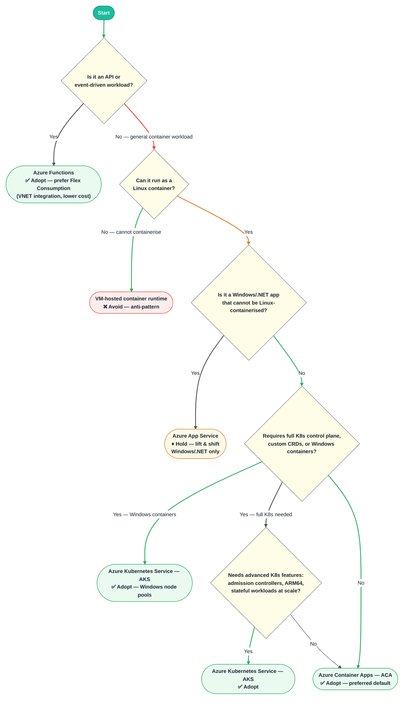

# Azure Container Platform Selection

## Compatibility

This advice pertains to the choice of container platform target in Azure, driven by agreements between D&A Engineering
architecture, LMP architecture, CPE architecture, LSEG Procurement and Cyber Security.

## Recommended Target

| Technology                       | Status | ITC                    | CPF Module                |
|----------------------------------|--------|------------------------|---------------------------|
| Azure Container Apps             | Adopt  | [ITC-91617][ITC-91617] | [ACA CPF Module]          |
| Azure Kubernetes Service (AKS)   | Adopt  | [ITC-90058][ITC-90058] | [AKS CPF Module]          |
| Azure App Service                | Hold   | [ITC-90974][ITC-90974] | [App Service CPF Module]  |

Azure Container Apps (ACA) is the **preferred default** for containerised workloads due to lower OPEX, simpler
operations, and cloud-native PaaS design. AKS is recommended where full Kubernetes control plane access or Windows
container node pools are required. Azure App Service is acceptable only for lift-and-shift Windows/.NET workloads
that cannot be Linux-containerised. Hosting container runtimes on VMs is an anti-pattern and should be avoided.
Azure Functions (especially Flex Consumption) is a strong contender for APIs and event-driven workloads.

## Decision Tree Diagram

As a starting point, review the *Choose an Azure compute service* decision tree in
the [public Azure documentation](https://learn.microsoft.com/en-us/azure/architecture/guide/technology-choices/compute-decision-tree).
It helps delineate what is available in Azure for container orchestration, serverless containers, and managed compute.

## Container Platform Selection — AKS · ACA · App Service · Functions

---

### Recommendation Summary

| Platform | Status | Best For |
| -------- | ------ | -------- |
| **Azure Container Apps (ACA)** | ✅ **Adopt** | **Preferred default** for containerised Linux workloads — lower OPEX, simpler operations, cloud-native PaaS, direct compete to App Service + Linux |
| **Azure Kubernetes Service (AKS)** | ✅ **Adopt** | Windows containers (Windows node pools), full K8s control plane, custom CRDs, advanced node pools, ARM64, stateful workloads at scale |
| **Azure Functions** | ✅ **Adopt** | APIs and event-driven workloads — prefer **Flex Consumption** for VNET integration and lower cost over Elastic Premium |
| **Azure App Service** | ⏸ **Hold** | Lift-and-shift Windows/.NET workloads that **cannot** be Linux-containerised — simpler and less costly than VMs or Windows Containers + AKS |
| **VM-hosted container runtime** | ❌ **Avoid** | General anti-pattern — minimise lift-and-shift to VM targets; use ACA or AKS instead |

---

### Key Characteristics

#### ✅ ACA — Adopt (Preferred Default)

- Cloud-native PaaS built from the ground up — direct compete to App Service + Linux
- Lower OPEX and simpler to configure, use and maintain compared to AKS
- Built-in KEDA for event-driven autoscaling and scale-to-zero
- Supports both dedicated and consumption billing plans
- Linux containers only — no Windows container support
- No access to control plane; limited K8s API surface
- Not cleared for highly restricted data classifications

#### ✅ AKS — Adopt

- You manage the platform (with CET support available)
- Full access to Kubernetes control plane and K8s API
- **Windows node pools** — the correct target for Windows containers (hosting container runtime on a VM is an anti-pattern)
- Supports ARM64 and advanced node pool configurations
- Admission controllers and full security policies
- Cleared for any data classification
- Rich extension ecosystem (Helm, Operators, custom CRDs)
- Higher OPEX and operational complexity than ACA — use where ACA's constraints are a blocker

#### ✅ Azure Functions — Adopt

- Strong contender for APIs and event-driven APIs in particular
- **Flex Consumption** plan recommended: includes VNET integration and is lower cost than Elastic Premium (subject to limits)
- Serverless model — pay per execution, scale-to-zero by default
- Simpler operational model than container-based approaches for function-style workloads

#### ⏸ Azure App Service — Hold

- Acceptable only for **lift-and-shift Windows/.NET workloads** that cannot be Linux-containerised
- Less costly and simpler than VM hosting or Windows Containers + AKS for these specific scenarios
- Does **not** support ARM64
- Not recommended for Linux container workloads — ACA is the better fit
- No admission controller or advanced security policy enforcement
- Not recommended for new greenfield builds
- Existing workloads may remain until migration is feasible

#### ❌ VM-hosted container runtime — Avoid

- Hosting a container runtime on a VM is a general anti-pattern
- Significantly higher operational overhead with no meaningful benefit over ACA or AKS
- Minimise lift-and-shift to VM targets; containerise to ACA or AKS instead

---

### Legend

| Colour | Meaning |
| ------ | ------- |
| 🟢 Green arrow | **Yes** — proceed or recommended path |
| 🔴 Red arrow | **No** — continue evaluation |
| 🟠 Amber arrow | **Yes** → Hold outcome (caution path) |
| 🟡 Diamond | Decision point |
| � Pill (green) | **Adopt** — recommended platform |
| 🟨 Pill (amber) | **Hold** — existing workloads only |
| 🟥 Pill (red) | **Avoid** — anti-pattern |

## Notable Differences

| | Azure Container Apps (ACA) | Azure Kubernetes Service (AKS) | Azure App Service |
| --- | --- | --- | --- |
| **Cost** | Consumption plan: pay per vCPU-second and per GiB-second, and HTTP requests. Dedicated plan: billed for allocated instances per workload profile, regardless of activity. | Control plane pricing depends on tier (Free, Standard, Premium). Worker nodes billed as VMs. | Pay per App Service Plan tier (Basic, Standard, Premium, Isolated). Pricing based on instance size and count, not per request. |
| **Memory** | 8-880GiB | Depends on VM size selected in node pools; Most Azure instance types supported | Depends on App Service Plan tier and VM size; higher tiers provide significantly more memory. |
| **Scaling** | Fully serverless scaling using KEDA. Supports HTTP, event‑driven, CPU, memory, and custom scalers | Horizontal Pod Autoscaler (HPA) for application pods, Cluster Autoscaler for node scaling. Scale-to-Zero using KEDA. | Automatic scaling based on metrics like CPU/Memory or scheduled auto-scale (horizontal scale out). |
| **Storage** | Container-scoped storage, or Azure Files for more durable storage | AKS CSI driver available to provision AKS persistent storage. Azure Container Storage also available for more rapid provisioning | Local disk storage (ephemeral). Azure Files or Azure Blob for persistent storage via mounted storage |
| **Operating Systems** | Linux only | Linux or Windows | Linux or Windows |
| **Management** | Azure manages underlying infrastructure | Azure manages OS & cluster upgrades. K8s API exposed to application | Fully managed PaaS. Azure manages OS patching, load balancing, and infrastructure |
| **Underlying Infrastructure** | Limited control | High control | No control |
| **Monitoring Agents** | None or limited integration (sidecars) | Agents installed as daemonsets | Built-in Azure Monitor and Application Insights integration |
| **Security** | Managed/Serverless Security - Limited | Full Control Security - Security Policies, Admission Controller, RBAC | Managed Platform Security: Managed TLS, authentication/authorization, network restrictions. Limited compared to AKS |
| **Patching Lifecycle** | Managed by provider | Managed by provider, can be automated or manually done by end-user | Managed by provider |

## Considerations

- **Preferred default — ACA over App Service for Linux workloads**: Azure Container Apps is built from the ground
  up as cloud-native PaaS and is a direct compete to App Service + Linux. For most containerised Linux workloads,
  ACA is the preferred target due to lower OPEX, simpler operations, and better cloud-native alignment.
- **Windows containers — AKS only**: For workloads requiring Windows containers, AKS with Windows node pools is
  the correct target. Hosting a container runtime on a VM is a general anti-pattern and should be avoided.
- **App Service — narrow use case**: App Service remains acceptable only for lift-and-shift Windows/.NET workloads
  that cannot be Linux-containerised. It is simpler and less costly than VM hosting or Windows Containers + AKS for
  these specific scenarios. It is on Hold for new greenfield adoption.
- **Azure Functions for event-driven workloads**: Functions is a strong contender for APIs and particularly
  event-driven APIs. Flex Consumption is the preferred plan as it includes VNET integration and is lower cost than
  Elastic Premium (subject to per-plan limits).
- **Minimise VM targets**: Lift-and-shift to VM-hosted workloads should be minimised. Containerise to ACA or AKS
  where possible.
- **Kubernetes API**: Some applications take full advantage of the Kubernetes API. AKS provides a platform that
  exposes the Kubernetes API, whereas Azure Container Apps (whilst Kubernetes-based underneath) does not expose
  a Kubernetes API. Only use AKS where this control plane access is genuinely required.
- **Processor Architecture**: If `arm64` architecture is required, AKS is the recommended choice.

## Further Reading

- [Containerisation Platform Strategy](https://lsegroup.sharepoint.com/:w:/r/teams/CloudDevOpsArchitectureOrganisation/Shared%20Documents/Strategies/Container%20Strategy/Containerisation%20Platform%20Strategy.docx)
- [Azure Kubernetes Service](https://azure.microsoft.com/en-gb/products/kubernetes-service)
- [Azure Container Apps](https://azure.microsoft.com/en-gb/products/container-apps)
- [Cloud Product Framework: Azure Kubernetes Service](https://gitlab.dx1.lseg.com/app/app-51310/azure/prdsvc/terraform/azure-prdsvc-terraform-kubernetescluster)
- [Cloud Product Framework: Azure Container App](https://gitlab.dx1.lseg.com/app/app-51310/azure/prdsvc/terraform/azure-prdsvc-terraform-containerapp)

[ITC-91617]: https://lseg.leanix.net/lsegprod/factsheet/ITComponent/14a6eacb-2ca8-4ef9-8c43-0acc841211a4
[ITC-90058]: https://lseg.leanix.net/lsegprod/factsheet/ITComponent/f22bf105-e0e0-4f67-bfdb-6ff2dcb07a65
[ITC-90974]: https://lseg.leanix.net/lsegprod/factsheet/ITComponent/0ad5aca6-541d-4977-a89e-f84238926c14
[ACA CPF Module]: https://devportal.lseg.com/modules/azure-container-apps?filters%5Bkind%5D=CloudServiceModule
[AKS CPF Module]: https://devportal.lseg.com/modules/azure-kubernetes-service-aks?filters%5Bkind%5D=CloudServiceModule
[App Service CPF Module]: https://devportal.lseg.com/modules/azure-app-service?filters%5Bkind%5D=CloudServiceModule

