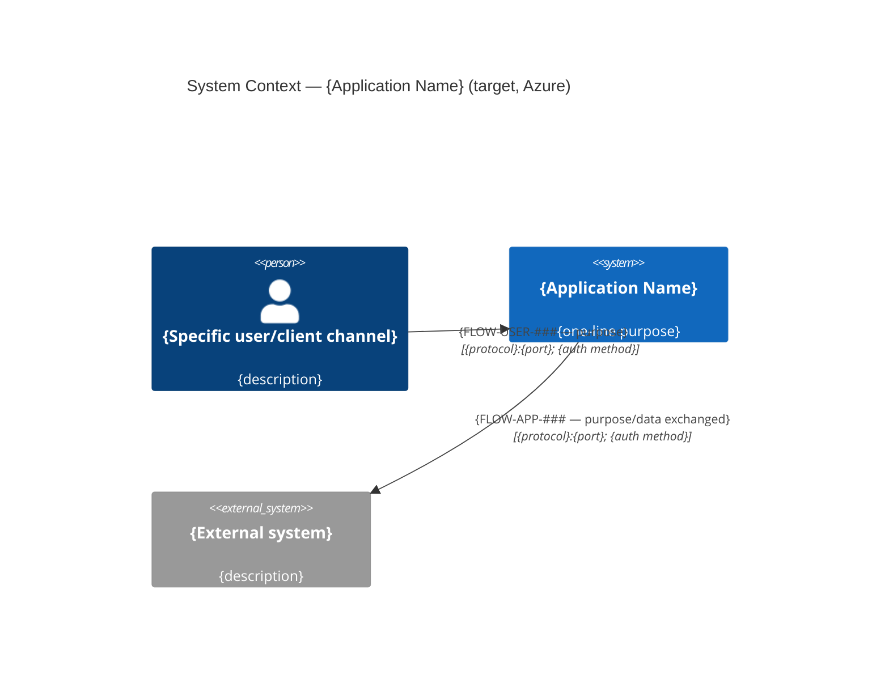
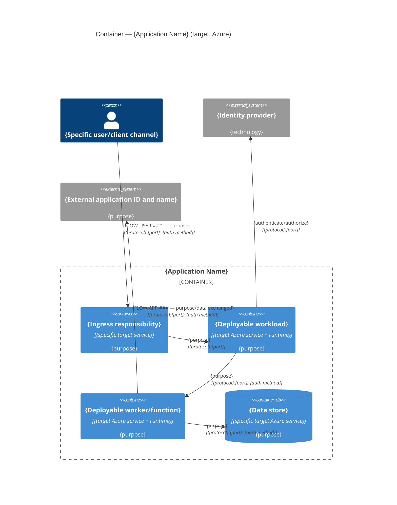
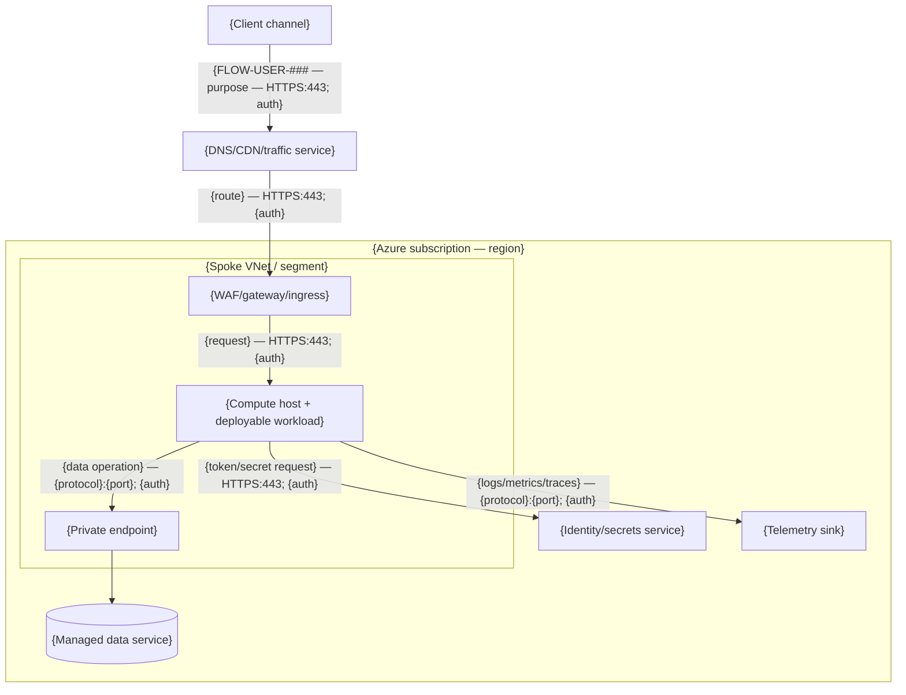
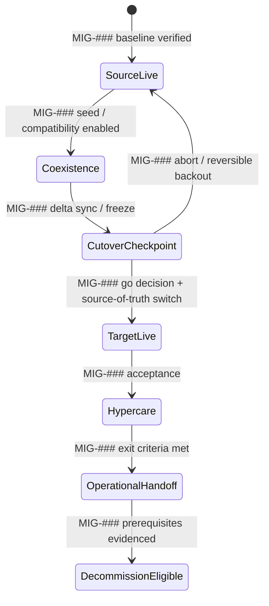

# Target Architecture: {Application Name}

**Feature branch**: `{###-app-slug}` | **Date**: {YYYY-MM-DD} | **Status**: Draft
**Application**: {Application Name} ({APP-ID})
**Authors**: {names/roles} | **Contributors**: {name — material contribution, or `None`}

> Write this as a design brief for a senior architecture review: factual, concise, and traceable. First design the least-change application architecture that satisfies every approved REQ/NFR and applicable LSEG ADR, pattern, MEC control, and resiliency obligation. Derive the R-Type only after the complete design exposes the changes required; never choose or constrain the design to fit a preferred R-Type. This document is the source of truth for the approved target architecture; downstream documents cite it rather than re-deriving it. As-is/business facts only the app team can supply stay `UNKNOWN` when unsupplied, but every target-design field (region/SKU choice, sizing, security control, resiliency parameter, cost estimate) is a judgment call this document exists to propose — draft a specific `Proposed` value with rationale and confidence level (`High`/`Medium`/`Low`) before recording `UNKNOWN` for it (Constitution Principle IV).

## Input Sources

List every source used, so every claim below is traceable (Constitution Principle IV).
For Word, Excel, PDF, image, diagram, or other non-Markdown sources, use an applicable existing
workspace or installed skill/tool before attempting custom extraction or analysis. If no suitable
capability is available, record the limitation and preserve unsupported content as `UNKNOWN`.

| Source Type | Reference | Notes |
|-------------|-----------|-------|
| Requirements & NFRs | `requirements/index.md` and source records (this feature) | Primary input — every layer below traces to a specific REQ-###/NFR-### record, not the raw discovery report directly |
| Discovery / Pre-Discovery Report | {path or doc name} | {version/date} |
| Other app-team source docs (MD/SAD/interview notes) | {path or description} | {version/date} |
| LSEG knowledge base | `docs/INDEX.md` | ADRs, patterns, CPF modules, MEC, platform guides — see Section 7 for what was actually applied |
| MEC v3.3 | `docs/mec-reference.md` | Complete migration-scoped cyber applicability and target control constraints |
| GCF v3 | `docs/gcf-reference.md` | Application/IaC quality and security gate design, profiles and exceptions |
| DevSecOps Checklist | `docs/DevSecOps-Checklist/INDEX.md`, `compliance/checklist.md`, and applicable topic files | End-to-end development, artifact and deployment lifecycle controls |
| Azure Well-Architected Framework | `docs/waf-reference.md`; pillar checklists (reviewed {YYYY-MM-DD}); CPF module WAF sections and WAF service guides for every selected service | Applied by each layer in Research and Validation; evidenced in Sections 7.9, 12.7–12.9 and 13.9; never overrides an LSEG ADR/pattern/CPF/MEC decision or adds non-migration scope |
| Microsoft official documentation (secondary) | {Azure Architecture Center / Microsoft Learn pages actually used, or "None needed"} | Only used to fill a gap the LSEG knowledge base didn't cover; never overrides an LSEG ADR/pattern/CPF/MEC decision |
| Backlog Playbook | `docs/backlog-playbook/v1/Backlog-Playbook-v1.csv` | Planning & Design User Stories — coverage-checked in Section 15, not a design source itself |
| Canonical SAD contract | `sad-v3.4-contract.json`, `sad-v3.4-coverage-map.json`, `G-sad-baseline.md` | Live-DOCX-derived hierarchy/table/guidance contract and upstream ownership; reviewed in Section 16 |

## Architecture Reasoning Order

Apply this sequence without inversion:

1. **Application outcomes** — establish required behavior, quality attributes, interfaces, data
  semantics, security, resilience, operability, capacity, and transition outcomes from indexed
  REQ/NFR records and application-source evidence.
2. **LSEG grounding** — identify and apply every relevant published LSEG ADR, pattern, CPF
  constraint, MEC control, resiliency rule, platform guide, and technology-selection result.
  Then research the Azure Well-Architected pillar checklist(s) each layer owns or contributes to
  (`docs/waf-reference.md`), including the CPF module WAF section and WAF service guide of each
  candidate service, as secondary design input subordinate to LSEG sources.
3. **Application design** — design and reconcile the target compute, data, integration, network,
  identity/security, resilience, and transition model that satisfies steps 1–2 with the minimum
  necessary application change. Decompose each layer into components grouped by related
  responsibility before choosing products/SKUs, and flag any pattern repeated across components or
  layers as a reuse candidate for a single shared component/interface (Constitution Principle VI).
  Cost prices and validates that design; it does not choose it.
4. **Change classification** — compare the reconciled target with the as-is application and record
  each required deployment/configuration, application/data-code, or architectural change.
5. **R-Type proposal** — only now classify the highest migration-necessary change using the
  constitutional R-Type definitions and propose Section 8 for human review.

The requirements-stage matrix is evidence and a set of component hypotheses, not a design
constraint or an R-Type decision. Layer skills report requirement fit and change signals; they must
not reject a requirement-compliant design because of an assumed R-Type.

## Layer Ownership

Every section below is produced by a dedicated skill (`.github/skills/architecture-*/SKILL.md`),
each running its own **Plan → Act → Review** pass (Plan = Required Inputs + Research; Act =
Evaluation + Design; Review = Validation); the orchestrator (`/speckit.architecture`) runs its own
macro-level Plan → Act → Review across all eight — Plan (shared setup), Act (dispatch + conflict
resolution + assembly), Review (Section 14) — merging their Layer Findings and resolving
conflicts between them (Section 11) rather than designing every layer itself.

| Section | Layer | Skill |
|---------|-------|-------|
| 1.2, 1.3, 3 (compute rows), 3.2, 3.3, 4, 8 (signal) | Compute & Hosting | `architecture-compute` |
| 3 (data rows), 6 (incl. 6.8 sovereignty, 6.9 integrity) | Data & Storage | `architecture-data` |
| 5 (networking half), 5.6 | Networking & Connectivity | `architecture-networking` |
| 3 (integration rows), 5 (integration half), 5.2.1, 5.2.2 | Integration & Messaging | `architecture-integration` |
| 7 (7.1–7.4, 7.9) | Security & Identity | `architecture-security` |
| 7.5–7.8; validates 5.6 | Threat protection (sub-skill of Security) | `architecture-security-protection` |
| 7A | Migration Transition & Cutover | `architecture-transition` (runs after the six steady-state design layers and before Cost) |
| 12 (12.2, 12.4–12.9) | Operability & Resilience | `architecture-resilience` |
| 12.1, 12.1.1, 12.3 monitoring | Observability (sub-skill of Resilience) | `architecture-observability` |
| 13 | Cost & Capacity Profile | `architecture-cost` (runs last — prices steady-state and Section 7A transition design) |
| 13.8, 13.8.1 | Sustainability (sub-skill of Cost) | `architecture-sustainability` |
| 1, 1.1, 2, 9, 10, 10.1, 11, 14, 15 | Cross-layer synthesis | orchestrator itself (not a single layer's job) |
| 16 | SAD v3.4 Publication Readiness | `architecture-sad-coverage` review skill |

Sub-skills are not additional design layers. The parent layer invokes its sub-skill during its own
Act pass, merges the sub-skill output into its Layer Finding and remains accountable for its
Validation; the orchestrator still dispatches exactly eight layers.

**Well-Architected alignment is designed in, not summarized after.** There is no standalone WAF
narrative. Each layer applies the WAF pillar(s) it owns or contributes to while designing, and
validates its design against every checklist item before handing over its Layer Finding. The
owning chapter records one alignment table with a row per checklist code:

| Pillar | Section | Owning skill |
| --- | --- | --- |
| Security (SE:01–SE:12) | 7.9 | `architecture-security` |
| Reliability (RE:01–RE:10) | 12.7 | `architecture-resilience` |
| Operational Excellence (OE:01–OE:11) | 12.8 | `architecture-resilience` |
| Performance Efficiency (PE:01–PE:12) | 12.9 | `architecture-resilience` |
| Cost Optimization (CO:01–CO:14) | 13.9 | `architecture-cost` |

Use the dispositions in `docs/waf-reference.md` (`Aligned`, `Partially aligned`,
`Deviation — justified`, `Deviation — risk`, `Not applicable`). LSEG sources take precedence; a
recommendation needing non-migration change is `Deviation — justified` under Constitution
Principle I/V and never adds Section 4 work or escalates the R-Type.

## 1. Target Solution Overview

{1-2 paragraph narrative: what this application does today, and the shape of the least-change
target on Azure. Not a restatement of the as-is — the *target*.}

### 1.1 SAD Overview and Business Context

| SAD Field | Value | Evidence / Owner | Status / ADR/Risk |
| --- | --- | --- | --- |
| In-scope applications/components | {explicit list and APP IDs} | {source/owner} | {Confirmed/Unknown + ADR/RSK} |
| Out-of-scope/deferred components | {explicit list and boundary rationale} | {source/owner} | {status} |
| Important Business Service | {IBS name and Critical/Supporting/No} | {LeanIX/app owner evidence} | {status} |
| Business criticality | {Tier 1–5 and stated impact} | {source/owner} | {status} |
| Impacted business units | {canonical SAD business-unit selections} | {source/owner} | {status} |
| Business functions and user base | {scope} | {REQ/source} | {status} |
| Regulatory activity/entities | {Yes/No + regulated entities and impact} | {compliance owner/source} | {status} |
| App Family | {family/name or N/A with evidence} | {LeanIX/platform owner} | {status} |
| Application type and nature | {business application / microservice application / third-party application; nature such as business application, shared service, SaaS, infrastructure, authentication/authorisation provider, SIEM} | {LeanIX/app owner} | {status — drives logging, perimeter and connectivity obligations} |
| Internet-facing | {Yes/No + ingress components; detail in Section 5.6} | {source/owner} | {status} |
| Information classification (highest) | {Public/Corporate/Restricted/Highly Restricted, derived from Section 6.1} | {data owner} | {status} |

### 1.2 Deployment Estate Summary

| Environment | Subscription / Project | Region(s) | Hosting Venue | Deployment Unit(s) | App Family | Purpose | Status / Evidence |
| --- | --- | --- | --- | --- | --- | --- | --- |
| {environment} | {subscription/project} | {region} | {Azure/Hybrid/SaaS/etc.} | {cluster/app/function/VM/data unit} | {family/N/A} | {purpose} | {Confirmed/Unknown + source/ADR/RSK} |

| Environment | Subscription / Account Management | Evidence / Status |
| --- | --- | --- |
| {environment} | {LSEG-managed / third-party-managed (name) / unmanaged / N/A} | {source/ADR/RSK} |

### 1.3 Environment Topology Variances

Production is the design baseline for Sections 2–7 and 12. Record only how each other environment
differs from it, so a reviewer sees the real topology of every environment without inferring it
from cost rows. Section 13.2 pricing must reconcile to this table.

| Environment | Type | Components Added / Removed vs Production | SKU / Instance / Capacity Differences | Zones / Redundancy / Resilience Posture | Network / Connectivity Differences | Off-Hours Shutdown | Rationale | Traces / ADR/Risk |
| --- | --- | --- | --- | --- | --- | --- | --- | --- |
| {DEV/QA/PPE/DR} | {dev/qa/pre-prod/dr} | {`None` or component + add/remove + reason} | {`Same as production` or delta} | {e.g. single zone, no HA, backup-and-restore only} | {delta or `None`} | {Yes/No + reason} | {minimum-viable/test-fidelity reason} | {NFR/ADR/RSK} |

## 2. C4 Diagrams

Use Mermaid C4 diagrams so they render and diff in plain Markdown. Context and Container are
mandatory for every R-Type. A target Azure deployment/runtime view is also mandatory because C4
Container shows logical/deployable responsibilities, not the subscription, region, network,
cluster, node-pool, private-endpoint, and managed-service topology needed for implementation and
SAD review. Component is mandatory only when the R-Type is Refactor or Re-architect (internal
component boundaries are changing); for Rehost/Replatform, state "Not applicable — component
boundaries unchanged" instead of drawing an empty diagram.

Apply these rules to every view:

- Show the **target**, not a reproduction of the as-is estate or a list of possible products.
- Use the stable IDs from each Layer Finding's Diagram contributions. A node represents one
  selected service/runtime. Never label a node "A or B"; Proposed, Conditional and Unknown nodes
  must name their linked ADR/risk and use visibly different Mermaid styling from Confirmed nodes.
- **One Azure managed service per node — never a combined data/messaging box.** If the target
  design uses PostgreSQL Flexible Server, Blob Storage, Azure Files, Cosmos DB, Service Bus and
  Event Hubs, the deployment/runtime view (and the Container view's data-store containers) show
  six separate nodes, each named with its specific Azure service and SKU/tier — never one
  "data", "data stores", or "persistent and durable stores" box listing multiple services in its
  label. This applies even when every service is Proposed/Conditional rather than Confirmed: a
  lower confidence level is expressed through node styling (see Notation), not by merging
  services together. The same rule applies to identity/secrets (Entra ID, Key Vault and workload
  identity are three distinct concerns, not one "identity" box, once a design names them
  individually) and to observability sinks with distinct roles (metrics/traces backend vs. alert
  router).
- Label every directional relationship with its stable `FLOW-USER-###` or `FLOW-APP-###` ID,
  purpose and `protocol:port`; add the
  authentication/authorization mechanism where legibility permits. Use `UNKNOWN`, never an
  inferred value, when evidence is missing.
- Show all evidenced user/client channels, ingress hops, independently deployable workloads,
  identity/trust services, data stores, external integrations, secrets paths, and observability
  sinks. Do not use generic "users", "application", "partners", or "data" boxes when the source
  identifies distinct actors/components.
- Keep each diagram readable. If one view becomes crowded, split it by access path or deployment
  unit and retain a small overview; do not solve crowding by dropping relationships.
- Reconcile diagrams against Sections 3, 5, 6, 7 and 12: every depicted element/relationship has
  a row there, and every target flow in those sections appears in a diagram.

### 2.0 Target Diagram Inventory and Notation

| ID | Name | Type | Technology / Azure service | Boundary | Status | Evidence / ADR/Risk | Traces to Req/NFR |
| --- | --- | --- | --- | --- | --- | --- | --- |
| {stable_id} | {display name} | {Person/System/External System/Container/Data Store/Infrastructure Node} | {specific target technology or `UNKNOWN`} | {owning boundary} | {Confirmed/Proposed/Conditional/Unknown} | {source citation; non-Confirmed rows also link ADR/RSK} | {REQ-###/NFR-###} |

**Notation**: {state the visual treatment for Confirmed, Proposed, Conditional and Unknown nodes;
include a legend in each diagram that contains non-Confirmed content.}

### 2.1 System Context

The system of interest remains a single black box at Level 1. Show each evidenced user/client
class and every external application/service, identity provider, operator/monitoring consumer,
and batch/file endpoint that exchanges data with it; do not show Azure internals here.

### 2.2 Container (Target Azure Services)

Show each independently deployable workload/container and its responsibility. Include logical
ingress, identity, messaging, secrets, data, external-system and observability dependencies, but
do not use C4 boundaries to imply physical Azure network placement.

### 2.3 Target Azure Deployment / Runtime View

Use a Mermaid `flowchart` (or C4 Deployment syntax when supported by the renderer) to show the
production target. Include, where applicable and evidenced: client/source zones; DNS/CDN/global
traffic management; reverse proxy/WAF/gateway/ingress; Azure tenant/subscription/region;
hub/spoke VNet and subnets; compute host/cluster/node pools/namespaces/workloads; Functions and
other managed runtimes; private endpoints; identity, data, messaging, secrets and observability
services; on-premises/cross-cloud/external systems; and secondary-region/failover paths.

Every end-user or external-integration arrow must include its stable flow ID and be labeled
`{FLOW-... — purpose — protocol}:{port}; {auth method}`. Internal arrows use the same format and
may use `FLOW-INT-###`. Show
public versus private paths and trust/network boundaries. Use the same stable IDs as Sections 2.0,
2.2 and 5. Summarize material non-production topology differences below the diagram; do not draw
fictional production resources where a decision remains open.

**Environment differences**: {Production, DR and non-production deployment-unit/region/scale
differences, or "None evidenced".}

### 2.4 Component (Refactor/Re-architect only)

{Mermaid `C4Component` diagram, or "Not applicable — R-Type is {Rehost/Replatform}, component
boundaries are unchanged from as-is."}

## 3. Component Model / Bill of Services

Map every as-is component to its target — this is the architecture-level source that `plan.md`
Phase 1 later inherits instead of re-deriving.

| As-Is Component | Source Service / Hosting | Target Azure Service | Target SKU / Configuration | CPF Module / Catalog Ref | R-Type Applied | Traces to Req/NFR | Why (evidence) |
| --- | --- | --- | --- | --- | --- | --- | --- |
| {component} | {source technology/service/venue/version} | {one selected target service} | {SKU and material config} | {`cpf/<module>` or "N/A — no LSEG CPF module, see Decisions"} | {Rehost/Replatform/Refactor/Re-architect} | {REQ-###/NFR-### or "None — as-is inventory only"} | {as-is spec fact / discovery report ref} |

> "Traces to Req/NFR" is what makes this table auditable against the indexed requirement records — never leave
> it blank for a row that exists because of a specific functional or non-functional requirement.

### 3.1 SKU / Tier Deployability Reconciliation

Before a selected service/SKU is treated as a valid architecture choice or is priced in Section 13,
reconcile the service's CPF module with all mandatory module controls/settings, applicable MEC and
security constraints, required provisioning path, and the Networking/Resilience design. An Azure
SKU being available is not proof that it can be deployed through CPF or satisfy LSEG controls. A
conflict such as a mandatory CMK control requiring a tier whose HA setting conflicts with the
recovery design remains `Conditional` and needs a Proposed ADR/risk; Cost may price it but must
not silently resolve it.

| Target Azure Service | Proposed SKU / Tier | CPF Module / Version | CPF Mandatory Control / Setting | Applicable MEC / Security Constraint | Resilience / Network Compatibility | Provisioning Path / Prerequisite | Deployability Disposition | Conflict / Required Resolution | Traces / ADR / Risk |
| --- | --- | --- | --- | --- | --- | --- | --- | --- |
| {service from Section 3} | {SKU/tier} | {module/version} | {control + required setting} | {MEC/NFR/security source} | {zone/geo/private endpoint/identity compatibility} | {module/dependency/policy path} | {Deployable / Conditional / Not deployable / Unknown} | {None or exact conflict + owner/ADR/risk} | {REQ/NFR + ADR/RSK} |

Every Azure service selected in Section 3 or Section 6 has exactly one row. Do not use `Deployable`
when a mandatory CPF control is incompatible with the selected tier or with another layer's design.

### 3.2 Technology Inventory and Lifecycle

One row per material technology used by each Section 3 component: runtime, language, framework,
significant library, platform, datastore engine and security agent. Source versions come from
discovery/repository evidence; never infer them. This drives MEC-v3_3-8 (software currency),
Section 7.6 code provenance and Section 12.6.4 lifecycle planning.

| Component | Technology Type | Technology / Version (Source → Target) | Code Provenance | Lifecycle Status (Tech-Selection / TIME) | Vendor Support / End of Life | LeanIX IT Component ID | Currency Disposition (MEC-v3_3-8) | Migration Change Required? | Traces / ADR/Risk |
| --- | --- | --- | --- | --- | --- | --- | --- | --- | --- |
| {component} | {runtime/language/framework/library/platform/datastore/agent} | {e.g. Java 11 → Java 11} | {LSEG-developed/commercial product/open source/SaaS-managed} | {Adopt/Hold/Eliminate/unlisted; Invest/Hold/Assess/Decommissioned when evidenced} | {date or `UNKNOWN`} | {ITC-##### or `UNKNOWN`} | {Supported/Upgrade required/Exception} | {No / Yes → IMP-T### / Deferred (Principle I)} | {REQ/NFR + ADR/RSK} |

An unsupported or end-of-life technology is a migration blocker only when a REQ/NFR, MEC
criterion or target-platform constraint makes it one; otherwise record it as a governed risk.

### 3.3 Infrastructure Requirements Assessment

Explicitly declare whether each infrastructure category needs anything beyond the standard LSEG
platform/CPF patterns. `Not assessed` is not the same as `Standard` and keeps the gate open.

| Category | Assessment | Basis / Evidence | Assessing Layer | Status / ADR/Risk |
| --- | --- | --- | --- | --- |
| Compute | {Standard/Exceptional/Not applicable/Not assessed} | {CPF module + SKU basis} | `architecture-compute` | {status} |
| Compute guardrails | {Within guardrails/Outside guardrails/Not applicable/Not assessed} | {platform policy, approved SKU/OS/image evidence} | `architecture-compute` | {status} |
| Storage | {Standard/Exceptional/Not applicable/Not assessed} | {volume/IOPS/media evidence} | `architecture-data` | {status} |
| Networking | {Standard/Exceptional/Not applicable/Not assessed} | {bandwidth/circuit/routing evidence} | `architecture-networking` | {status} |
| End-user computing | {Standard/Exceptional/Not applicable/Not assessed} | {device/client-software evidence, Section 7.2.5} | `architecture-security` | {status} |

| Exceptional Requirement | Category | Why the Standard LSEG Pattern Is Insufficient | Design Decision / ADR | Traces / Risk |
| --- | --- | --- | --- | --- |
| {e.g. GPU inference, non-standard OS, dedicated circuit, BYOD, or `None`} | {category} | {evidence-based rationale} | {ADR-#### (Proposed until approved)} | {REQ/NFR + RSK} |

## 4. Architecture-Derived Implementation Backlog

Create this backlog only after the target architecture layers have been assembled and reconciled.
Requirements such as supported frameworks, authenticated APIs, resilience, MEC and GCF define the
required outcomes; the selected Azure services, ADRs, patterns, CPF constraints and current source
evidence determine the concrete application-code, data-code, configuration and CI/CD changes.
Do not invent implementation work from MEC alone or use this section for unrelated modernization.

Use one migration Feature by default: `{Application Name} — Azure Migration Refactor and
Automation`. Split into additional Features only when separate repositories, delivery ownership or
independent release boundaries make that necessary. Every implementation Task belongs to exactly
one User Story and every User Story belongs to exactly one Feature. Stable IDs survive planning and
task generation: `IMP-F###`, `IMP-US###` and `IMP-T###`.

Agent suitability is advisory. It identifies the implementation capability needed and never
replaces the accountable human/team owner or grants an agent permission to approve decisions,
risks, exceptions, releases or production changes.

Section 4 team allocation is proposed in two passes using `docs/code-refactoring-reference.md`:
record viable role options by candidate R-Type before Section 8 is derived, then select the option
for the Proposed R-Type. Preserve source-matrix role labels and distinguish Responsible from
Accountable. The resulting Migration Team/Application Team mapping remains Proposed pending named
human review and any required commercial/capacity discussion; the R-Type does not approve the RACI.
For every Feature, User Story and Task, the `Owner` / `Accountable Owner` value must be exactly
`Migration Team` or `Application Team`. Platform, data, integration, security and operations groups
may be listed as contributors or consultees, but not as migration-program Owners.

### 4.1 Refactor and Automation Features

| Feature ID | Feature Title | Scope / Repository Boundary | Migration Outcome | Included Domains | Architecture / Requirement Traces | Accountable Owner | Status / ADR / Risk |
| --- | --- | --- | --- | --- | --- | --- | --- |
| {IMP-F001} | {{Application Name} — Azure Migration Refactor and Automation} | {repositories/components/releases covered} | {target-state outcome required for migration} | {Application code / Data code / Configuration / CI/CD / Test automation} | {Sections + REQ/NFR + ADR/pattern/MEC/GCF} | {Migration Team / Application Team} | {Ready / Blocked + ADR/RSK} |

### 4.2 Refactor and Automation User Stories

Write the User Story around one independently demonstrable migration outcome, not a broad theme
such as "modernize the application". Acceptance criteria must be observable and must preserve the
required as-is contract unless an approved ADR explicitly changes it.

| User Story ID | Parent Feature | Domain | User Story / Migration Outcome | Components / Repositories | Acceptance Criteria | Architecture / Requirement Traces | Accountable Owner | Status / ADR / Risk |
| --- | --- | --- | --- | --- | --- | --- | --- | --- |
| {IMP-US001} | {IMP-F001} | {Application code / Data code / Configuration / CI/CD / Test automation} | {As a migration team, we must adapt X to Y so that approved behavior Z is preserved on Azure} | {named repository, deployable component and module boundaries} | {measurable behavior, compatibility, security, operability and evidence outcomes} | {Section 3/5/7/12.6 + REQ/NFR + ADR/pattern/MEC/GCF} | {Migration Team / Application Team} | {Ready / Blocked + ADR/RSK} |

### 4.3 Agent-Ready Implementation Tasks

Create the minimum sufficient implementation Tasks under each User Story. Each Task must be
assignable without rediscovering the architecture: name the repository and best-known path/module,
the current-to-target technical delta, boundaries, dependencies, expected artifacts and an
executable validation command or objectively reviewable evidence. Use `UNKNOWN — needs {owner}` and
a linked risk when source evidence cannot establish a path, version, API or command; do not guess.
Every `IMP-T###` must also link to its task-level RACI option/proposal in Section 4.4.

Recommended agent capabilities include `Application modernization`, `Java/.NET/Python/JavaScript
modernization`, `Data access migration`, `CI/CD automation`, `Test automation`, `Container/AKS`,
`IaC`, and `Human specialist`. Use the capability, not an assumed installed custom-agent name.

| Task ID | Parent User Story | Activity / Deliverable | Repository / Path / Module | Current → Target Technical Delta | In Scope / Explicitly Out of Scope | Dependencies / Inputs | Acceptance and Executable Validation | Architecture / Requirement Traces | Accountable Owner | Contributors / Consulted | Recommended Agent Capability | Status / ADR / Risk |
| --- | --- | --- | --- | --- | --- | --- | --- | --- | --- | --- | --- | --- |
| {IMP-T001} | {IMP-US001} | {imperative implementation activity and produced artifact} | {repository + path/module, or UNKNOWN + owner/risk} | {specific SDK/API/runtime/pipeline/configuration change} | {bounded migration work / named exclusions} | {predecessor IMP-T###, approved decision, access, schema, environment} | {command/test/gate/report and measurable pass condition} | {Section + REQ/NFR + ADR/pattern/MEC/GCF} | {Migration Team / Application Team} | {specialist teams or roles} | {capability} | {Ready / Blocked + ADR/RSK} |

### 4.4 RACI Options and Proposed Team Split

#### 4.4.1 Conditional options by candidate R-Type

Create one row per `IMP-T###` and candidate R-Type covered by the source matrix. Preserve its
scenario ID and responsibility wording. Keep source labels separate from local Migration Team /
Application Team mappings; mark unsupported mappings `Unknown` and do not infer that a role label
is contractually equivalent to either team.

| RACI Option ID | IMP-T### | Source Scenario ID / Activity | Candidate R-Type | Source Matrix Responsibility / Accountability Wording | Proposed Local Responsible Team | Proposed Local Accountable Team | Crosswalk Evidence / Assumption | Confidence / Status |
| --- | --- | --- | --- | --- | --- | --- | --- | --- |
| {RACI-001} | {IMP-T001} | {scenario ID + short name} | {Rehost / Replatform / Refactor / Re-architect} | {verbatim or concise traceable source wording} | {Migration Team / Application Team / Shared / Unknown} | {Migration Team / Application Team / Shared / Unknown} | {evidence or owner-attributed crosswalk gap} | {High / Medium / Low; Conditional} |

#### 4.4.2 Proposed split for the architecture R-Type

After Section 8 independently derives the Proposed R-Type, select the corresponding option per
task. If R-Type remains Unconfirmed, keep the alternatives and mark the split Conditional. This is
the architecture's proposed delivery split, not an accepted contractual/commercial RACI.

| IMP-T### | Proposed R-Type | Proposed Responsible Team | Proposed Accountable Team | RACI Option ID / Rationale | Application Team / Commercial Confirmation Needed | Status |
| --- | --- | --- | --- | --- | --- | --- |
| {IMP-T001} | {Proposed R-Type / Unconfirmed} | {Migration Team / Application Team / Shared / Unknown} | {Migration Team / Application Team / Shared / Unknown} | {RACI-### + evidence-bounded rationale} | {yes + named role/decision, or no} | {Proposed / Conditional; human approval pending} |

If no application, data, configuration, pipeline or test-automation change is required, state
`None — components and delivery controls are compatible unchanged` in each subsection and cite the
compatibility evidence. An empty table or service mapping alone is not evidence that no change is
required.

## 5. Integration & Networking

Sections 5.1 and 5.2 are mandatory. They are the tabular source for the relationships depicted in
Section 2 and provide the detail expected by SAD connectivity review. Use one row per distinct
direction/purpose/authentication path; never summarize several systems into one row.

### 5.1 End-User Connectivity Design

| Flow ID | Connection Type | User / Client Channel | User Count / Scale | Source Location / Region | Destination Component | Public / Private | Protocol | Port | Encryption | Authentication / Authorization | Ingress / Security Proxy | Purpose | Status | Evidence | Traces to Req/NFR |
| --- | --- | --- | --- | --- | --- | --- | --- | --- | --- | --- | --- | --- | --- | --- | --- |
| {FLOW-USER-###} | {Native Internet/Private Access/ZPA/Delivery Direct/etc.} | {specific actor/channel} | {count/profile or `UNKNOWN`} | {location/region} | {stable target element ID + name} | {Public/Private/On-premises/UNKNOWN} | {HTTPS/etc.} | {443/etc.} | {TLS version/control or `UNKNOWN`} | {token/SSO/mTLS/etc. or `UNKNOWN`} | {ordered ingress hops or `None — evidenced reason`} | {user interaction} | {Confirmed/Proposed/Conditional/Unknown} | {source + ADR/RSK when non-Confirmed} | {REQ-###/NFR-###} |

### 5.2 Application-to-Application Interface Design (SAD 2.6.2)

| Flow ID | Connection Type | Source Application (ID and Name) | Source Component | Destination Application (ID and Name) | Destination Component | Direction | Public / Private / On-Premises | Protocol | Port | Encryption | Authentication / Authorization | Security Proxy / Gateway | Purpose / Data Exchanged | Criticality / Frequency | Status | Evidence | Traces to Req/NFR |
| --- | --- | --- | --- | --- | --- | --- | --- | --- | --- | --- | --- | --- | --- | --- | --- | --- | --- |
| {FLOW-APP-###} | {LSEG app/external service/batch/event/etc.} | {APP-##### + name} | {stable element ID + name} | {APP-##### + name} | {stable element ID + name} | {Inbound/Outbound/Bidirectional} | {Public/Private/On-premises/UNKNOWN} | {HTTPS/SFTP/AMQP/etc.} | {443/22/etc.} | {TLS version/control or `UNKNOWN`} | {token/cookie/managed identity/mTLS/key/etc. or `UNKNOWN`} | {proxy/gateway ID, or `None — evidenced reason`} | {business purpose and data} | {criticality/frequency or `UNKNOWN`} | {Confirmed/Proposed/Conditional/Unknown} | {source + ADR/RSK when non-Confirmed} | {REQ-###/NFR-###} |

Every `FLOW-USER-###` and `FLOW-APP-###` row must map to a directional relationship in Section
2.2 and/or 2.3. Every external or user relationship in those diagrams must map back to exactly one
row. Missing fields are `UNKNOWN` and require a linked ADR/risk before the Architecture Review
Gate can clear; they are never silently omitted.

#### 5.2.1 Interface Protection Controls

One row per `FLOW-USER-###` and `FLOW-APP-###`. Link each flow to the datasets it carries so the
highest Section 6 classification drives in-transit protection, and record the controls that apply
to the kind of channel. `N/A` requires the channel to genuinely not be of that kind.

| Flow ID | Interaction Style | Datasets Carried (Section 6) | Highest Classification → In-Transit Protection | Network Segmentation / Egress Control | Rate Limiting / Throttling | File Transfer Pattern | Malware Scanning Before Persistence | Email Security Gateway | Status / ADR/Risk |
| --- | --- | --- | --- | --- | --- | --- | --- | --- | --- |
| {FLOW-*-###} | {sync request-response / async message-event / batch file / email / stream} | {DATA-SRC-### or dataset names, or `None`} | {classification → TLS/mTLS/pattern} | {NSG/firewall/proxy/private endpoint pattern} | {Yes + limits / No + reason / N/A — not an API} | {LMP-PAT-#### / N/A — no file transfer} | {mechanism / N/A — no inbound files} | {pattern / N/A — not email} | {status} |

#### 5.2.2 Dependency Governance

One row per external application or service this application depends on, and per external
consumer that must change its own configuration for the migration. Critical-path recovery and
workload expectations are agreed with the dependency owner, not assumed.

| Dependency (App ID / Name) | Type | Flow IDs | Critical Path? | Dependency RTO/RPO vs Application RTO/RPO | Degradation / Fallback When Unavailable | Expected Load (Peak Rate; Daily Ingress/Egress GB) | Load Agreed with Dependency Owner | Owner Sign-Off / Change Coordination | Third-Party Risk (TPRM) Status | Status / ADR/Risk |
| --- | --- | --- | --- | --- | --- | --- | --- | --- | --- | --- |
| {APP-##### name} | {LSEG application/microservice/third-party/SaaS/inbound consumer} | {FLOW IDs} | {Yes/No + reason} | {values + Compatible/Constrains application/Unknown} | {behavior} | {values or `UNKNOWN`} | {Yes/No/Unknown} | {sign-off, or consumer repoint coordinated via MIG-###} | {assessed/open issues/not assessed/not required} | {status} |

A critical dependency whose RTO/RPO exceeds the application's target is a conflict signal for
Resilience. `Load Agreed = Unknown` is an evidence gap, never an implicit No or Yes.

### 5.3 Network Placement and Service Connectivity

| Concern | As-Is | Target | Traces to Req/NFR | Notes |
| --- | --- | --- | --- | --- |
| End-user connectivity | {...} | {...} | {REQ-###/NFR-### or "N/A"} | {ZPA / Application Gateway / Front Door — cite `docs/PLATFORM-GUIDES-INDEX.md`} |
| App-to-app integration | {...} | {...} | {REQ-###/NFR-### or "N/A"} | {direct call / queue / event — cite pattern if one applies} |
| Network segment | {...} | {Segment 1-8, see Platform Guides} | {REQ-###/NFR-### or "N/A"} | {reasoning} |
| Region | {...} | {Azure region} | {REQ-###/NFR-### or "N/A"} | {approved region + segment availability, see Platform Guides} |
| DNS and failover | {...} | {public/private zones, ownership, failover role} | {REQ-###/NFR-### or "N/A"} | {vanity/internal domains; no invented names} |
| IP addressing / routing | {...} | {public/private/non-routable needs} | {REQ-###/NFR-### or "N/A"} | {CIDR source or `UNKNOWN`; never invent ranges} |
| Bandwidth / long-running connections | {...} | {target constraint} | {REQ-###/NFR-### or "N/A"} | {volume/session evidence or `UNKNOWN`} |

### 5.4 Integration Between Environments

| Flow ID | Source Environment / Component | Destination Environment / Component | Purpose / Data | Protocol / Port / Auth | Why Cross-Environment Is Required | Protection / Approval | Status / Traces / ADR/Risk |
| --- | --- | --- | --- | --- | --- | --- | --- |
| {FLOW-ENV-### or `None`} | {source} | {destination} | {purpose} | {details} | {reason} | {controls/approval} | {status/traces} |

### 5.5 Network Capacity, Addressing and DNS Facts

| Environment / Flow | Public Routable IPs | Private Routable IPs | Non-Routable IPs | Private WAN Bandwidth | Exceeds ~500 Mbps? | Session Duration / Long-Running TCP | Evidence / Owner | Status / ADR/Risk |
| --- | ---: | ---: | ---: | --- | --- | --- | --- | --- |
| {environment/FLOW ID} | {count} | {count} | {count} | {Mbps/Gbps} | {Yes/No/Unknown; Yes requires connectivity-process action} | {duration/controls} | {source/owner} | {status} |

| DNS Question | Response | Owner | Failover Role | Evidence / Status / ADR/Risk |
| --- | --- | --- | --- | --- |
| Customer-facing vanity domain | {domain/N/A/Unknown} | {owner} | {role} | {source/status} |
| Internal infrastructure domains | {domains/N/A/Unknown} | {owner} | {role} | {source/status} |
| DNS part of application failover? | {Yes/No/Unknown} | {owner} | {mechanism} | {source/status} |
| Application-owned records | {records/reference} | {owner} | {role} | {source/status} |
| Other DNS records used | {records/reference} | {owner} | {role} | {source/status} |

### 5.6 Internet Perimeter Protection

One row per component with internet-reachable ingress. If none exist, record a single row
`None — no internet-facing ingress` with the evidence (Section 5.1 exposure, Section 1.1).

| Component / Ingress | Exposure Path (Section 5.1 Flow IDs) | Web Application Firewall (MEC-v3_3-1) | DDoS Protection | API Gateway / Reverse Proxy | Bot / Rate Controls | TLS / Certificate Management | Rapid Perimeter Blocking (MEC-v3_3-12) | Status / Traces / ADR/Risk |
| --- | --- | --- | --- | --- | --- | --- | --- | --- |
| {component} | {FLOW-USER-###} | {CPF/pattern + prevention mode} | {platform/network DDoS plan or pattern} | {service/pattern or `None — reason`} | {controls} | {TLS version, certificate source/rotation} | {mechanism} | {status} |

## 6. Data View

### 6.1 Data Footprint

Include business and non-business data, logs, caches and temporary stores.

| Data Source ID | Source Kind | Data Name / Description | Owner | Source Store / Technology / Exact Version / Topology | Target Store / Technology / SKU | Authoritative? / Source of Truth | Retention | Size / Growth | Security Classification | Personal Data? | Residency | Encryption Level | Key Protection & Management | Traces | Status / ADR/Risk |
| --- | --- | --- | --- | --- | --- | --- | --- | --- | --- | --- | --- | --- | --- | --- | --- |
| {DATA-SRC-###} | {kind} | {data set} | {owner} | {source facts} | {one selected target} | {Yes/No + authority} | {period} | {size/growth} | {Public/Corporate/Restricted/Highly Restricted} | {Yes/No/Unknown} | {locations/constraints} | {None/Storage/Logical Container/Application} | {vendor/customer key, HSM/software, store/rotation} | {REQ/NFR} | {status} |

### 6.2 Data Privacy Assessments

| Project / Assessment | Assessment Type | OneTrust ID | Link | Status / Owner | Traces / ADR/Risk |
| --- | --- | --- | --- | --- | --- |
| {project} | {PIA/DPIA/LIA} | {ID or Unknown} | {link} | {status/owner} | {REQ/NFR/ADR/RSK} |

### 6.3 Data Transfers to Third Parties

| Data Set | Third Party / Destination | Purpose | Classification / Personal Data | Transfer Location / Residency Impact | Contract / Assessment | Protection in Transit / At Rest | Status / Owner | Traces / ADR/Risk |
| --- | --- | --- | --- | --- | --- | --- | --- | --- | --- |
| {data} | {party/app ID} | {purpose} | {classification} | {location/impact} | {DPA/PIA/etc.} | {controls} | {status/owner} | {REQ/NFR/ADR/RSK} |

### 6.4 Store-Specific Migration and Recovery Inputs

| Data Source ID / Store | As-Is Engine / Edition / Version / Topology | Target Engine / Version / Tier | Migration Shape | HA / Backup Frequency / Retention / Method | Backup Protection / Immutability / Key Management | Traces to Req/NFR | Status / ADR/Risk |
| --- | --- | --- | --- | --- | --- | --- | --- | --- |
| {DATA-SRC-### / store} | {source facts} | {one target} | {homogeneous/heterogeneous; offline/online; seed+delta/etc.} | {HA + backup details} | {protection details} | {REQ/NFR} | {status} |

### 6.5 Source Profile Fitness for Migration Design

Copy and assess every `DATA-SRC-###` profile from `migration-transition.md`. `Ready` means the
profile can support exact source-target and tool compatibility decisions; it does not mean the
migration is approved.

| Data Source ID | Exact Source Pair Facts | Structure / Feature Compatibility | Workload / Scale / Change Rate | Downtime / RPO / Freeze | Dependencies / Drivers | Security / Residency | Network / Tested Throughput | Profile Readiness | Missing Evidence / Owner | ADR/Risk |
| --- | --- | --- | --- | --- | --- | --- | --- | --- | --- | --- | --- |
| {DATA-SRC-###} | {engine/edition/version/topology → exact target} | {objects/features/blockers} | {usage/size/change} | {constraints} | {dependencies} | {controls} | {route/bandwidth/window/test} | {Ready/Partial/Blocked} | {specific gaps} | {ADR/RSK or N/A} |

### 6.6 Migration Toolchain Decision

Use the current Microsoft Learn Azure Database Migration Service Tools Matrix
(`https://learn.microsoft.com/en-us/azure/dms/dms-tools-matrix`, record its reviewed/updated date)
as secondary capability evidence after LSEG requirements, published ADRs/patterns,
technology-selection guidance and CPF constraints. Use one row per source and lifecycle phase;
never claim one tool covers all phases unless every phase is independently supported.

| Data Source ID | Exact Source → Target Pair | Phase | Microsoft Matrix Candidates / Cell / Reviewed Date | Local ADR / Pattern / Tech-Selection Guidance | CPF / Approved Provisioning Path | Hard Filters Applied | Selected Tool / Mode | Selection Evidence | Status / Human Decision |
| --- | --- | --- | --- | --- | --- | --- | --- | --- | --- |
| {DATA-SRC-###} | {exact pair} | Discover/Inventory | {candidates/exact cell + Matrix URL + reviewed YYYY-MM-DD} | {guidance} | {path/CPF unavailable/N/A} | {filters} | {tool/mode/N/A/Unknown} | {evidence} | {status/ADR/RSK} |
| {DATA-SRC-###} | {exact pair} | Target/SKU Recommendation | {candidates/exact cell + Matrix URL + reviewed YYYY-MM-DD} | {guidance} | {path/CPF unavailable/N/A} | {filters} | {tool/mode/N/A/Unknown} | {evidence} | {status/ADR/RSK} |
| {DATA-SRC-###} | {exact pair} | App Data Access Assessment | {candidates/exact cell + Matrix URL + reviewed YYYY-MM-DD} | {guidance} | {path/CPF unavailable/N/A} | {filters} | {tool/mode/N/A/Unknown} | {evidence} | {status/ADR/RSK} |
| {DATA-SRC-###} | {exact pair} | Database Assessment | {candidates/exact cell + Matrix URL + reviewed YYYY-MM-DD} | {guidance} | {path/CPF unavailable/N/A} | {filters} | {tool/mode/N/A/Unknown} | {evidence} | {status/ADR/RSK} |
| {DATA-SRC-###} | {exact pair} | Performance Assessment | {candidates/exact cell + Matrix URL + reviewed YYYY-MM-DD} | {guidance} | {path/CPF unavailable/N/A} | {filters} | {tool/mode/N/A/Unknown} | {evidence} | {status/ADR/RSK} |
| {DATA-SRC-###} | {exact pair} | Schema | {candidates/exact cell + Matrix URL + reviewed YYYY-MM-DD} | {guidance} | {path/CPF unavailable/N/A} | {filters} | {tool/mode/N/A/Unknown} | {evidence} | {status/ADR/RSK} |
| {DATA-SRC-###} | {exact pair} | Offline Data | {candidates/exact cell + Matrix URL + reviewed YYYY-MM-DD} | {guidance} | {path/CPF unavailable/N/A} | {filters} | {tool/mode/N/A/Unknown} | {evidence} | {status/ADR/RSK} |
| {DATA-SRC-###} | {exact pair} | Online Data/CDC | {candidates/exact cell + Matrix URL + reviewed YYYY-MM-DD} | {guidance} | {path/CPF unavailable/N/A} | {filters} | {tool/mode/N/A/Unknown} | {evidence} | {status/ADR/RSK} |
| {DATA-SRC-###} | {exact pair} | Validation/Reconciliation | {Matrix has no dedicated validation column + Matrix URL + reviewed YYYY-MM-DD} | {requirements/pattern capability} | {path/N/A} | {tolerance/coverage/audit} | {tool/method/Unknown} | {evidence} | {status/ADR/RSK} |
| {DATA-SRC-###} | {exact pair} | Postmigration Optimization | {candidates/exact cell + Matrix URL + reviewed YYYY-MM-DD} | {guidance} | {path/N/A} | {filters} | {tool/mode/N/A/Unknown} | {evidence} | {status/ADR/RSK} |

Interpretation rules: a blank Matrix cell means **no Microsoft recommendation**, not N/A; multiple
candidates require filtering/comparison; third-party candidates require local approval, security,
procurement/license and support ownership; no exact row is unsupported/unlisted and cannot be
inferred from a similar pair. Validation/reconciliation derives from requirements and documented
tool capability because the Matrix has no dedicated validation column.

### 6.6.1 Rejected Migration Tool Candidates

| Data Source ID | Phase | Candidate | Source (Matrix / Pattern / ADR) | Rejection Reason | Requirement / Constraint | Reconsideration Trigger |
| --- | --- | --- | --- | --- | --- | --- |
| {DATA-SRC-###} | {phase} | {tool} | {source/date/status} | {hard-filter or trade-off reason} | {REQ/NFR/profile field} | {evidence/decision change} |

### 6.7 Migration Tool Deployment and Operational Consequences

| Data Source ID / Selected Tool | Product Experience vs Provisioned Resource | Temporary Compute / Storage / Staging | Network / Ports / Routes / Throughput | Identity / Privilege / Secrets | Audit / Monitoring / Error Handling | License / Procurement / Support | Cleanup / Decommission | Owning Layers / Cost Ref | ADR/Risk |
| --- | --- | --- | --- | --- | --- | --- | --- | --- | --- | --- |
| {DATA-SRC-### / tool} | {e.g. PostgreSQL Migration Service, not Classic DMS} | {resources} | {requirements} | {controls} | {controls} | {requirements} | {revocation/destruction} | {Networking/Security/Resilience/Cost} | {ADR/RSK or N/A} |

> The local `cpf-azure-prdsvc-databasemigrationservice` module provisions Classic DMS and is
> clear-listed only for MySQL; it must not be used to represent SQL Server migration in Azure Arc,
> PostgreSQL Migration Service, portal-integrated migration, or another non-clear-listed scenario.

### 6.8 Data Sovereignty and Jurisdiction

Record where each data set originates and whether its storage, replicas, backups, DR copies and
flows respect any applicable sovereignty or residency requirement. Never infer origin from user
location, cloud provider or hosting region. Use `Not applicable` only with evidence.

| Data Set | Origin Jurisdiction(s) / Status | Applicable Sovereignty / Residency Requirement | Primary Storage Region | Replica / Backup / DR Region(s) | Cross-Border Flows (Flow IDs, third parties, cross-environment) | Treatment / Compliant? | Evidence Owner | Traces / ADR/Risk |
| --- | --- | --- | --- | --- | --- | --- | --- | --- |
| {DATA-SRC-### / dataset} | {e.g. GB, EU, US; Declared/Unknown/Not assessed/Not applicable} | {regulation/contract/policy or `None evidenced`} | {region} | {regions} | {flows or `None`} | {treatment + Yes/No/Unknown} | {data/compliance owner} | {REQ/NFR + ADR/RSK} |

A DR or backup region in a different jurisdiction from the data origin requires an explicit
compliance disposition; if none exists it is a Proposed ADR/Identified risk, not an assumption.

### 6.9 Data Integrity Controls

Design the steady-state controls that keep data correct and detect corruption or tampering. This is
distinct from migration reconciliation in Section 7A.4.

| Data Set / Store | Integrity Risk | Preventive Control | Detection / Monitoring | Recovery / Correction | Traces / ADR/Risk |
| --- | --- | --- | --- | --- | --- |
| {DATA-SRC-### / store} | {lost or duplicate writes, partial updates, ordering, corruption, unauthorized change} | {transactions/constraints, idempotency/deduplication, checksums, versioning/immutability, audit trail} | {reconciliation job, integrity alerts, audit review} | {restore/replay/correction procedure} | {REQ/NFR + ADR/RSK} |

## 7. Security & MEC Alignment

### 7.1 Security Overview and Standards Deviations

| Concern | Target Treatment | Applies / Exposure | Standard / Pattern | Deviation / Alternative | Exception Approval | Traces / ADR/Risk |
| --- | --- | --- | --- | --- | --- | --- | --- |
| Internet-facing status | {Yes/No; perimeter controls per Section 5.6} | {scope} | {standard} | {None or deviation} | {approval or Human Review Required} | {traces} |
| LSEG Technology & Information Security Standards | {treatment} | {scope} | {standard IDs} | {None or deviation} | {approval} | {traces} |

### 7.2 Access Control — Users, Systems and Privileged Accounts

#### 7.2.1 Authentication Model

| Access Type | Role(s) | Destination(s) / Server(s) | Authentication Method(s) | Server-Side Credential Protection | Status / Owner | Traces / ADR/Risk |
| --- | --- | --- | --- | --- | --- | --- | --- |
| {end user/admin/non-human/database admin/etc.} | {roles} | {targets} | {method/domain/token flow} | {protection or N/A-approved method} | {status/owner} | {traces} |

#### 7.2.2 End-User Authentication and Session Management

| Control / Access Scenario | SSO / Domain / Authentication Detail | Post-Authentication User Identification / Session Control | Token / Session Lifetime & Revocation | Status / Owner | Traces / ADR/Risk |
| --- | --- | --- | --- | --- | --- | --- |
| {scenario/control} | {detail} | {session/identity handling} | {lifetime/revocation} | {status/owner} | {traces} |

#### 7.2.3 Authorisation, Entitlements and Account Lifecycle

| Access Type | Role / Scope of Functionality | Entitlement Store | Entitlement Provisioning / Approval | Joiner-Mover-Leaver / Recertification | Least-Privilege Evidence | Status / Owner | Traces / ADR/Risk |
| --- | --- | --- | --- | --- | --- | --- | --- | --- |
| {access type} | {role/scope} | {store} | {process} | {lifecycle} | {evidence} | {status/owner} | {traces} |

#### 7.2.4 Privileged and Service Accounts

| Account Type | Purpose / Scope | Authentication / Vaulting | PAM / Access Path | Rotation / Monitoring | Owner | Status / Traces / ADR/Risk |
| --- | --- | --- | --- | --- | --- | --- | --- |
| {admin/service/database/etc.} | {purpose} | {method} | {path} | {controls} | {owner} | {status/traces} |

#### 7.2.5 End-User Device Profiles and MFA

| Device Profile | Device Type | Management Model | Roles / Flow IDs Using It | MFA Enforced | Device Security Controls | Local Data Handling (Section 7.3.5) | Status / Traces / ADR/Risk |
| --- | --- | --- | --- | --- | --- | --- | --- |
| {profile} | {managed workstation/virtual desktop/privileged-access workstation/managed mobile/unmanaged device} | {LSEG-managed/third-party-managed/user-managed} | {roles + FLOW-USER-###} | {Yes/No/N/A + method} | {EDR/anti-malware/compliance policy} | {reference or `None`} | {status} |

#### 7.2.6 Production Operator Access Model

| Scope | Access Model | Why Human Access Is Needed | Break-Glass / Just-in-Time Controls | Privileged Layer | Owner | Status / Traces / ADR/Risk |
| --- | --- | --- | --- | --- | --- | --- |
| {environment/component} | {fully automated / automated with break-glass / manual access required} | {reason or `None`} | {PAM path, approval, session recording, alerting, expiry} | {operating system / infrastructure platform / application} | {role} | {status} |

### 7.3 Data Protection

#### 7.3.1 Production Data in Non-Production

| Data Set | Used In Environment / Purpose | Classification | Extraction & Movement Protection | Storage / Access / Audit | Masking / Deletion | Retention / Destruction | Owner / Approval | Traces / ADR/Risk |
| --- | --- | --- | --- | --- | --- | --- | --- | --- | --- |
| {data or `None — production data not used`} | {environment/purpose} | {classification} | {controls} | {controls} | {method/review} | {period/destruction} | {owner/approval} | {traces} |

#### 7.3.2 Data-at-Rest Encryption

| Section 6 Data Store | Encrypted? | Deployment Level | Method / Algorithm | Key Store / Ownership / Rotation | Customer Key Isolation | Status | Traces / ADR/Risk |
| --- | --- | --- | --- | --- | --- | --- | --- | --- |
| {store} | {Yes/No} | {Storage/Logical Container/Application} | {method} | {key controls} | {per-customer key / shared key / not customer data} | {status} | {traces} |

#### 7.3.3 Secrets and Password Protection

| Secret / Credential | Used By / Destination | Store | Retrieval Authentication | Rotation / Revocation / Audit | Owner | Status / Traces / ADR/Risk |
| --- | --- | --- | --- | --- | --- | --- | --- |
| {secret/key/password/certificate} | {flow/components} | {Key Vault/etc.} | {method} | {controls} | {owner} | {status/traces} |

#### 7.3.4 Backups and Backup Protection

| Section 6 Data Store | Backup Frequency | Retention | Method / Restore Test | Immutability / Deletion Protection | Encryption / Algorithm / Key Management | Owner | Status / Traces / ADR/Risk |
| --- | --- | --- | --- | --- | --- | --- | --- | --- |
| {store} | {frequency} | {period} | {method/test} | {controls} | {controls} | {owner} | {status/traces} |

#### 7.3.5 Data on EUC Devices

| User / Data / Device Scenario | Managed / Unmanaged | Download / Storage Path | Access Control | Encryption / DLP | Retention / Removal | Disposition / Evidence | Owner | Traces / ADR/Risk |
| --- | --- | --- | --- | --- | --- | --- | --- | --- | --- |
| {scenario or `None`} | {type} | {path} | {controls} | {controls} | {treatment} | {Applicable/N/A/Unknown + evidence} | {owner} | {traces} |

### 7.4 MEC Applicability and Target Treatment

Reference `docs/mec-reference.md` and `requirements/MEC-applicability-evidence.md`. Preserve all 30
independently derived rows. Architecture adds target design and maturity; it never converts a
planned control into implemented evidence. At architecture stage, application MEC compliance is a
target-design assessment: an approved pattern/CPF-backed design may be `Compliant` while Target
Maturity remains `Designed`. This table is copied verbatim into `spec.md` Section 5.

| MEC ID | Criterion | Independent Applicability | This Application's MEC Compliance Status | Compliance Review State | Evidence / Rationale / Confidence | Optional Human Comparison | Target Control Design | Target Maturity | Expected / Actual Evidence | Action / Owner / Due | ADR/Pattern | Traces to Req/NFR/Risk |
| --- | --- | --- | --- | --- | --- | --- | --- | --- | --- | --- | --- | --- |
| MEC-v3_3-## | {title} | Applicable / Not Applicable / Unknown | Compliant / Not Applicable / Non-Compliant / Partially-Compliant | Proposed — pending Migration Architect, Application Architect and Security SME review / Approved — {names/date} | {source locator + reasoning + confidence} | {finding or Not supplied} | {how target satisfies the exact criterion} | {Designed / Implemented / Evidence Verified / Exception Proposed / Blocked} | {required evidence + actual locator or gap} | {action/role/date or UNKNOWN} | {LMP-ADR-#### / LMP-PAT-#### or N/A} | {REQ/NFR/ADR/RSK/IMP} |

#### 7.4.1 MEC Assessment Quality Checklist

| Checklist | Items | Passed | Open | Last Validation | Open IDs / Gate Effect |
| --- | ---: | ---: | ---: | --- | --- |
| `checklists/mec-assessment.md` | {n} | {n} | {n} | {YYYY-MM-DD / validator result} | {CHK IDs or None}; unchecked required items keep this gate Not Cleared and G-4 In Progress |

### 7.5 Endpoint and Workload Security Agents

*Sections 7.5–7.8 are produced by `architecture-security-protection` and merged by
`architecture-security`.*

| Component / Hosting | Anti-Malware (MEC-v3_3-3) | Endpoint Detection & Response | Vulnerability Management (MEC-v3_3-4) | Secure Baseline (MEC-v3_3-5/6) | Mechanism (agent / platform-native / managed-service responsibility) | Status / Traces / ADR/Risk |
| --- | --- | --- | --- | --- | --- | --- |
| {component} | {control or N/A — reason} | {control or N/A — reason} | {control} | {golden image / hardened custom / vendor default / none} | {e.g. Defender for Containers, VM agent, PaaS provider} | {status} |

### 7.6 Application and Software Security

Scope the assurance to what the migration changes or newly exposes; do not expand it into a
general application-security programme (Constitution Principle I).

| Component / Repository | Code Provenance (Section 3.2) | Threat Model | Static / Composition / Dynamic Testing (GCF, Section 12.6.2) | Supply Chain (trusted sources, SBOM, provenance) | Third-Party / Commercial Product Assurance | Secure Coding Standard | Status / Traces / ADR/Risk |
| --- | --- | --- | --- | --- | --- | --- | --- |
| {component} | {provenance} | {Existing / Required for migration-changed trust boundaries / N/A — reason} | {SAST/SCA/DAST/image scan applicability} | {controls} | {vendor patching, support, TPRM} | {standard or `UNKNOWN`} | {status} |

### 7.7 AI and LLM Security

If no component uses AI, an LLM or an MCP server, record one row `None — no AI/LLM/MCP use evidenced`
with the evidence (repository scan, discovery answer or app-team confirmation).

| Component | AI Integration Type | Model / Provider / Hosting | Data Sent to the Model (Classification) | Threats Considered | Controls | Status / Traces / ADR/Risk |
| --- | --- | --- | --- | --- | --- | --- |
| {component} | {LLM inference / MCP server (customer-facing, external, internal, local) / other AI / none} | {service and region} | {datasets + classification} | {prompt injection, sensitive-data disclosure, model/data poisoning, hallucination, excessive agency, unbounded consumption} | {input/output filtering, grounding, least-privilege tools, human approval, quotas, logging} | {status} |

### 7.8 Security Logging and Threat Detection

| Component / Log Source | Security Events Captured | Forwarding Route to SIEM | Retention / Immutability | Detection Use Cases / Alert Owner | MEC-v3_3-28/29 Disposition | Status / Traces / ADR/Risk |
| --- | --- | --- | --- | --- | --- | --- |
| {component/platform} | {authentication, authorization failure, privileged action, configuration change, sensitive-data access} | {collector/diagnostic route → SIEM} | {period/controls} | {use cases + owner} | {Met/Gap} | {status} |

### 7.9 Well-Architected Security Alignment

Validate Sections 5, 6, 7 and 12.6 against the
[WAF Security checklist](https://learn.microsoft.com/azure/well-architected/security/checklist)
and the WAF sections of each selected service's CPF module/service guide. MEC and LSEG standards
are the baseline; WAF confirms nothing material is missed. One row per code.

| WAF Code | Recommendation (short) | Target Design Treatment | Architecture Reference | Contributing Layer(s) | Alignment | Justification / Evidence | Traces / ADR/Risk |
| --- | --- | --- | --- | --- | --- | --- | --- |
| SE:01 | Security baseline | {treatment} | {section/row} | {layers} | {disposition} | {LSEG source/principle or evidence} | {REQ/NFR/MEC + ADR/RSK} |
| SE:02 | Secure development lifecycle | {treatment} | {section/row} | {layers} | {disposition} | {evidence} | {traces} |
| SE:03 | Data classification | {treatment} | {section/row} | {layers} | {disposition} | {evidence} | {traces} |
| SE:04 | Segmentation and perimeters | {treatment} | {section/row} | {layers} | {disposition} | {evidence} | {traces} |
| SE:05 | Identity and access management | {treatment} | {section/row} | {layers} | {disposition} | {evidence} | {traces} |
| SE:06 | Network isolation and filtering | {treatment} | {section/row} | {layers} | {disposition} | {evidence} | {traces} |
| SE:07 | Encryption | {treatment} | {section/row} | {layers} | {disposition} | {evidence} | {traces} |
| SE:08 | Resource hardening | {treatment} | {section/row} | {layers} | {disposition} | {evidence} | {traces} |
| SE:09 | Application secrets | {treatment} | {section/row} | {layers} | {disposition} | {evidence} | {traces} |
| SE:10 | Threat monitoring | {treatment} | {section/row} | {layers} | {disposition} | {evidence} | {traces} |
| SE:11 | Security testing | {treatment} | {section/row} | {layers} | {disposition} | {evidence} | {traces} |
| SE:12 | Incident response | {treatment} | {section/row} | {layers} | {disposition} | {evidence} | {traces} |

## 7A. Migration Transition & Cutover Design

*Owned by `architecture-transition`, dispatched after Compute, Data, Networking, Integration,
Security and Resilience, and before Cost. This section designs the coordinated transition at
architecture level. `plan.md` later adds dates, named change records, commands and operator-level
runbook steps without re-deciding this strategy.*

Every control uses a stable `MIG-###` ID. A missing answer is `Unknown` with an evidence owner and
linked ADR/risk; it is not deferred silently. `Not Applicable` requires evidence.

### 7A.1 Strategy, Migration Units and Waves

| Control ID | Migration Unit / Wave | Components, Clients and Data Included | Dependency / Ordering Constraints | Entry Evidence | Exit / Acceptance Evidence | Status | Traces to Req/NFR | ADR/Risk |
| --- | --- | --- | --- | --- | --- | --- | --- | --- | --- |
| MIG-001 | {unit/wave or `Single coordinated cutover`} | {scope} | {predecessors, coupling, blackout constraints} | {approved prerequisites} | {observable acceptance} | {Confirmed/Proposed/Conditional/Unknown} | {REQ/NFR IDs} | {ADR/RSK or N/A} |

### 7A.2 Client / Customer / User Migration

Map every user/client channel from Sections 2 and 5.1; “no client-side software change” does not
remove endpoint, compatibility, adoption, communication or support considerations.

| Control ID | Population / Channel | Transition Treatment | Compatibility / Session / Identity Impact | Endpoint / Routing Change | Communication & Support | Adoption / Acceptance Measure | Owner | Status | Traces | ADR/Risk |
| --- | --- | --- | --- | --- | --- | --- | --- | --- | --- | --- | --- |
| MIG-### | {Section 5.1 population/flow IDs} | {transparent/phased/opt-in/coordinated/N/A with evidence} | {impact} | {switch and reversibility} | {treatment} | {measurable evidence} | {role/team} | {status} | {REQ/NFR} | {ADR/RSK} |

### 7A.3 Application Cutover and Coexistence

| Control ID | Transition State | Source Role | Target Role | Traffic / Source-of-Truth Control | Read/Write Ownership & Conflict Handling | Jobs / Queues / Integrations | Secrets / Certificates / Config | Exit Condition | Traces | ADR/Risk |
| --- | --- | --- | --- | --- | --- | --- | --- | --- | --- | --- | --- |
| MIG-### | {Before/During/After/Coexistence} | {role} | {role} | {switch mechanism or Unknown} | {single writer/dual write/read-only + conflict treatment} | {drain/pause/replay/order} | {transition handling} | {observable condition} | {REQ/NFR} | {ADR/RSK} |

### 7A.4 Data Migration and Reconciliation

Include one row for every data store, file set and durable queue in Section 6. The Data layer owns
the store-specific transfer technology; this section owns coordinated state transition and
acceptance. A backup or successful tool exit code is not reconciliation evidence.

| Control ID | Section 6 Data Set / Owner | Source → Target / Source of Truth | Seed / Bulk Method | Delta / CDC | Freeze & Final Sync | Reconciliation Checks & Tolerance | Exception / Sign-Off | Rollback / Reverse Data Treatment | Retention | Status | Traces | ADR/Risk |
| --- | --- | --- | --- | --- | --- | --- | --- | --- | --- | --- | --- | --- | --- |
| MIG-### | {store/file/queue + owner} | {engines/endpoints and authority} | {Data-layer method} | {method/N/A/Unknown} | {control/window} | {counts/checksums/business totals + threshold} | {workflow and authority} | {restore/reverse sync/discard/forward-fix + consequence} | {source/backup retention} | {status} | {REQ/NFR} | {ADR/RSK} |

### 7A.5 Rehearsal, Go/No-Go and Acceptance Gates

| Control ID | Gate / Rehearsal | Scope and Production Fidelity | Entry Criteria | Evidence / Threshold | Decision Authority | Abort / Escalation Rule | Traces | ADR/Risk |
| --- | --- | --- | --- | --- | --- | --- | --- | --- | --- |
| MIG-### | {dress rehearsal / readiness / go-no-go / checkpoint} | {scope} | {prerequisites} | {measurable evidence} | {named role/team, not fabricated person} | {rule} | {REQ/NFR} | {ADR/RSK} |

### 7A.6 Rollback / Backout and Point of No Return

| Control ID | Trigger / Threshold | Decision Authority | Maximum Decision + Recovery Time | Traffic / Application Recovery | Data / Message Recovery | Communications | Point of No Return / Forward-Recovery Strategy | Verification Evidence | Traces | ADR/Risk |
| --- | --- | --- | --- | --- | --- | --- | --- | --- | --- | --- | --- |
| MIG-### | {observable trigger} | {role/team} | {target} | {mechanism} | {reverse sync/restore/replay/discard treatment} | {audiences/owner} | {irreversibility and approved response} | {rehearsal/test evidence} | {REQ/NFR} | {ADR/RSK} |

### 7A.7 Hypercare, Operational Handoff and Decommission Prerequisites

| Control ID | Stage | Entry Criteria | Telemetry / Incident / Data-Quality Thresholds | Support & Escalation Owner | Exit / Acceptance Criteria | Retention / Legal Hold / Access Removal / Dependency Evidence | Recovery Impact | Traces | ADR/Risk |
| --- | --- | --- | --- | --- | --- | --- | --- | --- | --- | --- |
| MIG-### | {Hypercare/Handoff/Decommission readiness} | {evidence} | {measurable thresholds} | {role/team} | {evidence and authority} | {prerequisites} | {effect of source removal} | {REQ/NFR} | {ADR/RSK} |

### 7A.8 Transition Sequence and State Model

{Numbered architecture-level sequence using `MIG-###` controls. No dates or shell commands.}

**Point of no return**: {state/control after which rollback changes to forward recovery, or
`None — rollback remains viable`, with evidence and ADR/risk.}

## 8. R-Type Recommendation

Complete this section only after Sections 1–7A and 9–13 have been designed and reconciled. Evaluate
the full indexed REQ/NFR set, all applicable LSEG ADRs/patterns/MEC/resiliency obligations, every
Layer Finding, and the architecture-derived implementation backlog in Section 4. R-Type is the classification of
the highest change demonstrably required for migration; it is not a target selected before design.

- **Recommended R-Type**: {Rehost | Replatform | Refactor | Re-architect}
- **Justification**: {Cite Section 3/4 above — which evidenced `IMP-T###` technical delta (if any)
  forces escalation beyond Rehost. If none, state "No forcing change identified — Rehost applies."}
- This recommendation is an **ADR** (see source files under `decisions/`, Category "Scope" or "Governance") and
  is **Proposed** until a named human approves it — `spec.md` Section 2 cites the *approved* value,
  never a still-Proposed one.

### 8A. Complexity Calculator V4.1 Inputs

Complete after Sections 3–7A and 12 are reconciled. This table supplies the authoritative evidence
for `complexity-calculator.md` and the Excel calculator; do not copy the workbook's pre-populated
ratings. Requirements supplies raw facts and constraints. Architecture owns final target counts,
topologies, modified scope and cutover design.

The workbook has no evidence/comment column; therefore the **Architecture Evidence / Calculation
Comment** below is the reviewer-facing derivation record. Every row must identify the workbook-
defined unit, enumerate or summarize included/excluded/grouped items, show arithmetic or category
mapping to the exact V4.1 rule, and provide exact grounded source locators. A section number alone
is not evidence. Repository/file/flow/diagram counts are labeled proxies unless their equivalence
to the workbook unit is demonstrated. Estimated and Unknown rows state what could change the
result, the missing evidence, and the named validation owner.

#### Calculator Version and External Validation

| Field | Value |
| --- | --- |
| Framework baseline | Complexity Calculator V4.1; `{path/hash or framework version}` |
| Supplied application workbook(s) | {exact path, workbook/sheet title, declared version, supplied/modified date, author/reviewer or `None supplied`} |
| Rubric comparison | {factor names, weights, guidelines, thresholds/formulas and bands: identical, or list exact cell/row differences} |
| Governing version | {V4.1 / approved supplied version / HUMAN REVIEW REQUIRED} |
| Validation result | {ratings/totals that agree; factor differences classified as input gap, analysis defect, source conflict, version drift or framework gap} |
| Approval / gap owner | {named reviewer/date/evidence or owner/action/ADR/risk} |

A supplied completed workbook is validation evidence, not authority to change architecture or
scope. Independently recompute its support-sheet totals and selected ratings. Resolve duplicate
items, unexplained exclusions, wrong workbook units and assumptions that conflict with approved
requirements/ADRs before treating its overall band as validated. Do not combine thresholds from
different calculator versions.

| Workbook Row / Factor | Final Input / Count | Rating | Architecture Evidence / Calculation Comment | Requirements Trace | Confidence | ADR / Risk / Human Review |
| --- | --- | --- | --- | --- | --- | --- |
| 5 Dependencies | {qualifying external systems only} | {S/M/L/XL} | {enumeration + inclusion/exclusion/grouping + arithmetic + V4.1 threshold + exact Section 5.2.2/source locators} | {REQ/profile} | {Measured/Estimated/Unknown} | {ADR/RSK/N/A} |
| 6 Deployable Target Infra Components | {IaaS/PaaS dominant category + primary-region count after Pattern/CPF reuse} | {S/M/L/XL} | {itemized Section 3/runtime IDs + deductions/exclusions + arithmetic + category threshold + source locators} | {REQ/NFR} | {confidence} | {ADR/RSK/N/A} |
| 7 Modified Application Component Counts | {Migration-Team-modified count; as-is/automated exclusions} | {S/M/L/XL/clarification} | {IMP-T/component enumeration + ownership + exclusions/deduplication + arithmetic + threshold + source locators} | {REQ} | {confidence} | {ADR/RSK/N/A} |
| 8 Modified Database Object Counts | {applicability + qualifying analyzed count} | {S/M/L/XL/clarification} | {DATA-SRC enumeration + tool/date + exclusions/repeated schemas + arithmetic + threshold + source locators} | {DATA-SRC/REQ} | {confidence} | {ADR/RSK/N/A} |
| 9 Integration Testing Complexity | {standalone external test count + owner/automation} | {Z/S/M/L/XL/clarification} | {case/interface enumeration + ownership/automation exclusions + arithmetic + threshold + source locators} | {REQ/NFR} | {confidence} | {ADR/RSK/N/A} |
| 10 Resilience | {application-wide recovery topology} | {S/M/L/XL} | {rule characteristics matched/unmatched + Section 12.4/12.5 row and NFR/ADR locators} | {NFR} | {confidence} | {ADR/RSK/N/A} |
| 11 DevOps Maturity | {current-state pipeline/GCF category} | {S/M/L/XL} | {repository/current-state aggregation + GCF evidence/gaps + rule mapping + exact assessment locators; no target substitution} | {NFR/assessment} | {confidence} | {RSK/N/A} |
| 12 Cut-over complexity (single application or unit of deployment) | {application/unit, waves, regions/time zones, dual run/sync/failback} | {S/M/L/XL} | {rubric characteristics matched/unmatched + exact MIG/Section 2A/ADR locators + mapping rationale} | {REQ/NFR/Section 2A} | {confidence} | {ADR/RSK/N/A} |

Validate each rating against the exact V4.1 rules in `complexity-calculator.md`. Keep human
review open for the workbook's count-5 integration-test overlap, undefined zero/not-applicable
ratings, or database narrative/scoring-label discrepancy.

#### 8A.Q Complexity Quality Checklist

The required Spec-Kit quality checklist is `checklists/complexity-calculator.md`, instantiated from
the controlled `.specify/checklists/complexity-calculator.md` baseline. It tests whether
Section 8A and G-7 are complete, clear, consistent, measurable, evidence-grounded and reviewable;
it does not test implementation behavior. Generate and evaluate it through `/speckit.checklist
complexity calculator quality`. Unchecked items retain their exact gap and evidence owner and keep
the Architecture Review Gate and G-7 status open.

| Checklist | Gate Effect | Items | Passed | Open | Validator / Evidence | Disposition |
| --- | --- | ---: | ---: | ---: | --- | --- |
| `checklists/complexity-calculator.md` | Required | {count} | {checked count} | {unchecked count} | `validate-checklists.ps1`; {last reviewed date/reviewer} | {Pass / Blocked — open CHK IDs} |

`Pass` requires every item checked from objective artifact evidence. Do not check an item merely
because its gap is documented; documented Unknowns make the output honest but leave the associated
quality item open. A Cleared architecture gate or Complete G-7 with an unchecked required item is
invalid.

## 9. Architectural Grounding (ADRs & Patterns Applied)

Every row here must be a real catalog entry — see `docs/INDEX.md`'s grounding rule.

| ID | Title | Type (ADR / Source-to-Target / Reference Architecture / IaC) | Applied To | Source | Status | Exception Approval |
| --- | --- | --- | --- | --- | --- | --- |
| LMP-ADR-#### | {title} | ADR | {component/decision} | `docs/adrs/_catalog.json` | {published/status} | {N/A or approval} |
| LMP-PAT-#### | {title} | {pattern type} | {component/decision} | `docs/patterns/_catalog.json` | {published/draft} | {N/A or approval} |

### 9.1 New Pattern Identification

List patterns identified during design even when no approved pattern was available. This is a
request for the LSEG pattern process, not permission to use an unapproved pattern.

| Pattern Title | Pattern Request Reference | Rationale / Reuse Case | Used in This Design? | Exception / Decision |
| --- | --- | --- | --- | --- |
| {title or `None identified`} | {reference/Unknown} | {rationale} | {Yes/No} | {approval/ADR/RSK/N/A} |

## 10. Open Decisions & Risks

Do not resolve these here — log them via `.specify/templates/decision-log-template.md` and
`.specify/templates/risk-register-template.md` (created alongside this file) and link them below.
Per Constitution Principle III, none of these are final until a named human reviews them.

| Type | ID | Summary | Status | SII Issue # | ADO RAID ID | Mitigation / Owner / Target Date | Residual Risk |
| --- | --- | --- | --- | --- | --- | --- | --- |
| Decision | ADR-0001 | R-Type recommendation (Section 8) | Proposed | N/A | {ADO ref or N/A} | {owner/date} | N/A |
| Risk | RSK-001 | {risk event/issue} | Identified | {SII # or Human Review Required} | {RAID ID or Human Review Required} | {plan/owner/date} | {Low/Medium/High} |

### 10.1 Guardrail and Policy Exceptions Register

One consolidated list of every place the design departs from a guardrail, policy or standard,
wherever it was first recorded: Section 3.3 exceptional requirements, Section 7.1 standards
deviations, Section 12.6.2 GCF customizations/exemptions, Section 13.5B declined FinOps
recommendations and every WAF `Deviation — risk`. An exception is never approved here; its ADR
or risk file carries the human decision. If none exist, write `None identified`.

| Exception ID | Guardrail / Policy / Control | Scope | Justification | Compensating Controls | Approver / Status | Expiry / Review Date | Source Section | ADR/Risk |
| --- | --- | --- | --- | --- | --- | --- | --- | --- |
| {EXC-###} | {MEC/CPF control/GCF gate/platform guide/security standard/WAF code/FinOps} | {components/environments} | {reason} | {controls} | {Proposed — approver role} | {date} | {section/row} | {ADR-####/RSK-###} |

## 11. Conflict Resolution Log

Every contradiction the orchestrator found between two layers' Constraints/Designs, and how it
was handled — this is what makes "the orchestrator resolves conflicts between layers" auditable
rather than an invisible judgment call. If no conflicts were found, say "None identified" rather
than leaving this empty.

| Layers in conflict | Nature of conflict | Resolution | Resolved by rule or escalated? |
|------------------------|------------------------|------------|-----------------------------------|
| {e.g. Networking vs. Security} | {what contradicted what} | {what was changed, or "escalated"} | {Constitution Principle {N} / Escalated — see DEC-###} |

> A conflict between a decomposition/reuse choice (Principle VI) and another layer's design is
> resolved the same way — by naming which constitutional principle wins, or escalating to a
> Decision — never by the orchestrator's own preference.

## 11A. Quality Attribute Trade-offs

Every deliberate trade-off between two quality attributes a layer's Design made — cost vs.
performance, availability vs. cost, extensibility vs. footprint — whether or not it produced a
Section 11 conflict. This makes trade-off reasoning auditable even when no other layer disagreed;
if a layer recorded "None" in its Layer Finding, state that rather than omitting the row.

| Layer | Attributes traded | Choice made | Rationale | Traces / ADR/Risk |
|-------|-------------------|-------------|-----------|--------------------|
| {e.g. Compute} | {e.g. Cost vs. Performance headroom} | {what was favored} | {Tier/criticality baseline, LSEG source, or Constitution Principle I/V} | {REQ/NFR + ADR/RSK or "None"} |

## 12. Operability & Resilience

Most of this is inherited by default (constitution's "Foundational controls" — deployment
pipeline, patching, PAM, observability/ITSM/security-monitoring integration) — state confirmation
of that inheritance, then anything this application's tier needs beyond the default.

### 12.1 Monitoring and Observability

Cover every target and hybrid/on-premises/cross-cloud dependency end-to-end.

| Component / Service | Logs | Metrics | Traces / Synthetics / RUM | Collection / Routing | Monitoring & Alert Tool | Incident Destination / SLA | Retention | Policy Exception / Approval | Traces |
| --- | --- | --- | --- | --- | --- | --- | --- | --- | --- |
| {component} | {sources} | {metrics} | {coverage} | {agent/diagnostic route/protocol} | {Datadog/BigPanda/etc.} | {destination/response} | {period} | {N/A or justification/approval} | {REQ/NFR} |

#### 12.1.1 Observability Solution Design

*Produced by `architecture-observability` for `architecture-resilience`.* Group components that
share a monitoring approach into reusable solutions. Every Section 3 component maps to exactly one
solution. Concrete threshold values, alert rules and runbook text stay in their operational
systems; this section designs how they are set, owned and linked.

| Solution ID | Components Covered | Pattern / Tools | Telemetry Signals | Correlation ID Standard | Metric Threshold Design | Alert Ownership, Action Guidance and Escalation | Safe Automation | Evidence References | Status / Traces / ADR/Risk |
| --- | --- | --- | --- | --- | --- | --- | --- | --- | --- |
| {obs-###} | {components} | {LMP pattern / OpenTelemetry, Datadog, Azure Monitor, BigPanda} | {golden signals, business signals, health probes, dependency and data-quality signals} | {e.g. W3C Trace Context / OTel trace_id, or equivalent + description} | {baseline-derived/SLO-derived/static + governance} | {owner, runbook location, escalation path} | {auto-remediation or `None`} | {dashboards/rules/runbooks or `Pending`} | {status} |

### 12.2 Performance

| KPI / Flow / Component | Target | Scope / Percentile / Window | Measurement and Monitoring | Load-Test Evidence | Traces / ADR/Risk |
| --- | --- | --- | --- | --- | --- |
| {KPI} | {threshold/unit} | {scope} | {method} | {evidence/status} | {NFR/ADR/RSK} |

### 12.3 Capacity Management

| Environment / Component | Metric | Baseline / Peak | Measurement and Monitoring | Trend / Forecast Method and Review Cadence | Scaling Mechanism | Scalability Limits / Quotas | Capacity Reservation | Owner / Traces / ADR/Risk |
| --- | --- | --- | --- | --- | --- | --- | --- | --- | --- |
| {scope} | {CPU/concurrency/throughput/storage/etc.} | {values} | {method} | {e.g. monthly trend vs growth forecast, quota headroom alert} | {scale in/out/up/down} | {limits} | {reservation/N/A} | {owner/traces} |

### 12.4 Service Levels and Recovery Times

The first row is mandatory and records the approved **overall application** RTO/RPO. Architecture
must prove that recovery of critical dependencies can achieve that pair. Prioritize databases,
object/file storage, durable caches, queues/topics/streams, and other stateful services. Add
per-service RTO/RPO rows only where a component has a separate approved target or can constrain
the overall application objective; do not invent targets for every stateless service.

| Product / Service / Application | SLA | SLO | RTO | RPO | RTO/RPO Design Principle / Commentary | Dependencies | Verification / Owner | Traces / ADR/Risk |
| --- | --- | --- | --- | --- | --- | --- | --- | --- |
| Overall application | {contractual SLA or Unknown} | {application target/window} | {approved overall RTO} | {approved overall RPO} | {end-to-end recovery principle and how dependency recovery composes into it} | {critical recovery chain} | {application recovery test/owner} | {NFR/ADR/RSK} |
| {stateful data/durable messaging dependency or service with distinct target} | {SLA} | {target/window} | {target/contribution/N/A} | {target/contribution/N/A} | {backup/replication/restore/replay/reconciliation contribution} | {dependencies} | {test/owner} | {NFR/ADR/RSK} |

### 12.5 Recovery Pattern

| Scope | Pattern | Tier Applicability | Traffic Failover | Data Recovery / Replication | Test Cadence / Evidence | Owner | Traces / ADR/Risk |
| --- | --- | --- | --- | --- | --- | --- | --- |
| {service/application} | {Active/Active, Active/Passive, Warm Standby, Pilot Light, other} | {tier} | {mechanism} | {mechanism} | {cadence/evidence} | {owner} | {NFR/ADR/RSK} |

### 12.6 CI/CD Automation and SDLC

Design the full lifecycle from first commit through production deployment, rollback, evidence and
operational handoff. Reconcile `docs/DevSecOps-Checklist/INDEX.md`, `docs/gcf-reference.md`, and
`docs/mec-reference.md`: the checklist governs the wider engineering/deployment lifecycle, GCF is
the target application/IaC quality and security gate solution through its supported GitLab
Pipeline Execution Policy, and MEC supplies applicable cyber controls. None substitutes for the
others. Standalone scanners and direct GCF stage-gate includes may be recorded as as-is evidence
but are not a compliant target substitute.

Resolve checklist-linked delivery patterns through `docs/patterns/_catalog.json` and use their
current published sources: `LMP-PAT-0087` (rollback), `LMP-PAT-0065` (segregation of duties), and
applicable `LMP-PAT-0033` (releasable versions) / `LMP-PAT-0034` (Terraform artifacts). Do not use
the superseded `LMP-PAT-0032` or `LMP-PAT-0035` as the design authority.

#### 12.6.1 Development and Delivery Strategy

| Repository / Component | Repository Topology and Ownership | Branching / Release / Hotfix Strategy | MR / Review / RBAC / Separation of Duties | Pipeline Topology, Stages and Approved Templates | Environment Progression and Approval | Deployment Strategy | Rollback / Reproducibility | Documentation / Handoff | Traces / ADR / Risk |
| --- | --- | --- | --- | --- | --- | --- | --- | --- | --- |
| {repo/component} | {mono/poly/hybrid; app/infra/config boundaries and owners} | {trunk/GitFlow/release branches/tags} | {protected branches/environments, approvers, no self-approval, merge checks} | {build/test/package/deploy; parent-child/multi-project; GCF and terraform-core placement} | {DEV -> QA/PPR -> PRD; artifact promotion and manual gates} | {rolling/blue-green/canary/immutable/other + rationale} | {app/IaC rollback, version selection, data/config integrity} | {README/runbook/change log/support acceptance} | {REQ/NFR/ADR/RSK} |

#### 12.6.2 Build, Test, Gates and Evidence

| Repository / Component | Build / Dependency Strategy | Unit / Functional / Integration Test Strategy | GCF Gate / Tool Family | Applicability and Rationale | PEP / Profile / Enforcement | Inputs / Secrets / Reports | Evidence / Retention | Remediation Owner / SLA | Customization / Exemption Approval and Expiry | Traces / ADR / Risk |
| --- | --- | --- | --- | --- | --- | --- | --- | --- | --- | --- | --- |
| {repo/component} | {approved templates, trusted dependency sources, deterministic build} | {frameworks, stages, reports, acceptance thresholds} | {IaC/Security/Unit Test/Code Quality/Image/Functional/PAR/Info} | {Applicable/N/A/Unknown + evidence} | {PEP opt-in, SILVER/GOLD/PLATINUM/custom, hard/soft behavior} | {configuration, masked/vaulted secrets, artifact prerequisites} | {auditable pass/skip evidence and retention} | {owner/target} | {N/A or approvers, controls, risk, expiry} | {REQ/NFR/ADR/RSK} |

#### 12.6.3 Artifact, IaC and Deployment Controls

| Scope | Versioning / Tagging | Artifact Build / Signing / Provenance | Repository and Ordered Promotion | IaC Modules / Providers / State | Deployment Safety / Secrets / Runners | Verification / Evidence | Owner | Traces / ADR / Risk |
| --- | --- | --- | --- | --- | --- | --- | --- | --- |
| {application package/image/Terraform/config} | {SemVer and immutable version selection} | {build once, sign/SBOM/attest as applicable} | {Enterprise Artifactory/ACR; DEV -> QA/PPR -> PRD promotion} | {CPF/terraform-core, approved providers, remote per-env state, validation} | {protected environment, approval, Vault/Key Vault, trusted runner} | {provenance, deployment and rollback evidence} | {role/team} | {REQ/NFR/ADR/RSK} |

Every mandatory checklist gap and MEC control maps to a target design row or an evidence-backed
N/A. Every custom GCF threshold or exemption is time-bounded and remains Proposed until the
application owner and GCF approvers accept it. Unknown applicability, profile, approval, expiry,
deployment strategy, rollback, artifact flow, or ownership keeps the Architecture Review Gate open.

#### 12.6.4 Target Lifecycle, Currency and Exit

Plan how the target is kept supported after migration and how it could be retired or exited. This
documents obligations and ownership; it does not add portability or modernization work.

| Scope | Operations and Support Ownership | Patching and Currency Cadence (MEC-v3_3-8/10) | End-of-Life Watch (Section 3.2) | Future Decommission / Exit Approach | Owner | Status / Traces / ADR/Risk |
| --- | --- | --- | --- | --- | --- | --- |
| {application/component/platform} | {team + support model} | {cadence/automation} | {technologies + dates} | {data export, contract/licence exit, dependency notification} | {role} | {status} |

### 12.7 Well-Architected Reliability Alignment

Validate Sections 3, 5, 6, 7A and 12.1–12.5 against the
[WAF Reliability checklist](https://learn.microsoft.com/azure/well-architected/reliability/checklist)
and each selected service's CPF WAF section/service guide. LSEG resiliency guidance (tier RTO/RPO
band, RES rules) is the baseline. One row per code.

| WAF Code | Recommendation (short) | Target Design Treatment | Architecture Reference | Contributing Layer(s) | Alignment | Justification / Evidence | Traces / ADR/Risk |
| --- | --- | --- | --- | --- | --- | --- | --- |
| RE:01 | Simplicity and efficiency | {treatment} | {section/row} | {layers} | {disposition} | {evidence} | {traces} |
| RE:02 | Identify and rate flows | {treatment} | {section/row} | {layers} | {disposition} | {evidence} | {traces} |
| RE:03 | Failure mode analysis | {treatment} | {section/row} | {layers} | {disposition} | {evidence} | {traces} |
| RE:04 | Reliability and recovery targets | {treatment} | {section/row} | {layers} | {disposition} | {evidence} | {traces} |
| RE:05 | Redundancy | {treatment} | {section/row} | {layers} | {disposition} | {evidence} | {traces} |
| RE:06 | Scaling strategy | {treatment} | {section/row} | {layers} | {disposition} | {evidence} | {traces} |
| RE:07 | Self-preservation and self-healing | {treatment} | {section/row} | {layers} | {disposition} | {evidence} | {traces} |
| RE:08 | Reliability testing | {treatment} | {section/row} | {layers} | {disposition} | {evidence} | {traces} |
| RE:09 | Disaster recovery | {treatment} | {section/row} | {layers} | {disposition} | {evidence} | {traces} |
| RE:10 | Health monitoring | {treatment} | {section/row} | {layers} | {disposition} | {evidence} | {traces} |

### 12.8 Well-Architected Operational Excellence Alignment

Validate Sections 7A, 12.1 and 12.6 against the
[WAF Operational Excellence checklist](https://learn.microsoft.com/azure/well-architected/operational-excellence/checklist).
GCF, the DevSecOps Checklist and inherited foundational controls are the baseline. One row per code.

| WAF Code | Recommendation (short) | Target Design Treatment | Architecture Reference | Contributing Layer(s) | Alignment | Justification / Evidence | Traces / ADR/Risk |
| --- | --- | --- | --- | --- | --- | --- | --- |
| OE:01 | Standard development/operations practices | {treatment} | {section/row} | {layers} | {disposition} | {evidence} | {traces} |
| OE:02 | Formalize operations tasks | {treatment} | {section/row} | {layers} | {disposition} | {evidence} | {traces} |
| OE:03 | Formalize development practices | {treatment} | {section/row} | {layers} | {disposition} | {evidence} | {traces} |
| OE:04 | Development and QA standards | {treatment} | {section/row} | {layers} | {disposition} | {evidence} | {traces} |
| OE:05 | Infrastructure as code | {treatment} | {section/row} | {layers} | {disposition} | {evidence} | {traces} |
| OE:06 | Workload supply chain | {treatment} | {section/row} | {layers} | {disposition} | {evidence} | {traces} |
| OE:07 | Monitoring stack | {treatment} | {section/row} | {layers} | {disposition} | {evidence} | {traces} |
| OE:08 | Incident management | {treatment} | {section/row} | {layers} | {disposition} | {evidence} | {traces} |
| OE:09 | Testing practices | {treatment} | {section/row} | {layers} | {disposition} | {evidence} | {traces} |
| OE:10 | Automation | {treatment} | {section/row} | {layers} | {disposition} | {evidence} | {traces} |
| OE:11 | Safe deployment practices | {treatment} | {section/row} | {layers} | {disposition} | {evidence} | {traces} |

### 12.9 Well-Architected Performance Efficiency Alignment

Validate Sections 3, 5, 6 and 12.2–12.3 against the
[WAF Performance Efficiency checklist](https://learn.microsoft.com/azure/well-architected/performance-efficiency/checklist)
and each selected service's WAF service guide. Compute, Data and Integration supply the service/
tier/scaling/partitioning rows; Resilience assembles. One row per code.

| WAF Code | Recommendation (short) | Target Design Treatment | Architecture Reference | Contributing Layer(s) | Alignment | Justification / Evidence | Traces / ADR/Risk |
| --- | --- | --- | --- | --- | --- | --- | --- |
| PE:01 | Performance targets | {treatment} | {section/row} | {layers} | {disposition} | {evidence} | {traces} |
| PE:02 | Capacity planning | {treatment} | {section/row} | {layers} | {disposition} | {evidence} | {traces} |
| PE:03 | Right services and tiers | {treatment} | {section/row} | {layers} | {disposition} | {evidence} | {traces} |
| PE:04 | Performance measurement | {treatment} | {section/row} | {layers} | {disposition} | {evidence} | {traces} |
| PE:05 | Scaling and partitioning | {treatment} | {section/row} | {layers} | {disposition} | {evidence} | {traces} |
| PE:06 | Performance testing | {treatment} | {section/row} | {layers} | {disposition} | {evidence} | {traces} |
| PE:07 | Optimize code and infrastructure | {treatment} | {section/row} | {layers} | {disposition} | {evidence} | {traces} |
| PE:08 | Optimize data usage | {treatment} | {section/row} | {layers} | {disposition} | {evidence} | {traces} |
| PE:09 | Prioritize critical flows | {treatment} | {section/row} | {layers} | {disposition} | {evidence} | {traces} |
| PE:10 | Optimize operational tasks | {treatment} | {section/row} | {layers} | {disposition} | {evidence} | {traces} |
| PE:11 | Respond to live performance issues | {treatment} | {section/row} | {layers} | {disposition} | {evidence} | {traces} |
| PE:12 | Continuous performance optimization | {treatment} | {section/row} | {layers} | {disposition} | {evidence} | {traces} |

## 13. Cost & Capacity Profile

*Owned by `architecture-cost`, dispatched last — it prices the Bill of Services (Section 3),
Region (Section 5), Data View (Section 6), Migration Transition design (Section 7A), and HA/DR
posture (Section 12) the other seven layers already decided, using the indexed Environment Capacity & Scaling Profile records to
size each environment. It never substitutes a different service/SKU to hit a cost target — a
cheaper option is a proposed Decision for the owning layer, not a change made here.*

> **SKU/tier validation comes before rightsizing.** Before any environment's baseline is sized,
> every service's CPF module (`docs/cpf/`) and Section 7's Security & MEC Alignment findings are
> checked for a SKU/tier constraint that overrides pure cost-minimization — e.g. a CPF module that
> mandates Azure Key Vault Premium regardless of environment, because of an HSM-backed-key MEC
> criterion. Rightsizing may only vary capacity/instance-count/throughput parameters the CPF
> module leaves open; it may never downgrade a CPF- or MEC-constrained SKU/tier to save cost.

### 13.1 Pricing Basis & Region Alignment

| Field | Value |
|-------|-------|
| Target Region(s) | {must equal Section 5's Region row / the approved region Decision} |
| Pricing Source | Azure Pricing Calculator `.xlsx` export using public prices; LMP-specific discounts excluded and assessed by FinOps |
| Currency | USD |
| Date Priced | {YYYY-MM-DD} |
| ADO Application Region Check | {Pass/Fail — must match this section and Section 5} |

### 13.2 Per-Environment Baseline Cost Profile

| Environment / Profile | Service (Section 3 ref) | SKU/Tier | Quantity / Usage | SKU/Tier Constrained By (CPF module / MEC criterion, or "Cost-rightsized — no constraint") | Rightsizing Basis | Monthly Baseline Cost (USD) | Traces to NFR |
| --- | --- | --- | --- | --- | --- | ---: | --- |
| PRODBASE | {service} | {SKU/tier} | {count/usage} | {CPF module ID / MEC-v3_3-## or "None"} | First deployed, before customer cutover | {amount} | {NFR-### / MIG-###} |
| PROD | {service} | {SKU/tier} | {count/usage} | {CPF module ID / MEC-v3_3-## or "None"} | Fully ramped expected-performance target, or N/A with rationale when PRODBASE is full deployment | {amount/N/A} | {NFR-### / MIG-###} |
| {Non-Prod, e.g. DEV} | {service} | {SKU/tier} | {count/usage} | {CPF module ID / MEC-v3_3-## or "None"} | Minimum safe footprint for normal purpose | {amount} | {NFR-###} |

> Non-production baselines use the lowest capacity that still satisfies the app team's stated
> minimum-viable requirement from the indexed records; production's baseline matches its expected
> performance target. If a service's SKU/tier is CPF/MEC-constrained, that column is fixed across
> every environment regardless of tier — only capacity/instance-count parameters may vary. If
> the records didn't supply a per-environment target, write `⚠️ HUMAN REVIEW REQUIRED — needs
> app team input: {environment} performance/reliability target` rather than guessing a capacity.
> Include compute, storage, networking, Azure-native monitoring, backup, mandatory platform components, and
> app-specific landing-zone components such as Firewall and Application Gateway where applicable.
> Datadog/BigPanda technical integration remains in the architecture and SAD, but its third-party
> commercial charges are Application Team-owned and excluded from Azure C-3 totals.
> For Azure SQL, use Pay-as-you-go in all non-production profiles and Azure Hybrid Benefit only in
> Production. Use `N/A` only when Azure SQL is absent.

### 13.3 Scaling / Burst Cost Profile

| Lower Environment | Scaling Event | Requirements Disposition | Baseline Ref | Trigger / Duration / Frequency | Additional Azure Capacity | Incremental Cost vs. Baseline (USD) | Return-to-Baseline Condition | Rationale / Traces to NFR |
| --- | --- | --- | --- | --- | --- | ---: | --- | --- |
| DEV | {performance/load/stress, HA/failover/DR/resilience, or integration test} | {Required / Not required / Unknown} | {13.2 row(s)} | {trigger/duration/frequency or N/A} | {SKU capacity/count delta, N/A, or Unknown} | {amount/N/A/Unknown} | {completion/scale-down condition or N/A} | {rationale + NFR-###} |
| PPE/PPR | {performance/load/stress, HA/failover/DR/resilience, or integration test} | {Required / Not required / Unknown} | {13.2 row(s)} | {trigger/duration/frequency or N/A} | {SKU capacity/count delta, N/A, or Unknown} | {amount/N/A/Unknown} | {completion/scale-down condition or N/A} | {rationale + NFR-###} |

> Carry every lower environment and assessed event from requirements into this table. Design and
> price additional capacity only for `Required` events. Preserve evidence-backed `Not required`
> rows and human-review `Unknown` rows so an omitted scaling export is deliberate and traceable.
> Keep scaling separate from baseline and do not treat it as always-on unless explicitly approved.

### 13.4 Non-Production Cost Optimisation

| Environment | Off-Hours Shutdown/Deallocation Applied? | Schedule | Estimated Saving vs. Always-On | Justification (if No) |
|-------------|:--------------------------------------------:|----------|------------------------------------:|----------------------------|
| {dev/qa/test/staging} | Yes/No | {e.g. nights + weekends} | {amount} | {CPF/service reason, or "N/A"} |

> Per the Azure Well-Architected Framework's Cost Optimization pillar, every non-production
> environment — Dev in particular — is assumed to support scheduled shutdown/deallocation
> (VMs/VMSS stopped/deallocated, PaaS scaled to zero where the service and its CPF module support
> it) outside business hours and weekends, unless a named CPF/service reason prevents it. "No"
> with no stated reason is a gap, not a valid answer.

### 13.4A Cost Drivers and Commitment Strategy

| Service / Component | Cost Drivers | Optimisation Strategies Applied | Commitment Recommendation and Timing | FinOps Recommendation Declined / Deferred + Rationale | Evidence Reference | Traces / ADR/Risk |
| --- | --- | --- | --- | --- | --- | --- |
| {Section 3 service} | {usage, scale, retention, throughput, licence} | {right-size / scale in-out / lights-off / other} | {reserved instance / savings plan / capacity reservation / none — and when, e.g. after hypercare baseline} | {recommendation + reason or `None`} | {calculator/Advisor/Cloudability ref} | {NFR/ADR/RSK} |

> Commitments are recommendations for FinOps, not purchases. Keep Section 13.2 at public
> pay-as-you-go prices; never price assumed commitment discounts into C-3 totals.

### 13.5 Summary

| Environment / Profile | Region | Current Monthly / ACR Forecast | Estimated Running Monthly | Upfront Cost | Currency | Pricing Calculator `.xlsx` Evidence | Expected Usage / Date Range | Usage Spikes | Variance % / 25% Justification |
| --- | --- | ---: | ---: | ---: | --- | --- | --- | --- | --- |
| {environment} | {region} | {amount} | {amount} | {amount} | {currency} | {link/export} | {usage/window} | {quarter/year-end/etc.} | {percentage + justification if >=25%} |

### 13.5A Observability Ownership & SAD Handoff

| Environment | Observability Capability / Destination | Technical Scope / Requirement | Commercial Cost Treatment | Accountable Owner | SAD / REQ/NFR Trace | Evidence / Status |
| --- | --- | --- | --- | --- | --- | --- |
| {environment} | {Datadog/BigPanda/etc.} | {APM/logs/metrics/synthetics/RUM/alerts as applicable} | Excluded from C-3 - Application Team-owned | {Application Team role} | {SAD block / NFR} | {evidence or Human Review Required} |
| {environment} | {Azure Monitor/Log Analytics/managed Prometheus/diagnostic export resources} | {Azure-native billable scope} | Included in C-3 Azure total | {Migration/Platform role} | {Section 13 row / NFR} | {calculator evidence/status} |

> Keep Datadog/BigPanda in requirements, architecture, planning and the SAD. Do not include their
> license, ingestion, indexing, APM/RUM, synthetics or support charges in C-3 Azure totals and do
> not make those charges a C-3 completion blocker. Price Azure-native monitoring, storage,
> networking and egress resources required to connect to or support the observability design.

10% Justification: {per environment, Azure-native observability cost as a share of Azure total and
business justification when it exceeds 10%; the Datadog/BigPanda share is Application Team-owned
evidence referenced here, or `HUMAN REVIEW REQUIRED`}

### 13.5B FinOps Rightsizing Evidence

| Environment / Service | Azure Advisor Recommendation | Cloudability Rightsizing Report | Applied / Exception | Exception Justification / Approval | Evidence Date / Owner |
| --- | --- | --- | --- | --- | --- |
| {scope} | {reference/result} | {report/export/screenshot} | {Applied/Not Applied/N/A} | {justification/approval} | {date/owner} |

### 13.5C Calculator Export & Lifecycle Control

| Environment / Region / Profile | Required Filename | Planning & Design Export | Cloud & DevOps Revalidation | ADO Create Cost Profile Task / Query Evidence | Single Current Attachment / Replacement Status |
| --- | --- | --- | --- | --- | --- |
| {DEV / QA / PPE / PPR / *SCALE / PRODBASE / PROD} | {`<Environment>_<LeanIxAppId>_<DDMMMYYYY>.xlsx`; add region sequence for multi-region} | {date/link/status} | {date/pending/change result} | {link/evidence} | {one current file / replaced / gap} |

> Create baseline exports for every environment and region. Create `PRODBASE` and `PROD` unless
> the first deployment is already fully ramped; document that rationale when `PROD` is omitted.
> Create lower-environment scaling exports only for evidenced material events. At the end of Cloud
> & DevOps Engineering, revalidate every profile and replace changed ADO attachments. Never retain
> multiple current files for one environment/region/profile type because forecasts double-count them.

### 13.6 Migration Transition Cost

Keep one-time transition and source/target overlap costs separate from steady-state monthly run
rate. Every temporary resource traces to Section 7A; unknown duration or capacity is a human-review
gap, not a zero-cost assumption.

| MIG Control / Wave | Temporary Service / Capacity | Purpose | Quantity / Duration | One-Time Cost | Overlap Monthly Cost | Pricing Basis | Traces to Req/NFR | Status / ADR/Risk |
| --- | --- | --- | --- | ---: | ---: | --- | --- | --- |
| {MIG-###} | {migration endpoint/tooling/rehearsal capacity/replication/telemetry/source retention} | {purpose} | {quantity + duration or Unknown} | {amount} | {amount} | {region/SKU/date} | {REQ/NFR} | {Confirmed/Unknown + ADR/RSK} |

### 13.7 Third-Party License Details

| # | Software / Version | Vendor | License Type | Reuse Existing? | Renewal / Purchase Date | Licenses by Environment | Support Included? | Cost / Term | Migration Requirement / Traces | Notes / Owner / ADR/Risk |
| ---: | --- | --- | --- | --- | --- | --- | --- | --- | --- | --- |
| {n} | {software/version} | {vendor} | {type} | {Yes/No} | {date} | {counts} | {Yes/No} | {cost/term} | {REQ/NFR/N/A} | {notes/owner/status} |

### 13.8 Sustainability Certifier Inputs

| Environment | Dominant Footprint Driver (Location / Time / Service) | Current CO2 Score (1–5) | Realistic Potential Score (1–5) | Relative Impact | Business Justification / Highlights / Lowlights | Certifier Version / Evidence | Upload Status / Owner |
| --- | --- | ---: | ---: | --- | --- | --- | --- |
| {environment} | {driver} | {score} | {score} | {impact} | {justification; default score is 1 unless evidenced} | {version/date/result} | {uploaded link/status/owner} |

| Result Category | Current Score | Potential Score | Improvement Differential |
| --- | ---: | ---: | ---: |
| {category/total} | {score} | {score} | {difference} |

#### 13.8.1 Sustainability Design Rationale

*Produced by `architecture-sustainability` for `architecture-cost`.* Explain the environmental
reasoning already embodied in the design; it must stay consistent with the cited sections. An
improvement that needs non-migration change is recorded as a post-migration opportunity.

| Dimension | Design Rationale | Evidence (Sections) | Post-Migration Opportunity | Status / ADR/Risk |
| --- | --- | --- | --- | --- |
| Hosting platform and location | {why the region/platform was selected and its carbon relevance} | {1.2, 5.3, 13.1} | {or `None`} | {status} |
| Infrastructure efficiency | {continuous-availability need, rightsizing, autoscaling, idle-capacity reduction} | {1.3, 3, 12.3, 13.4} | {or `None`} | {status} |
| Code efficiency | {language/runtime/library choices and engineering practices affecting efficiency} | {3.2, 4} | {or `None`} | {status} |
| Data efficiency | {tiering, retention, replication, transfer volume and format} | {6.1, 6.4, 5.2.2} | {or `None`} | {status} |

### 13.9 Well-Architected Cost Optimization Alignment

Validate Sections 3, 6 and 13.1–13.8 against the
[WAF Cost Optimization checklist](https://learn.microsoft.com/azure/well-architected/cost-optimization/checklist).
CPF/MEC-mandated SKUs/tiers and the LMP cost-profile process are the baseline; a WAF cost
recommendation never downgrades a constrained tier. One row per code.

| WAF Code | Recommendation (short) | Target Design Treatment | Architecture Reference | Contributing Layer(s) | Alignment | Justification / Evidence | Traces / ADR/Risk |
| --- | --- | --- | --- | --- | --- | --- | --- |
| CO:01 | Financial responsibility | {treatment} | {section/row} | {layers} | {disposition} | {evidence} | {traces} |
| CO:02 | Cost model | {treatment} | {section/row} | {layers} | {disposition} | {evidence} | {traces} |
| CO:03 | Collect and review cost data | {treatment} | {section/row} | {layers} | {disposition} | {evidence} | {traces} |
| CO:04 | Spending guardrails | {treatment} | {section/row} | {layers} | {disposition} | {evidence} | {traces} |
| CO:05 | Best rates | {treatment} | {section/row} | {layers} | {disposition} | {evidence} | {traces} |
| CO:06 | Align usage to billing increments | {treatment} | {section/row} | {layers} | {disposition} | {evidence} | {traces} |
| CO:07 | Optimize component costs | {treatment} | {section/row} | {layers} | {disposition} | {evidence} | {traces} |
| CO:08 | Optimize environment costs | {treatment} | {section/row} | {layers} | {disposition} | {evidence} | {traces} |
| CO:09 | Optimize flow costs | {treatment} | {section/row} | {layers} | {disposition} | {evidence} | {traces} |
| CO:10 | Optimize data costs | {treatment} | {section/row} | {layers} | {disposition} | {evidence} | {traces} |
| CO:11 | Optimize code costs | {treatment} | {section/row} | {layers} | {disposition} | {evidence} | {traces} |
| CO:12 | Optimize scaling costs | {treatment} | {section/row} | {layers} | {disposition} | {evidence} | {traces} |
| CO:13 | Optimize personnel time | {treatment} | {section/row} | {layers} | {disposition} | {evidence} | {traces} |
| CO:14 | Consolidate resources | {treatment} | {section/row} | {layers} | {disposition} | {evidence} | {traces} |

## 14. Self-Review Findings (Plan → Act → Review)

Sections 1–13 are the **Act** pass (dispatch eight layer skills, resolve conflicts, assemble). This
section is the orchestrator's own **Review** pass — a critical self-check of the assembled
document, done before presenting it for the Architecture Review Gate, not a formality filled in
after the fact. Each layer skill already ran its own Plan→Act→Review internally (its Validation
step) — this section checks the **cross-layer, whole-document** view that no single layer skill
can see.

| Review Area | Finding | Resolution |
|--------------|---------|------------|
| **LSEG knowledge coverage** | {Which `docs/` catalogs were relevant to this app's profile and whether each layer actually consulted them (cross-check each Layer Finding's Research section) — not just whether the obvious one was checked} | {Fixed in this draft / Logged as Decision or Risk / N/A} |
| **Microsoft documentation grounding** | {Everywhere a layer used Microsoft official documentation to fill a gap — confirm none of them silently overrode an LSEG ADR/pattern/CPF/MEC decision instead of supplementing it} | {Fixed in this draft / Logged as a Decision for human arbitration / None found} |
| **Conflicting requirements/designs** | {Any contradiction between two layers' Designs, or between a layer's Design and an indexed NFR record, not already caught in Section 11} | {Fixed in this draft / Logged as a Decision for human arbitration / None found} |
| **Well-Architected alignment** | {Sections 7.9, 12.7, 12.8, 12.9 and 13.9 each have one row per checklist code; every row cites a real architecture section; no `Deviation — risk` lacks an ADR/risk; no WAF recommendation overrides an LSEG source or adds non-migration Section 4 work; cross-pillar tensions appear in Section 11A} | {Fixed in this draft / Logged as Decision or Risk / None found} |
| **Component-level controls** | {Every Section 3 component appears in 3.2, 7.5 and 12.1.1; every flow appears in 5.2.1; every dependency in 5.2.2; every internet ingress in 5.6; every data set in 6.8 and 6.9; 3.3 has no `Not assessed` row; 7.7 records AI use or evidence of none; 1.3 reconciles to 13.2; every exception is in 10.1} | {Fixed in this draft / Logged as Decision or Risk / None found} |
| **Quality attribute trade-offs** | {Any Layer Finding whose "Quality attribute trade-offs" field is missing from Section 11A, or any trade-off stated in a Design but not carried into 11A} | {Fixed in this draft / None found} |
| **Completeness** | {Any layer whose Layer Finding skipped Evaluation or Validation; any uncatalogued ADR/pattern/CPF citation; any Section left at template placeholder text} | {Fixed in this draft / Logged as Risk / None found} |
| **Traceability** | {Any REQ-###/NFR-### from the indexed records tagged to a layer that isn't reflected anywhere in Sections 3–7, 7A, 12, or 13's "Traces to Req/NFR" columns} | {Fixed in this draft} |
| **Target views and connectivity** | {C4 Context/Container and Azure deployment/runtime views present; Section 3 services represented; Section 5.1/5.2 `FLOW-*` rows reconciled one-to-one with directional diagram relationships; protocol, port, auth, exposure, boundaries and evidence complete or explicitly Unknown with linked ADR/risk} | {Fixed in this draft / Logged as Decision or Risk / None found} |
| **Migration transition and cutover** | {Every Requirements Section 2A topic, Section 5 client/interface and Section 6 data set maps to Section 7A; source-of-truth/write ownership, reconciliation, rehearsal/go-no-go, rollback/point-of-no-return, hypercare and decommission prerequisites are complete or governed Unknowns} | {Fixed in this draft / Logged as Decision or Risk / None found} |
| **Data source profiles and migration tooling** | {Every DATA-SRC profile is complete enough for exact source-target selection; all ten lifecycle phases cite Matrix/local/CPF evidence; blank/multiple/third-party/no-row cases are handled; Classic DMS is used only for clear-listed MySQL; rejected candidates and cross-layer consequences are recorded} | {Fixed in this draft / Logged as Decision or Risk / None found} |
| **Cost/SKU validation** | {Any Section 13 SKU/tier that a CPF module or Yes-applicable MEC criterion constrains, not flagged as such in the "SKU/Tier Constrained By" column; any non-production environment priced at a different SKU/tier than production despite no CPF/MEC constraint allowing that difference; any Section 13.4 "No" with no stated reason} | {Fixed in this draft / Logged as Risk / None found} |
| **Migration testability** | {Whether every testing-profile row maps to a target mechanism, environment, observability/evidence path, identity/data prerequisite and owning architecture section; include R-Type resolution and production-only constraints} | {Fixed in this draft / Logged as Decision or Risk / Ready for planning} |
| **OAT scenario design** | {Whether all LSEG L2 catalog scenarios are dispositioned against evidenced as-is components and proposed Azure target, with safety, Operations, runbook, and evidence requirements} | {Fixed in this draft / Logged as Decision or Risk / Ready for planning} |

### 14.1 Migration Testability Matrix

Resolve all rows from `requirements/testing-profile.md` after Section 8 independently derives the
R-Type. This review does not select R-Type and does not replace owning-layer design. Return gaps to
the owning layer, rerun its validation, and update Section 8 if the resulting design changes the
component-change classification.

The resolved-applicability cell must begin with exactly `Applicable`, `Not Applicable`, or
`Exception Approved`, optionally followed by ` — {basis}`. An Applicable profile row cannot become
an exception. A conditional profile row resolves to Applicable or Not Applicable here.

Use exactly the canonical test types in the profile; do not add a separate Integration Testing row.
Map integration scenarios into Change-Based Functional Testing when the Migration Team performs
refactoring, including refactoring within Re-Host/Re-Platform. Otherwise, map them into mandatory
UAT owned by the Application Team. Preserve UAT in either branch and avoid counting the same case
twice.

| Test Type | Requirements / Profile Disposition | Resolved Applicability / R-Type Basis | Owning Architecture Section(s) | Target Mechanism Under Test | Approved Environment / Production Comparability | Observability / Evidence Path | Data / Identity / Access Prerequisites | Readiness | ADR/Risk |
| --- | --- | --- | --- | --- | --- | --- | --- | --- | --- |
| Connectivity | {REQ/NFR + disposition} | {Applicable — basis} | {Sections 2/5/7} | {flows/endpoints/auth/error paths} | {environment/comparability} | {telemetry/report/repository} | {accounts/data/access} | {Ready/Conditional/Blocked} | {N/A or ADR/RSK} |
| Unit | {REQ/NFR + disposition} | {Applicable/Not Applicable — existing suite continuation and changed-code basis} | {Sections 4/12.6} | {pipeline/suite/changed components} | {CI/build pipeline; DEV only if approved} | {test report/evidence} | {mocks/fixtures/repository access} | {Ready/Conditional/Blocked} | {N/A or ADR/RSK} |
| Data migration verification | {REQ/NFR + disposition} | {Applicable/Not Applicable — data-movement basis} | {Sections 6/7A} | {seed/delta/reconciliation/rollback} | {environment} | {counts/checksums/business totals/report} | {data/access/privacy} | {Ready/Conditional/Blocked} | {N/A or ADR/RSK} |
| Migration tool | {REQ/NFR + disposition} | {Applicable — basis} | {Sections 6/7A} | {selected tool/mode} | {source/test environment} | {progress/errors/results} | {source/target access} | {Ready/Conditional/Blocked} | {N/A or ADR/RSK} |
| Application installation | {REQ/NFR + disposition} | {Applicable — basis} | {Sections 3/12.6} | {deployment/configuration verification} | {environment} | {pipeline/resource evidence} | {deployment identity/config} | {Ready/Conditional/Blocked} | {N/A or ADR/RSK} |
| Smoke/regression | {REQ/NFR + disposition} | {Applicable — scope/risk basis} | {Sections 3/5/12.6} | {critical/common flows} | {PPE/equivalent} | {results/evidence} | {cases/data/accounts} | {Ready/Conditional/Blocked} | {N/A or ADR/RSK} |
| Change-based functional | {REQ/NFR + disposition} | {Applicable/Not Applicable — R-Type/change basis} | {Sections 4/5/12.6} | {changed/dependent behavior} | {PPE/equivalent} | {results/evidence} | {cases/data/dependencies} | {Ready/Conditional/Blocked} | {N/A or ADR/RSK} |
| Full functional | {REQ/NFR + disposition} | {Applicable/Not Applicable — R-Type basis} | {Sections 3–7/12.6} | {user stories/end-to-end flows} | {integrated environment} | {results/evidence} | {cases/data/dependencies} | {Ready/Conditional/Blocked} | {N/A or ADR/RSK} |
| Performance and baseline | {REQ/NFR + disposition} | {Applicable — level/baseline basis} | {Sections 12/13} | {workload/scaling/latency/throughput} | {production-representative PPE} | {monitoring/baseline/comparison report} | {scripts/data/load identities} | {Ready/Conditional/Blocked} | {N/A or ADR/RSK} |
| High availability | {REQ/NFR + disposition} | {Applicable — scenario/design basis} | {Sections 3/12/13} | {failure/failover/redundancy mechanisms} | {production-representative PPE} | {telemetry/failover report} | {fault access/data/load} | {Ready/Conditional/Blocked} | {N/A or ADR/RSK} |
| Disaster recovery | {REQ/NFR + disposition} | {Applicable — production acceptance + rehearsal basis} | {Sections 6/7A/12/13} | {recovery/failback/normalization} | {Production acceptance; lower-env rehearsal only} | {RTA/RPA/recovery evidence} | {change/access/data/runbook} | {Ready/Conditional/Blocked} | {N/A or ADR/RSK} |
| Security testing | {REQ/NFR + disposition} | {Applicable — control basis} | {Sections 7/12.6} | {scans/reviews/configuration controls} | {PPE except approved checks} | {findings/reports/repository} | {tool/access/test data} | {Ready/Conditional/Blocked} | {N/A or ADR/RSK} |
| Security penetration testing | {REQ/NFR + disposition} | {Applicable/Exception Approved — basis} | {Sections 5/7/13} | {production attack surface} | Production | {penetration report/findings} | {authorization/window/access} | {Ready/Conditional/Blocked} | {N/A or ADR/RSK} |
| Operational acceptance testing | {REQ/NFR + disposition} | {Applicable — basis} | {Sections 7A/12} | {operations/runbook/support scenarios} | Production | {OAT report/approval} | {operations access/runbooks} | {Ready/Conditional/Blocked} | {N/A or ADR/RSK} |
| User acceptance testing | {REQ/NFR + Applicable} | Applicable — every R-Type; no exemption | {Sections 5/7A/12} | {business scenarios/integrations} | {PPE/business environment} | {UAT results/sign-off} | {business users/data/access} | {Ready/Conditional/Blocked} | {N/A or RSK} |

> A fixable gap gets fixed here — go back and correct the relevant section (or ask the owning
> layer skill to redo its Design/Validation) before presenting the document, don't just note the
> gap and move on. Only genuine open questions that need the app team's, platform team's, or a
> named human's answer belong as a Decision, Risk, or `UNKNOWN` after this pass.

### 14.2 OAT Scenario Applicability Matrix

**Source**: `docs/testing-strategy/LSEG-L2-OAT-Game-Day-Scenario-Catalog.md`. Invoke
`oat-scenario-design`. Assess each source ID against current as-is evidence and the proposed Azure
target separately. Keep every ID, including non-applicable and blocked scenarios. Use one
disposition: `Recommended`, `Conditionally applicable`, `Not applicable`, or `Blocked`. N/A needs
evidence; missing inventory, target capability, safe test method, or owner is a gap. Map only
services and fault mechanisms evidenced in the target design. A recommendation is not evidence of
execution or approval.

| Catalog ID | Scenario | Applicability | As-is evidence | Proposed Azure target and evidence | Operational objective / testability | Environment, safety, change | Owner, runbook, evidence, ADR/risk |
| --- | --- | --- | --- | --- | --- | --- | --- |
| L2-OAT-GD-01 | Availability-zone failover | {Recommended/Conditionally applicable/Not applicable/Blocked} | {evidence} | {target evidence} | {objective} | {safety/change} | {owner/runbook/evidence/ADR/RSK} |
| L2-OAT-GD-02 | VM interruption during request | {Recommended/Conditionally applicable/Not applicable/Blocked} | {evidence} | {target evidence} | {objective} | {safety/change} | {owner/runbook/evidence/ADR/RSK} |
| L2-OAT-GD-03 | Container interruption during request | {Recommended/Conditionally applicable/Not applicable/Blocked} | {evidence} | {target evidence} | {objective} | {safety/change} | {owner/runbook/evidence/ADR/RSK} |
| L2-OAT-GD-04 | Serverless concurrency limit | {Recommended/Conditionally applicable/Not applicable/Blocked} | {evidence} | {target evidence} | {objective} | {safety/change} | {owner/runbook/evidence/ADR/RSK} |
| L2-OAT-GD-05 | Database zone failure | {Recommended/Conditionally applicable/Not applicable/Blocked} | {evidence} | {target evidence} | {objective} | {safety/change} | {owner/runbook/evidence/ADR/RSK} |
| L2-OAT-GD-06 | High-concurrency stress and recovery | {Recommended/Conditionally applicable/Not applicable/Blocked} | {evidence} | {target evidence} | {objective} | {safety/change} | {owner/runbook/evidence/ADR/RSK} |
| L2-OAT-GD-07 | Storage internal errors | {Recommended/Conditionally applicable/Not applicable/Blocked} | {evidence} | {target evidence} | {objective} | {safety/change} | {owner/runbook/evidence/ADR/RSK} |
| L2-OAT-GD-08 | Messaging region failure | {Recommended/Conditionally applicable/Not applicable/Blocked} | {evidence} | {target evidence} | {objective} | {safety/change} | {owner/runbook/evidence/ADR/RSK} |
| L2-OAT-GD-09 | Third-party dependency outage | {Recommended/Conditionally applicable/Not applicable/Blocked} | {evidence} | {target evidence} | {objective} | {safety/change} | {owner/runbook/evidence/ADR/RSK} |
| L2-OAT-GD-10 | Application smoke | {Recommended/Conditionally applicable/Not applicable/Blocked} | {evidence} | {target evidence} | {objective} | {safety/change} | {owner/runbook/evidence/ADR/RSK} |
| L2-OAT-GD-11 | AKS upgrade and conditional key rotation | {Recommended/Conditionally applicable/Not applicable/Blocked} | {evidence} | {target evidence} | {objective} | {safety/change} | {owner/runbook/evidence/ADR/RSK} |
| L2-OAT-GD-12 | IaC no-change drift check | {Recommended/Conditionally applicable/Not applicable/Blocked} | {evidence} | {target evidence} | {objective} | {safety/change} | {owner/runbook/evidence/ADR/RSK} |
| L2-OAT-GD-13 | Production deployment operational checks | {Recommended/Conditionally applicable/Not applicable/Blocked} | {evidence} | {target evidence} | {objective} | {safety/change} | {owner/runbook/evidence/ADR/RSK} |
| L2-OAT-GD-14 | Critical workflow SLO breach alert | {Recommended/Conditionally applicable/Not applicable/Blocked} | {evidence} | {target evidence} | {objective} | {safety/change} | {owner/runbook/evidence/ADR/RSK} |
| L2-OAT-GD-15 | Upstream service-level breach alert | {Recommended/Conditionally applicable/Not applicable/Blocked} | {evidence} | {target evidence} | {objective} | {safety/change} | {owner/runbook/evidence/ADR/RSK} |
| L2-OAT-GD-16 | Server/container resource threshold alert | {Recommended/Conditionally applicable/Not applicable/Blocked} | {evidence} | {target evidence} | {objective} | {safety/change} | {owner/runbook/evidence/ADR/RSK} |
| L2-OAT-GD-17 | Serverless resource/timeout alert | {Recommended/Conditionally applicable/Not applicable/Blocked} | {evidence} | {target evidence} | {objective} | {safety/change} | {owner/runbook/evidence/ADR/RSK} |
| L2-OAT-GD-18 | Database backup failure alert | {Recommended/Conditionally applicable/Not applicable/Blocked} | {evidence} | {target evidence} | {objective} | {safety/change} | {owner/runbook/evidence/ADR/RSK} |
| L2-OAT-GD-19 | Storage capacity threshold alert | {Recommended/Conditionally applicable/Not applicable/Blocked} | {evidence} | {target evidence} | {objective} | {safety/change} | {owner/runbook/evidence/ADR/RSK} |
| L2-OAT-GD-20 | Log levels and error quality | {Recommended/Conditionally applicable/Not applicable/Blocked} | {evidence} | {target evidence} | {objective} | {safety/change} | {owner/runbook/evidence/ADR/RSK} |
| L2-OAT-GD-21 | Incident communications | {Recommended/Conditionally applicable/Not applicable/Blocked} | {evidence} | {target evidence} | {objective} | {safety/change} | {owner/runbook/evidence/ADR/RSK} |
| L2-OAT-GD-22 | Account/service quota threshold alert | {Recommended/Conditionally applicable/Not applicable/Blocked} | {evidence} | {target evidence} | {objective} | {safety/change} | {owner/runbook/evidence/ADR/RSK} |
| L2-OAT-GD-23 | Database point-in-time/backup restore | {Recommended/Conditionally applicable/Not applicable/Blocked} | {evidence} | {target evidence} | {objective} | {safety/change} | {owner/runbook/evidence/ADR/RSK} |
| L2-OAT-GD-24 | Object restore | {Recommended/Conditionally applicable/Not applicable/Blocked} | {evidence} | {target evidence} | {objective} | {safety/change} | {owner/runbook/evidence/ADR/RSK} |
| L2-OAT-CHG-01 | Recreate application IaC stack | {Recommended/Conditionally applicable/Not applicable/Blocked} | {evidence} | {target evidence} | {objective} | {safety/change} | {owner/runbook/evidence/ADR/RSK} |
| L2-OAT-CHG-02 | Golden-image refresh (self-managed compute) | {Recommended/Conditionally applicable/Not applicable/Blocked} | {evidence} | {target evidence} | {objective} | {safety/change} | {owner/runbook/evidence/ADR/RSK} |
| L2-OAT-CHG-03 | Database schema deployment | {Recommended/Conditionally applicable/Not applicable/Blocked} | {evidence} | {target evidence} | {objective} | {safety/change} | {owner/runbook/evidence/ADR/RSK} |
| L2-OAT-CHG-04 | Infrastructure deployment rollback | {Recommended/Conditionally applicable/Not applicable/Blocked} | {evidence} | {target evidence} | {objective} | {safety/change} | {owner/runbook/evidence/ADR/RSK} |
| L2-OAT-CHG-05 | Blue/green application deployment | {Recommended/Conditionally applicable/Not applicable/Blocked} | {evidence} | {target evidence} | {objective} | {safety/change} | {owner/runbook/evidence/ADR/RSK} |
| L2-OAT-CHG-06 | Application deployment rollback | {Recommended/Conditionally applicable/Not applicable/Blocked} | {evidence} | {target evidence} | {objective} | {safety/change} | {owner/runbook/evidence/ADR/RSK} |
| L2-OAT-CHG-07 | Database deployment rollback | {Recommended/Conditionally applicable/Not applicable/Blocked} | {evidence} | {target evidence} | {objective} | {safety/change} | {owner/runbook/evidence/ADR/RSK} |
| L2-OAT-CHG-08 | Vertical VM scaling | {Recommended/Conditionally applicable/Not applicable/Blocked} | {evidence} | {target evidence} | {objective} | {safety/change} | {owner/runbook/evidence/ADR/RSK} |
| L2-OAT-CHG-09 | Add disk/extend LVM capacity | {Recommended/Conditionally applicable/Not applicable/Blocked} | {evidence} | {target evidence} | {objective} | {safety/change} | {owner/runbook/evidence/ADR/RSK} |
| L2-OAT-VAL-01 | DR documentation and RTA/RTO evidence | {Recommended/Conditionally applicable/Not applicable/Blocked} | {evidence} | {target evidence} | {objective} | {safety/change} | {owner/runbook/evidence/ADR/RSK} |
| L2-OAT-VAL-02 | Encryption at rest/in transit | {Recommended/Conditionally applicable/Not applicable/Blocked} | {evidence} | {target evidence} | {objective} | {safety/change} | {owner/runbook/evidence/ADR/RSK} |
| L2-OAT-VAL-03 | Infrastructure/production access control | {Recommended/Conditionally applicable/Not applicable/Blocked} | {evidence} | {target evidence} | {objective} | {safety/change} | {owner/runbook/evidence/ADR/RSK} |
| L2-OAT-VAL-04 | Access approver groups and reviews | {Recommended/Conditionally applicable/Not applicable/Blocked} | {evidence} | {target evidence} | {objective} | {safety/change} | {owner/runbook/evidence/ADR/RSK} |
| L2-OAT-VAL-05 | Logging compliance | {Recommended/Conditionally applicable/Not applicable/Blocked} | {evidence} | {target evidence} | {objective} | {safety/change} | {owner/runbook/evidence/ADR/RSK} |
| L2-OAT-VAL-06 | Password rotation/secrets management | {Recommended/Conditionally applicable/Not applicable/Blocked} | {evidence} | {target evidence} | {objective} | {safety/change} | {owner/runbook/evidence/ADR/RSK} |
| L2-OAT-VAL-07 | Certificate uniqueness and renewal | {Recommended/Conditionally applicable/Not applicable/Blocked} | {evidence} | {target evidence} | {objective} | {safety/change} | {owner/runbook/evidence/ADR/RSK} |
| L2-OAT-VAL-08 | Third-party vulnerabilities/licensing | {Recommended/Conditionally applicable/Not applicable/Blocked} | {evidence} | {target evidence} | {objective} | {safety/change} | {owner/runbook/evidence/ADR/RSK} |
| L2-OAT-VAL-09 | One Policy Engine pipeline/report | {Recommended/Conditionally applicable/Not applicable/Blocked} | {evidence} | {target evidence} | {objective} | {safety/change} | {owner/runbook/evidence/ADR/RSK} |
| L2-OAT-VAL-10 | Terraform module scan/CPF drift | {Recommended/Conditionally applicable/Not applicable/Blocked} | {evidence} | {target evidence} | {objective} | {safety/change} | {owner/runbook/evidence/ADR/RSK} |
| L2-OAT-VAL-11 | Mandatory resource tagging | {Recommended/Conditionally applicable/Not applicable/Blocked} | {evidence} | {target evidence} | {objective} | {safety/change} | {owner/runbook/evidence/ADR/RSK} |
| L2-OAT-VAL-12 | Runbook and support contacts | {Recommended/Conditionally applicable/Not applicable/Blocked} | {evidence} | {target evidence} | {objective} | {safety/change} | {owner/runbook/evidence/ADR/RSK} |
| L2-OAT-VAL-13 | Manual operational activities/RAID | {Recommended/Conditionally applicable/Not applicable/Blocked} | {evidence} | {target evidence} | {objective} | {safety/change} | {owner/runbook/evidence/ADR/RSK} |
| L2-OAT-VAL-14 | CloudOps onboarding checklist | {Recommended/Conditionally applicable/Not applicable/Blocked} | {evidence} | {target evidence} | {objective} | {safety/change} | {owner/runbook/evidence/ADR/RSK} |
| L2-OAT-VAL-15 | Datadog monitor hygiene | {Recommended/Conditionally applicable/Not applicable/Blocked} | {evidence} | {target evidence} | {objective} | {safety/change} | {owner/runbook/evidence/ADR/RSK} |
| L2-OAT-VAL-16 | DML/technical debt and SIIs | {Recommended/Conditionally applicable/Not applicable/Blocked} | {evidence} | {target evidence} | {objective} | {safety/change} | {owner/runbook/evidence/ADR/RSK} |
| L2-OAT-VAL-17 | Azure account/subscription outage | {Recommended/Conditionally applicable/Not applicable/Blocked} | {evidence} | {target evidence} | {objective} | {safety/change} | {owner/runbook/evidence/ADR/RSK} |
| L2-OAT-VAL-18 | Third-party outage response | {Recommended/Conditionally applicable/Not applicable/Blocked} | {evidence} | {target evidence} | {objective} | {safety/change} | {owner/runbook/evidence/ADR/RSK} |

### 14.3 High-Level Test Scenario Design

Apply `docs/testing-strategy/automation-review-and-scenario-sizing.md` and the profile's Automation
Availability Review. For each applicable/conditional canonical type, propose a high-level family
only where application behavior, a component, flow, migration change, or governing test obligation
supports it. Where business facts or source inventory are missing, retain the gap as an owned
action instead of inventing a case catalog. Preserve supplied case IDs and source locators when
available; a proposed family is not an executed case or confirmed asset reuse. Keep family counts
distinct from verified case counts. Reference Section 14.2 for OAT without duplicate counts.

| Scenario Reference | Test Type | REQ/NFR / Component / Flow Evidence | Family / Outcome / Environment / Data | Automation Status / Review ID / Reuse-Adapt-Build-Manual | Proposed Volume / Derivation / Confidence | Implementation / Execution / Maintenance / LMP Section-RACI |
| --- | --- | --- | --- | --- | --- | --- |
| {stable family reference or ACT-### if evidence is insufficient} | {canonical type} | {REQ/NFR and actual component/flow/source locator; or exact evidence gap} | {evidenced behavior and outcome, or question that must be answered before case design} | {profile status and AUT-ID; verified assets versus proposed work} | {evidence-based family/case band and derivation, or Unknown; confidence} | {separate proposed roles; exact strategy section and Appendix 5; action owner/gate when unresolved} |

Unit: preserve existing suites and identify success/boundary/error/mocking families for
migration-changed impacted units only; do not automatically assign all legacy gaps to Migration.
Performance: outline owner-selected workload levels, baseline/volumetric inputs, script
reuse/adaptation/build, telemetry and comparison outcomes; owner approval and baseline validation
remain explicit. Section 4.1 enablement is conditional on MEC and maintenance capacity and limited
to one sprint; Application Team coverage growth/maintenance is separate work. Planning estimates
review, automation development, setup and execution separately; no detailed test scripts here.

### 14.4 Migration Impact-to-Test Crosswalk

Reconcile each evidenced source component, store, interface/flow and critical behavior affected by
the approved target change. Import the component and flow inventories; do not invent source paths
or infer business behavior from framework examples. For each row state whether the source asset is
retained, changed, replaced or retired; how data/state moves when applicable; the affected and
dependent unchanged behavior; the matching requirement and Section 14.3 family or supplied case;
and whether coverage is already evidenced, proposed, excluded with rationale, or pending a human
answer. For retirements, check callers, consumers, data ownership and transition/rollback controls;
do not create phantom target cases. Every pending row points to an action in
`requirements/testing-profile.md`. Applicability follows the independent architecture/R-Type and
governing LMP strategy; do not change either to match a supplied plan.

| Impact ID | Source Component / Store / Interface / Flow and Evidence Locator | Target Disposition (Retain / Change / Replace / Retire) | Data / State Movement Mechanism or Evidence-backed None | Impacted and Dependent Unchanged Behavior | REQ/NFR and Test Type / Section 14.3 Family or Supplied Case | Coverage Disposition (Covered / Proposed / Excluded / Pending) and Evidence | Owner / Action ID / Gate |
| --- | --- | --- | --- | --- | --- | --- | --- |
| XWALK-001 | {actual architecture inventory ID, name and source locator} | {Retain / Change / Replace / Retire; approved target reference} | {migration/reconciliation mechanism or evidence that no state moves} | {affected behavior and dependent unchanged components/flows} | {REQ/NFR; canonical type; SCN reference or supplied case ID} | {Covered / Proposed / Excluded / Pending; current evidence locator and gap} | {accountable role; ACT-### or N/A with evidence; needed-by gate} |

Coverage is assessed relative to available evidence, separately from input completeness. An
evidence-bounded proposal may be ready for human review while rows remain Proposed/Pending; it is
not execution-ready until required decisions, cases, evidence, and approvals are resolved.

## 15. Backlog Playbook Coverage Check

An independent check that this document actually covers what the Backlog Playbook expects
Planning & Design to produce — not a re-scoping exercise, and not the same thing as Section 14's
LSEG-knowledge/conflict/completeness self-critique. The Playbook's own User Stories are the
closest thing this framework has to an external checklist for "did the target design miss a
topic", so use them as one, independent of whatever this document already thinks it covered.

### 15.0 Discovery & Assessment Re-validation

`requirements.md` Section 7 already performed the authoritative Discovery & Assessment Playbook
coverage check — **do not duplicate it or re-derive fresh Yes/Partial/No dispositions here**.
Architecture instead closes the loop: for every Discovery & Assessment Playbook User Story that
Section 7 left **Partial** because the missing evidence was architecture-stage work (e.g. "approved
scope and technical deployment evidence are missing", "target architecture must define..."),
confirm whether this document's Sections 1–14 now supply that evidence, and cite exactly where.

| Discovery & Assessment User Story | Work Item ID | Requirements §7 gap (as recorded) | Now closed by architecture | Residual gap |
|-------------------------------------|--------------|-----------------------------------|------------------------------|----------------|
| {Title} | {ID} | {verbatim or summarized gap from requirements.md §7} | {Section(s) that now supply the evidence, or "Unchanged — still Category 1 / still R-Type-dependent"} | {what's still missing, or "None"} |

> Populate one row per Discovery & Assessment User Story that `requirements.md` Section 7 marked
> **Partial** or **No** — a Story Section 7 already marked **Yes** needs no re-check here. If
> architecture closed the gap, say so and cite the section; if the gap is still open (a genuine
> Category 1 fact, or dependent on the still-Unconfirmed R-Type), say that explicitly rather than
> silently repeating Section 7's original wording. This table does not change `requirements.md`
> itself — if a Story's status materially changed, note it here and let a `/speckit.requirements`
> follow-up pass update the source-of-truth record.

### 15.1 Planning & Design Coverage

**Source**: `docs/backlog-playbook/v1/Backlog-Playbook-v1.csv`, filtered to `Phase = "Planning &
Design"` and `Work Item Type = "User Story"` (ignore the Task-level rows underneath each — this
check is topic-level, not task-level; Section 3/4 of `spec.md` handles task-level Playbook
alignment later).

| Playbook User Story (Planning & Design) | Work Item ID | Covered by | Coverage |
|-------------------------------------------|--------------|------------|----------|
| {Title, e.g. "Solution Architecture and Design", "Networking", "Deployment Planning", "Migration and Cutover Planning"} | {ID} | {Section 2/3/4/5/6/7/12/13 row(s), or "N/A for this app — stated in Section {n}"} | Yes / Partial / No |
| ... | ... | ... | ... |

> Populate one row per Playbook User Story in this phase — do not hand-pick a subset. "Covered
> by" must cite a real section/row already produced by a layer skill, not a promise to cover it
> later. A topic this application genuinely doesn't have (e.g. no decommissioning of a
> predecessor system) is still **Yes** if a section states that explicitly — silence is what
> counts as a gap (**No**), not the absence of the topic itself.

### 15.2 Open Points & Topics

Every row from 15.1 marked **Partial** or **No** goes here — this is where a Playbook-driven gap
gets a concrete next step, not just a flagged table cell.

| Topic | Playbook User Story / Work Item ID | What's missing | Needed next (source doc or decision) | Linked Decision/Risk |
|-------|--------------------------------------|-----------------|-----------------------------------------|-------------------------|
| {topic name} | {ID from 15.1} | {what couldn't be resolved with current sources} | {specific document to request from the app/platform team, or the specific decision needed} | {DEC-###/RSK-### — add one if none exists yet} |

> If empty, say "None — Section 15.1's coverage check found no gaps" rather than leaving it
> blank. Every row here MUST also exist as a source ADR under `decisions/` or risk under `risks/` —
> this table is the human-readable index into those, not a separate untracked list.

## 16. SAD v3.4 Publication Readiness

Populate one row for **every canonical content heading** in
`deliverables-template/md-templates/sad-v3.4-contract.json`, from `Overview` through
`Sustainability Certifier > Upload Certifier Results`. Use the canonical `SAD-BLOCK-####` ID and
heading path exactly. A top-level chapter cannot be marked covered when one of its child headings,
questions or table schemas lacks upstream evidence. `Partial`/`No` rows require a concrete missing
field, evidence owner and linked ADR/risk. The Eikon/Jupyter SAD may benchmark depth but never
supplies facts for another application.

| Canonical SAD ID | SAD Heading Path | Upstream Architecture / Requirement Source | Owning Skill | Coverage | Missing Evidence / Field | Evidence Owner | ADR/Risk |
| --- | --- | --- | --- | --- | --- | --- | --- |
| {SAD-BLOCK-####} | {exact heading path} | {section/REQ/NFR/record} | {skill/orchestrator} | {Yes/Partial/No/N/A with evidence} | {specific gap or None} | {role/team} | {ADR/RSK or N/A} |

## Architecture Review Gate (STOP)

**Do not proceed to `/speckit.specify` until this gate is cleared.**

> **Who clears this gate**: the Migration Architect and/or Application Architect accountable for
> this application. No agent may clear it — Constitution Principle III requires a named human.
>
> **What "cleared" means, concretely** — two levels, both required:
>
> 1. **Every individual Proposed decision and Identified risk is resolved first**, in its own
>    source file, not here. Open `decisions/ADR-####.md` for each row in Section 10 still marked
>    `Proposed`/`proposed`, fill in its `## Human Review` table (`Human Decision`, `Reviewer`,
>    `Review Date`), and change its `Status` field to `accepted`, `rejected`, or `superseded`.
>    Open `risks/RSK-####.md` for each row still `Identified`, and move it to `Accepted`,
>    `Mitigated`, or `Escalated` with a named owner. Checking a box below does **not** approve a
>    decision or risk — editing its own file does.
> 2. **Only after every decision/risk above is resolved**, work through the checklist below against
>    the assembled document itself. When every box is true, fill in **Reviewed by / Date /
>    Outcome** at the very bottom of this section — that line is what marks the whole gate Cleared,
>    the same way `requirements.md`'s Requirements Review Gate is marked Cleared.

### Decisions & Risks awaiting your review

List every row from Section 10 still `Proposed`/`Identified` here as a direct action list — do not
make the reviewer cross-reference Section 10 themselves:

| ID | Summary | File to edit | Action needed |
| --- | --- | --- | --- |
| {ADR-####} | {one-line summary} | `decisions/{filename}.md` | Accept, reject, or supersede — fill `Human Decision`/`Reviewer`/`Review Date` |
| {RSK-####} | {one-line summary} | `risks/{filename}.md` | Accept, mitigate, or escalate — name an owner |

### Checklist

- [ ] Every layer skill produced a complete Layer Finding (Research, Evaluation, Design, Validation — none skipped)
- [ ] Every layer's design traces back to an indexed REQ-###/NFR-### record (or is flagged as
  outside the requirements record set, not silently added)
- [ ] Every Section 3/9 citation traces to a real `docs/` catalog entry (no invented ADR/pattern/CPF IDs)
- [ ] Section 4 was derived after cross-layer reconciliation; every migration-required application,
  data, configuration, runtime/dependency, test-automation and CI/CD delta has unique
  `IMP-F###`/`IMP-US###`/`IMP-T###` ancestry, repository scope, executable acceptance evidence,
  traces, accountable ownership and agent capability, or cited compatibility evidence proves no
  change is required
- [ ] Sections 2.1, 2.2 and 2.3 show the target context, containers and Azure deployment/runtime
  topology; all services, boundaries, ingress hops, identity/data/observability dependencies and
  external systems are evidence-backed or explicitly non-Confirmed with a linked ADR/risk
- [ ] Every Section 5.1/5.2 `FLOW-*` row appears on a directional diagram relationship and every
  user/external relationship maps back to exactly one row with purpose, protocol, port,
  authentication/authorization, exposure and evidence
- [ ] Section 7A maps every Requirements Section 2A topic, Section 5 client/interface and Section 6
  data set to a transition design; no client migration, coexistence, reconciliation, rollback,
  rehearsal, hypercare or decommission topic is silently deferred to planning
- [ ] Section 7A defines source-of-truth/write ownership, reconciliation tolerance, go/no-go and
  rollback authority, maximum rollback timing and point-of-no-return treatment, or links each
  unresolved item to a blocking ADR/risk
- [ ] Every `DATA-SRC-###` appears in Sections 6.1, 6.5, 6.6, 6.6.1, 6.7 and 7A.4; Section 6.6
  has exactly one row for each of the ten lifecycle phases with exact pair, Matrix review date or
  non-database N/A, local guidance, CPF/provisioning path, hard filters, selection and status
- [ ] No selected tool is inferred from a blank/grouped Matrix cell; third-party tooling has local
  approval or human ADR; Classic CPF DMS is used only for its clear-listed MySQL scenario
- [ ] Section 11 lists every conflict found, with a resolution or an escalation Decision — none silently dropped
- [ ] Section 8 R-Type recommendation reviewed and its Decision moved out of Proposed
- [ ] Section 8A contains all eight Complexity Calculator V4.1 inputs; each evidence/calculation
  comment shows the workbook-defined unit, inclusions/exclusions/grouping, derivation, exact rule
  mapping and grounded source locators; counts/categories reconcile
- [ ] Section 8A records every supplied calculator workbook and compares its actual rubric/support
  sheets with the framework baseline; version drift and source conflicts have a governing version
  approval or remain `HUMAN REVIEW REQUIRED`.
- [ ] `checklists/complexity-calculator.md` exists, passes `validate-checklists.ps1`, and every
  required item is checked before this gate is Cleared; its item/pass/open counts reconcile to
  Section 8A.Q and G-7
- [ ] All Section 10 decisions/risks reviewed by a named human
- [ ] Section 14.1 has exactly one row per testing-profile test type; every row traces requirements,
  resolves R-Type applicability, identifies an owning design section and test mechanism,
  environment/comparability, observability/evidence, prerequisites and readiness; every
  Conditional/Blocked row links an ADR/risk
- [ ] Section 7 MEC table reviewed by the app team
- [ ] Section 14.3 proposes scenario families for each applicable test type, traces automation review status/actions and sizes volume with evidence/confidence; implementation, execution and maintenance cite the LMP strategy and remain subject to team scope/effort review
- [ ] Sections 3.2, 3.3, 5.2.1, 5.2.2, 5.6, 6.8, 6.9, 7.2.5, 7.2.6 and 7.5–7.8 cover every
  component, flow, dependency, ingress and data set (or record evidence-backed `None`); critical
  dependencies with incompatible RTO/RPO, unagreed load, cross-jurisdiction replicas and AI use
  each link an ADR/risk
- [ ] Section 1.3 records every non-production/DR environment delta and reconciles to Section 13.2;
  Section 10.1 consolidates every guardrail/policy exception with an ADR/risk
- [ ] Sections 12.1.1, 12.3 forecasting, 12.6.4, 13.4A and 13.8.1 are populated or carry explicit
  evidence owners and ADR/risks
- [ ] Sections 7.9, 12.7, 12.8, 12.9 and 13.9 disposition every WAF checklist code for their
  pillar against the actual design; every `Partially aligned` or `Deviation — risk` row links an
  ADR/risk and every `Deviation — justified` row names its LSEG source or constitutional principle
- [ ] Section 12.6 maps every requirements-stage DevSecOps/SDLC row from first commit through
  production deployment, rollback and handoff; applies the checklist and MEC; and maps all GCF
  gate families to PEP integration, applicability, profile, enforcement, evidence and governed
  customization/expiry
- [ ] Section 13 (Cost & Capacity Profile) has a Section 13.2 row for every environment named in
  indexed Environment Capacity & Scaling Profile records, with every CPF-/MEC-constrained
  SKU/tier named as such (not silently cost-rightsized below its floor), and every Section 13.4
  "No" carrying a stated reason
- [ ] Section 13.1's Region matches Section 5's Region row and the approved region Decision
- [ ] Section 13.6 prices every Section 7A temporary/coexistence resource and source/target overlap,
  or explicitly marks missing quantity/duration for human review; transition cost is separate from
  steady-state run rate
- [ ] SAD business context/App Family, cross-environment/IP/DNS/bandwidth, full data/privacy,
  access/session/authorisation, production-test/EUC/backup protection, per-component operability,
  exact 25%/10% TCO controls, FinOps, licensing, and sustainability fields are populated or carry
  explicit evidence owners and ADR/risks
- [ ] Section 14 (Self-Review) completed with no unresolved "Fixed in this draft" gaps left open —
  every finding is either corrected above or explicitly logged as a Decision/Risk/`UNKNOWN`, and
  any Microsoft-documentation use was checked for conflicts with LSEG guidance
- [ ] Section 15.1 (Backlog Playbook Coverage) has one row per Planning & Design User Story in the
  Playbook CSV, with every Partial/No row reflected in Section 15.2
- [ ] Section 15.2 (Open Points & Topics) has no row without a linked Decision/Risk
- [ ] Section 16 contains every canonical SAD content-heading ID exactly once, and every Partial/No
  row names the missing field, evidence owner and linked ADR/risk

**Reviewed by**: {name} | **Date**: {YYYY-MM-DD} | **Outcome**: {Approved to proceed / Changes requested}

## Progress Tracking

| Phase | Status |
|-------|--------|
| Input Sources gathered (Phase 0) | Not Started / In Progress / Complete |
| Layer Finding: Compute & Hosting | Not Started / In Progress / Complete |
| Layer Finding: Data & Storage | Not Started / In Progress / Complete |
| Layer Finding: Networking & Connectivity | Not Started / In Progress / Complete |
| Layer Finding: Integration & Messaging | Not Started / In Progress / Complete |
| Layer Finding: Security & Identity | Not Started / In Progress / Complete |
| Layer Finding: Operability & Resilience | Not Started / In Progress / Complete |
| Layer Finding: Migration Transition & Cutover | Not Started / In Progress / Complete |
| Layer Finding: Cost & Capacity Profile (dispatched last) | Not Started / In Progress / Complete |
| Conflict Resolution (Section 11) | Not Started / In Progress / Complete |
| Complexity Calculator Inputs (Section 8A) | Not Started / In Progress / Complete |
| Document Assembled (Sections 1-2, 9-10) | Not Started / In Progress / Complete |
| Self-Review completed (Section 14 — Plan/Act/Review) | Not Started / In Progress / Complete |
| Backlog Playbook Coverage Check completed (Section 15) | Not Started / In Progress / Complete |
| SAD v3.4 Publication Readiness completed (Section 16) | Not Started / In Progress / Complete |
| Architecture Review Gate | Not Started |
